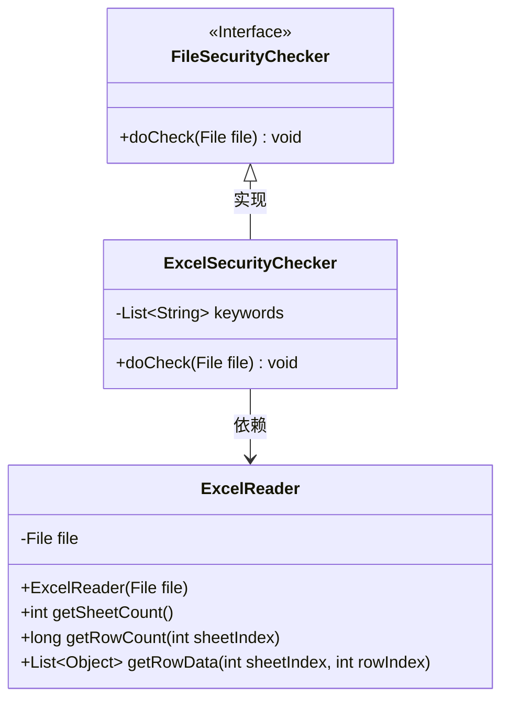
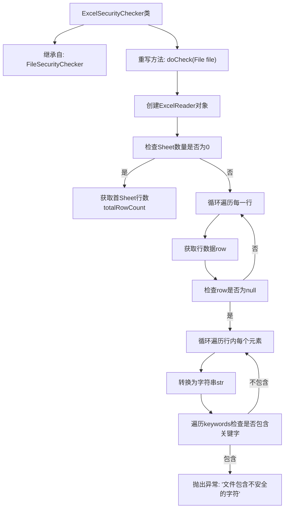

# 基础信息

|      |      |
|------|------|
| 名称 | ExcelSecurityChecker |
| 编码语言 | .java |
| 代码路径 | WeFe/board/board-service/src/main/java/com/welab/wefe/board/service/api/file/security/ExcelSecurityChecker.java |
| 包名 | com.welab.wefe.board.service.api.file.security |
| 依赖项 | ['com.welab.wefe.common.io.excel.ExcelReader', 'java.io.File', 'java.io.IOException', 'java.util.List'] |
| 概述说明 | Excel安全检查类，继承文件安全检查器，检查Excel文件是否包含不安全关键词，发现则抛出异常。 |

# 说明

ExcelSecurityChecker类继承FileSecurityChecker，用于检查Excel文件安全性。通过ExcelReader读取文件，首先检查工作表数量，若为空则直接返回。读取第一个工作表的所有行数据，逐行检查每个单元格内容。若发现单元格内容包含预定义关键词列表中的任意字符串，则抛出IO异常提示不安全字符。关键词检查采用字符串包含匹配方式。

# 类列表 Class Summary

| 名称   | 类型  | 说明 |
|-------|------|-------------|
| ExcelSecurityChecker | class | Excel安全检查类，继承文件检查器。读取Excel文件，检查每行数据是否含有关键字，发现则抛出异常提示不安全字符。 |

## 类 ExcelSecurityChecker

|      |      |
|------|------|
| 访问范围 | public |
| 类型 | class |
| 名称 | ExcelSecurityChecker |
| 说明 | Excel安全检查类，继承文件检查器。读取Excel文件，检查每行数据是否含有关键字，发现则抛出异常提示不安全字符。 |

### UML类图

类图描述：
该图展示了Excel安全检查器的类结构，ExcelSecurityChecker实现了FileSecurityChecker接口，并依赖ExcelReader进行Excel文件操作。主要功能是检查Excel文件中是否包含敏感关键词，包含三个核心类：接口FileSecurityChecker定义检查方法，ExcelSecurityChecker实现具体检查逻辑，ExcelReader提供Excel文件读取能力。安全检查过程涉及读取工作表、行数据并逐项匹配关键词列表。

### 内部方法调用关系图

这段代码流程图展示了ExcelSecurityChecker类的工作流程，该类继承自FileSecurityChecker并重写了doCheck方法。流程从创建ExcelReader开始，首先检查Sheet数量，然后逐行扫描Excel文件内容，将每个单元格数据转换为字符串后，与预设的关键词列表进行比对，若发现包含关键词则立即抛出安全异常。整个过程实现了对Excel文件内容的安全检查功能，能有效识别并阻止包含敏感关键词的文件。

### 字段列表 Field List

| 名称  | 类型  | 说明 |
|-------|-------|------|

### 方法列表

| 名称  | 类型  | 说明 |
|-------|-------|------|
| doCheck | void | 检查Excel文件是否包含不安全字符，若发现则抛出异常。 |

