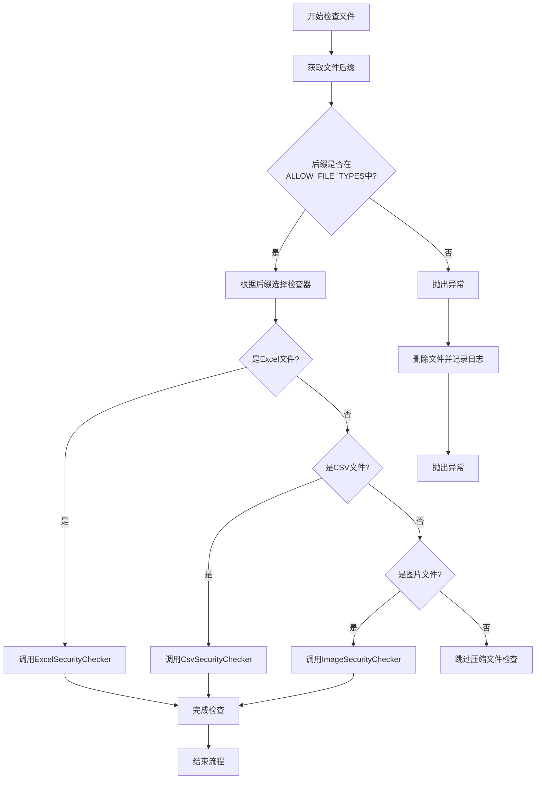
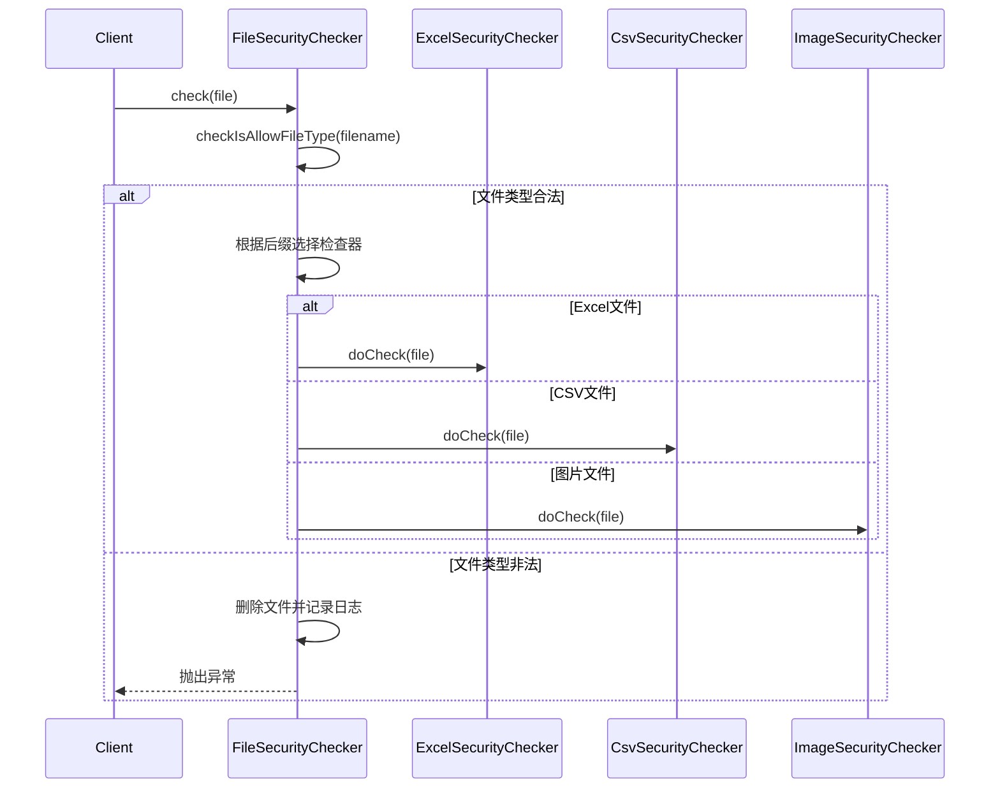
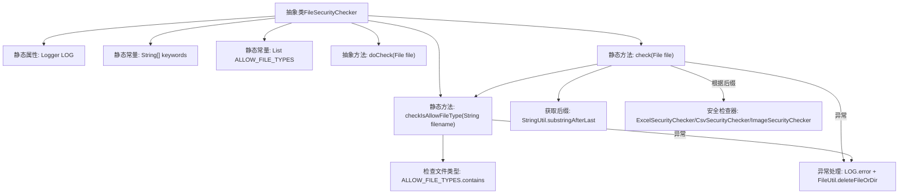

# 基础信息

|      |      |
|------|------|
| 名称 | FileSecurityChecker |
| 编码语言 | .java |
| 代码路径 | WeFe/board/board-service/src/main/java/com/welab/wefe/board/service/api/file/security/FileSecurityChecker.java |
| 包名 | com.welab.wefe.board.service.api.file.security |
| 依赖项 | ['com.welab.wefe.common.StatusCode', 'com.welab.wefe.common.exception.StatusCodeWithException', 'com.welab.wefe.common.util.FileUtil', 'com.welab.wefe.common.util.StringUtil', 'org.slf4j.Logger', 'org.slf4j.LoggerFactory', 'java.io.File', 'java.util.Arrays', 'java.util.List'] |
| 概述说明 | 抽象类FileSecurityChecker用于检查文件安全性，支持xls、csv等格式，检查失败删除文件并抛异常。 |

# 说明

FileSecurityChecker是一个抽象类，用于检查文件安全性。它定义了允许的文件类型列表，包括xls、xlsx、csv、zip、gz、tgz、7z、jpg、jpeg、png。类中包含静态方法check用于检查文件类型并调用相应的安全检查器，如ExcelSecurityChecker、CsvSecurityChecker和ImageSecurityChecker。方法checkIsAllowFileType用于验证文件后缀是否在允许列表中。若检查失败会删除文件并抛出异常。

# 类列表 Class Summary

| 名称   | 类型  | 说明 |
|-------|------|-------------|
| FileSecurityChecker | class | 抽象类FileSecurityChecker用于检查文件安全性，支持xls、csv等格式，检查失败删除文件并抛出异常。 |


## 类 FileSecurityChecker

|      |      |
|------|------|
| 访问范围 | public abstract |
| 类型 | class |
| 名称 | FileSecurityChecker |
| 说明 | 抽象类FileSecurityChecker用于检查文件安全性，支持xls、csv等格式，检查失败删除文件并抛出异常。 |


### UML类图

```mermaid
classDiagram
    class FileSecurityChecker {
        <<abstract>>
        #static final Logger LOG
        #static final String[] keywords
        -static final List~String~ ALLOW_FILE_TYPES
        #abstract doCheck(File file) void
        +static check(File file) void
        +static checkIsAllowFileType(String filename) void
    }

    class ExcelSecurityChecker {
        +doCheck(File file) void
    }
    // ExcelSecurityChecker 实现 FileSecurityChecker 的抽象方法
    FileSecurityChecker <|-- ExcelSecurityChecker

    class CsvSecurityChecker {
        +doCheck(File file) void
    }
    // CsvSecurityChecker 实现 FileSecurityChecker 的抽象方法
    FileSecurityChecker <|-- CsvSecurityChecker

    class ImageSecurityChecker {
        +doCheck(File file) void
    }
    // ImageSecurityChecker 实现 FileSecurityChecker 的抽象方法
    FileSecurityChecker <|-- ImageSecurityChecker
```





这段代码实现了一个抽象的文件安全检查框架，核心是FileSecurityChecker抽象类及其三个具体实现类。类图展示了父类与子类的继承关系，其中父类定义了公共常量、文件类型白名单和核心检查方法，子类分别处理Excel、CSV和图片文件的安全检查。流程图详细描述了从文件类型验证到具体检查器调用的完整逻辑分支，而时序图则展示了客户端与检查器之间的交互过程。整个设计采用模板方法模式，通过抽象方法doCheck实现不同文件类型的差异化检查，同时统一处理异常情况和日志记录。


### 内部方法调用关系图



该流程图展示了文件安全检查器的核心逻辑。抽象类包含静态配置和两个核心方法：check执行主流程（包括后缀提取、类型校验和具体安全检查），checkIsAllowFileType专门验证文件类型合法性。异常处理模块统一记录日志并删除问题文件，具体安全检查通过多态机制由不同子类实现。流程严格遵循"先校验后处理"原则，对空文件名、无后缀和非法类型进行早期拦截。

### 字段列表 Field List

| 名称  | 类型  | 说明 |
|-------|-------|------|
| LOG = LoggerFactory.getLogger(FileSecurityChecker.class) | Logger | FileSecurityChecker类中定义了一个受保护的静态日志对象LOG。 |
| keywords = {"<", ">", "\\"} | String[] | 定义受保护静态常量字符串数组keywords，包含三个特殊字符：<、>和\。 |
| ALLOW_FILE_TYPES = Arrays.asList(            "xls", "xlsx", "csv",            "zip", "gz", "tgz", "7z",            "jpg", "jpeg", "png"    ) | List<String> | 允许文件类型列表：xls、xlsx、csv、zip、gz、tgz、7z、jpg、jpeg、png。 |

### 方法列表

| 名称  | 类型  | 说明 |
|-------|-------|------|
| doCheck | void | 抽象方法doCheck，接收File参数，可能抛出异常。 |
| check | void | 检查上传文件安全性，支持xls、xlsx、csv、图片等格式，不合法则删除并报错。 |
| checkIsAllowFileType | void | 检查文件类型是否允许：文件名非空、有后缀且后缀在允许列表中，否则抛出异常。 |


