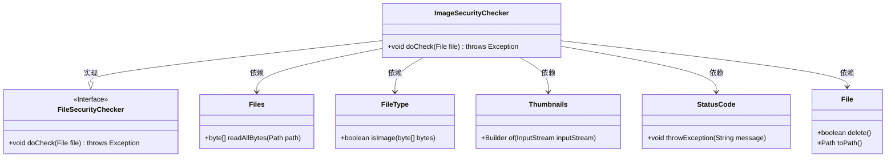
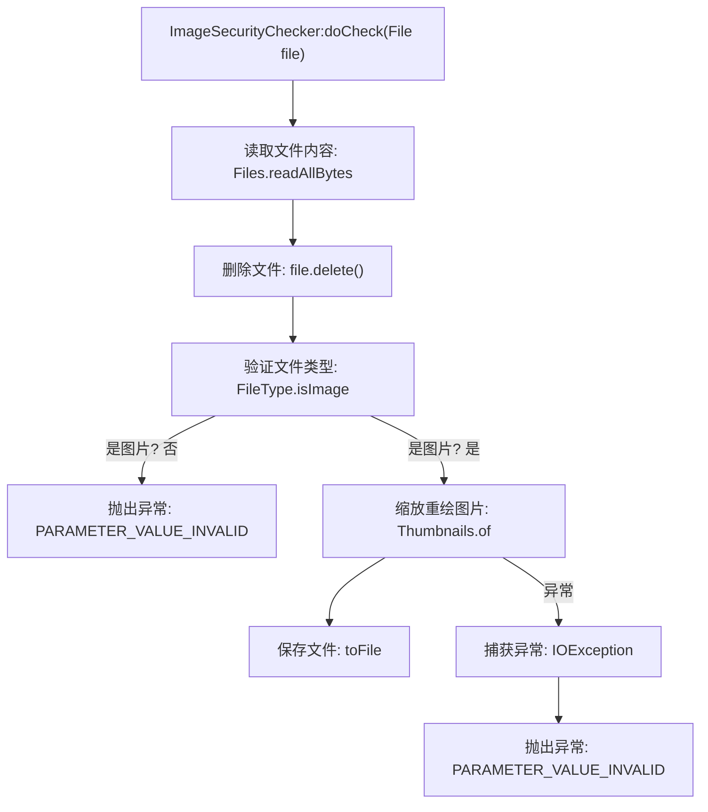

# 基础信息

|      |      |
|------|------|
| 名称 | ImageSecurityChecker |
| 编码语言 | .java |
| 代码路径 | WeFe/board/board-service/src/main/java/com/welab/wefe/board/service/api/file/security/ImageSecurityChecker.java |
| 包名 | com.welab.wefe.board.service.api.file.security |
| 依赖项 | ['com.welab.wefe.common.StatusCode', 'com.welab.wefe.common.util.FileType', 'net.coobird.thumbnailator.Thumbnails', 'java.io.ByteArrayInputStream', 'java.io.File', 'java.io.IOException', 'java.nio.file.Files'] |
| 概述说明 | ImageSecurityChecker类检查图片文件，验证格式后删除原文件，通过缩放重绘清除潜在木马内容，异常时提示错误信息。 |

# 说明

ImageSecurityChecker类继承FileSecurityChecker，用于检查图片文件安全性。首先读取文件字节后删除原文件，验证是否为图片格式，否则抛出异常。接着通过缩放重绘处理图片以清除潜在恶意内容，若处理失败则提示图片损坏。整个过程确保文件安全且格式正确。

# 类列表 Class Summary

| 名称   | 类型  | 说明 |
|-------|------|-------------|
| ImageSecurityChecker | class | ImageSecurityChecker类继承FileSecurityChecker，检查文件是否为图片格式，删除原文件后缩放重绘以清除潜在木马内容，异常时抛出错误提示。 |

## 类 ImageSecurityChecker

|      |      |
|------|------|
| 访问范围 | public |
| 类型 | class |
| 名称 | ImageSecurityChecker |
| 说明 | ImageSecurityChecker类继承FileSecurityChecker，检查文件是否为图片格式，删除原文件后缩放重绘以清除潜在木马内容，异常时抛出错误提示。 |

### UML类图

类图描述：
该图展示了ImageSecurityChecker类继承自FileSecurityChecker接口，并实现了文件安全检查的核心逻辑。通过依赖Files、FileType、Thumbnails、StatusCode和File等工具类，完成图片文件的读取、格式验证、安全重绘等操作。其中FileSecurityChecker作为抽象接口定义了检查规范，ImageSecurityChecker具体实现了图片文件的特殊安全检查流程，包括读取文件内容、删除原文件、验证图片格式、通过缩略图重绘消除潜在安全风险等关键步骤。

### 内部方法调用关系图

该流程图描述了ImageSecurityChecker类中doCheck方法的执行流程。方法首先读取文件字节并删除原文件，然后验证是否为有效图片格式，若非图片则抛出异常。对于合法图片，通过Thumbnails进行缩放重绘以清除潜在恶意内容，若处理失败则抛出图片损坏异常。整个过程实现了图片文件的安全检查和内容净化。

### 字段列表 Field List

| 名称  | 类型  | 说明 |
|-------|-------|------|

### 方法列表

| 名称  | 类型  | 说明 |
|-------|-------|------|
| doCheck | void | 方法读取文件后删除，检查是否为图片格式，非图片则报错。对图片缩放重绘以清除潜在木马，失败则提示图片损坏。 |

