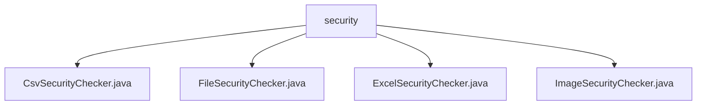

# 基础信息

|      |      |
|------|------|
| 名称 | security |
| 编码语言 | .java |
| 代码路径 | WeFe/board/board-service/src/main/java/com/welab/wefe/board/service/api/file/security |
| 包名 | docs.board.board-service.src.main.java.com.welab.wefe.board.service.api.file.security |
| 概述说明 | CsvSecurityChecker检查CSV文件内容安全性，逐行扫描关键词。FileSecurityChecker是抽象基类，定义允许的文件类型和检查流程。ExcelSecurityChecker检查Excel文件内容，验证工作表数据。ImageSecurityChecker验证图片格式并清除潜在恶意内容。 |

# 说明

## 概述  
该模块核心职责是提供多格式文件安全检查能力，通过继承抽象类FileSecurityChecker实现具体文件类型的安全验证。接口规范统一采用doCheck方法接收文件参数并可能抛出IOException，子类需实现该方法完成特定格式检查。关键数据结构包括CsvParser、ExcelReader和图片处理缓冲区。外部依赖涉及Apache POI（Excel处理）、OpenCSV和Java图像IO库。例如CsvSecurityChecker使用UTF-8编码解析CSV，ExcelSecurityChecker通过工作表遍历单元格。

## 主要业务场景  
模块支持检查CSV/Excel/图片等10种文件类型，采用"先格式校验后内容扫描"的流程。交互模式类似安全过滤链，检查失败会删除文件并阻断流程。典型应用包括用户上传文件时的自动安全扫描，例如Excel文件会逐行检测关键词，图片会经过重绘净化。API集成案例涵盖checkIsAllowFileType静态方法校验后缀，以及各子类实现的doCheck核心逻辑。关键词匹配采用字符串包含策略，类似基础内容过滤机制。

### 包内部结构视图

该流程图展示了security目录下的四个文件检查器类：CSV、文件、Excel和图片安全检查器。所有检查器类都直接隶属于security目录，没有更深层级的嵌套关系，结构简洁清晰。

# 文件列表

| 名称   | 类型  | 说明 |
|-------|------|-------------|
| [CsvSecurityChecker.java](CsvSecurityChecker.md) | file | CsvSecurityChecker类检查CSV文件内容，若发现keywords中的关键字则抛出异常。 |
| [FileSecurityChecker.java](FileSecurityChecker.md) | file | 抽象类FileSecurityChecker用于检查文件安全性，支持xls、csv等格式，检查失败删除文件并抛异常。 |
| [ExcelSecurityChecker.java](ExcelSecurityChecker.md) | file | Excel安全检查类，继承文件安全检查器，检查Excel文件是否包含不安全关键词，发现则抛出异常。 |
| [ImageSecurityChecker.java](ImageSecurityChecker.md) | file | ImageSecurityChecker类检查图片文件，验证格式后删除原文件，通过缩放重绘清除潜在木马内容，异常时提示错误信息。 |

