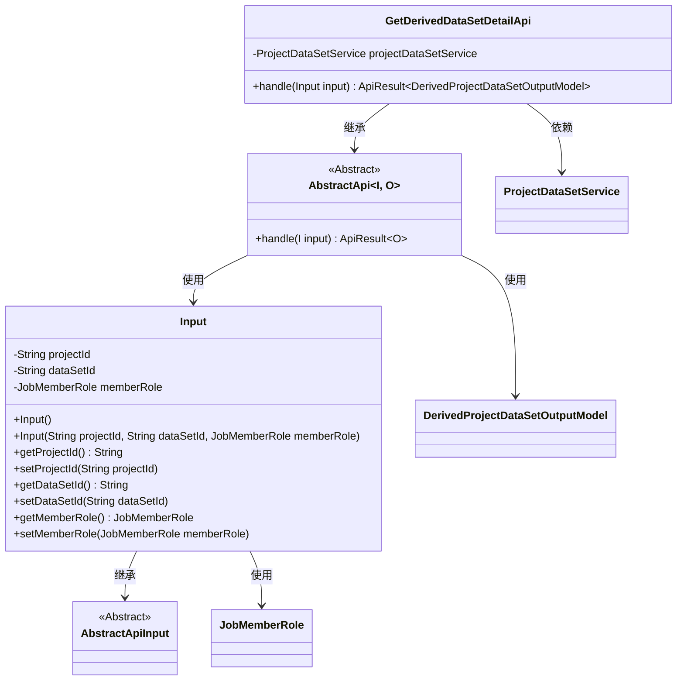

# 基础信息

|      |      |
|------|------|
| 名称 | GetDerivedDataSetDetailApi |
| 编码语言 | .java |
| 代码路径 | WeFe/board/board-service/src/main/java/com/welab/wefe/board/service/api/gateway/GetDerivedDataSetDetailApi.java |
| 包名 | com.welab.wefe.board.service.api.gateway |
| 依赖项 | ['com.welab.wefe.board.service.dto.entity.project.data_set.DerivedProjectDataSetOutputModel', 'com.welab.wefe.board.service.service.ProjectDataSetService', 'com.welab.wefe.common.exception.StatusCodeWithException', 'com.welab.wefe.common.fieldvalidate.annotation.Check', 'com.welab.wefe.common.web.api.base.AbstractApi', 'com.welab.wefe.common.web.api.base.Api', 'com.welab.wefe.common.web.dto.AbstractApiInput', 'com.welab.wefe.common.web.dto.ApiResult', 'com.welab.wefe.common.wefe.enums.JobMemberRole', 'org.springframework.beans.factory.annotation.Autowired'] |
| 概述说明 | 获取项目衍生数据集详情的API，需项目ID、数据集ID和成员角色参数，返回数据集详情。 |

# 说明

该代码定义了一个名为GetDerivedDataSetDetailApi的API类，用于获取项目中派生数据集的详细信息。API路径为gateway/derived_data_set/detail，支持签名访问。输入参数Input包含项目ID、数据集ID和成员角色ID，均为必填项。处理逻辑通过ProjectDataSetService获取派生数据集详情，并返回DerivedProjectDataSetOutputModel类型的结果。类中包含完整的getter和setter方法，以及带参数的构造函数。

# 类列表 Class Summary

| 名称   | 类型  | 说明 |
|-------|------|-------------|
| GetDerivedDataSetDetailApi | class | API类GetDerivedDataSetDetailApi用于获取项目中派生数据集详情，需项目ID、数据集ID和成员角色参数，返回派生数据集输出模型。 |

## 类 GetDerivedDataSetDetailApi

|      |      |
|------|------|
| 访问范围 | @Api(path = "gateway/derived_data_set/detail", name = "get a list of derived data sets in the project", allowAccessWithSign = true);public |
| 类型 | class |
| 名称 | GetDerivedDataSetDetailApi |
| 说明 | API类GetDerivedDataSetDetailApi用于获取项目中派生数据集详情，需项目ID、数据集ID和成员角色参数，返回派生数据集输出模型。 |

### UML类图

这段代码展示了一个API类`GetDerivedDataSetDetailApi`的结构，该类继承自泛型抽象类`AbstractApi`，用于处理获取派生数据集详情的请求。类图中包含核心类及其关系：API类依赖`ProjectDataSetService`服务，使用嵌套类`Input`作为输入参数，`Input`继承自`AbstractApiInput`并包含三个字段。抽象类`AbstractApi`定义了处理请求的模板方法，输出类型为`DerivedProjectDataSetOutputModel`。整体结构体现了清晰的层级关系和依赖。

### 内部方法调用关系图

```mermaid
graph TD
    A["类GetDerivedDataSetDetailApi"]
    B["注解: @Api"]
    C["继承: AbstractApi<Input, DerivedProjectDataSetOutputModel>"]
    D["依赖注入: @Autowired ProjectDataSetService"]
    E["重写方法: handle(Input input)"]
    F["内部类: Input"]
    G["属性: String projectId"]
    H["属性: String dataSetId"]
    I["属性: JobMemberRole memberRole"]
    J["构造方法: Input()"]
    K["构造方法: Input(String, String, JobMemberRole)"]
    L["getter/setter方法"]
    M["调用: projectDataSetService.getDerivedDataSetDetail"]
    N["返回: success(output)"]

    A --> B
    A --> C
    A --> D
    A --> E
    A --> F
    F --> G
    F --> H
    F --> I
    F --> J
    F --> K
    F --> L
    E --> M
    E --> N
```

这段代码定义了一个名为GetDerivedDataSetDetailApi的API类，用于获取项目中派生数据集的详细信息。该类继承自AbstractApi，通过ProjectDataSetService获取数据，并定义了Input内部类作为输入参数。Input类包含项目ID、数据集ID和成员角色等必填字段，并提供了相应的构造方法和getter/setter。handle方法处理输入参数并返回成功结果。

### 字段列表 Field List

| 名称  | 类型  | 说明 |
|-------|-------|------|
| projectDataSetService | ProjectDataSetService | 自动注入ProjectDataSetService实例。 |

### 方法列表

| 名称  | 类型  | 说明 |
|-------|-------|------|
| handle | ApiResult<DerivedProjectDataSetOutputModel> | 处理输入并返回派生项目数据集详情，成功时输出结果。 |

