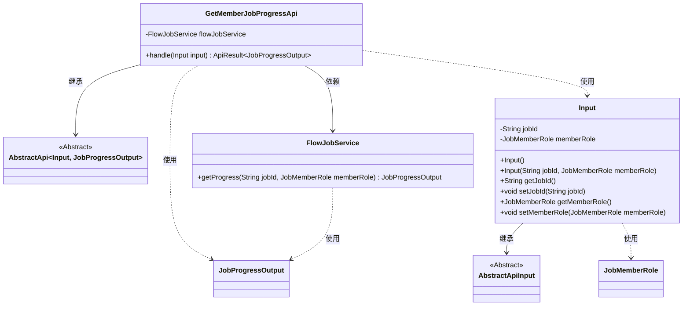
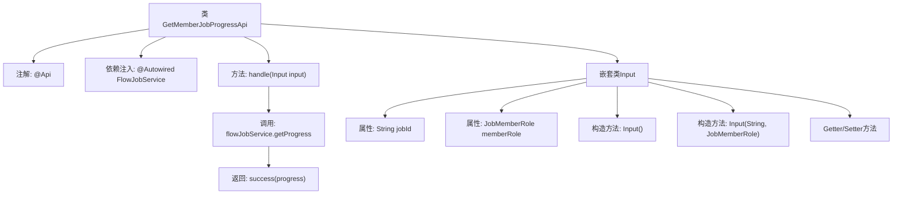

# 基础信息

|      |      |
|------|------|
| 名称 | GetMemberJobProgressApi |
| 编码语言 | .java |
| 代码路径 | WeFe/board/board-service/src/main/java/com/welab/wefe/board/service/api/gateway/GetMemberJobProgressApi.java |
| 包名 | com.welab.wefe.board.service.api.gateway |
| 依赖项 | ['com.welab.wefe.board.service.dto.vo.JobProgressOutput', 'com.welab.wefe.board.service.service.FlowJobService', 'com.welab.wefe.common.exception.StatusCodeWithException', 'com.welab.wefe.common.fieldvalidate.annotation.Check', 'com.welab.wefe.common.web.api.base.AbstractApi', 'com.welab.wefe.common.web.api.base.Api', 'com.welab.wefe.common.web.dto.AbstractApiInput', 'com.welab.wefe.common.web.dto.ApiResult', 'com.welab.wefe.common.wefe.enums.JobMemberRole', 'org.springframework.beans.factory.annotation.Autowired'] |
| 概述说明 | 获取任务进度API，路径gateway/get_job_progress，需任务ID和角色参数，返回任务进度信息。 |

# 说明

这是一个名为GetMemberJobProgressApi的API类，用于获取任务进度。API路径为gateway/get_job_progress，允许带签名访问。它继承自AbstractApi，输入类型为内部类Input，输出类型为JobProgressOutput。Input类包含两个必填字段：jobId（任务ID）和memberRole（角色）。处理逻辑通过注入的FlowJobService获取任务进度并返回成功结果。类中提供了Input的构造方法和getter/setter方法。

# 类列表 Class Summary

| 名称   | 类型  | 说明 |
|-------|------|-------------|
| GetMemberJobProgressApi | class | 获取任务进度API，路径gateway/get_job_progress，需任务ID和角色参数，返回任务进度信息。 |

## 类 GetMemberJobProgressApi

|      |      |
|------|------|
| 访问范围 | @Api(path = "gateway/get_job_progress", name = "get job progress", allowAccessWithSign = true);public |
| 类型 | class |
| 名称 | GetMemberJobProgressApi |
| 说明 | 获取任务进度API，路径gateway/get_job_progress，需任务ID和角色参数，返回任务进度信息。 |

### UML类图

类图描述：该图展示了GetMemberJobProgressApi类继承自泛型AbstractApi类，包含对FlowJobService的依赖。Input类继承自AbstractApiInput，包含jobId和memberRole字段及其访问方法。FlowJobService提供getProgress方法返回JobProgressOutput。各类通过继承和依赖关系组织，形成一个处理任务进度查询的API结构。

### 内部方法调用关系图

这段代码定义了一个名为GetMemberJobProgressApi的API类，继承自AbstractApi，用于获取任务进度。类通过@Api注解配置API路径和权限，使用FlowJobService获取任务进度信息。包含一个嵌套静态类Input作为输入参数，其中定义了两个必填字段jobId和memberRole，并提供了构造方法和Getter/Setter。主方法handle调用服务层获取数据后返回成功结果。

### 字段列表 Field List

| 名称  | 类型  | 说明 |
|-------|-------|------|
| flowJobService | FlowJobService | 自动注入FlowJobService服务实例。 |

### 方法列表

| 名称  | 类型  | 说明 |
|-------|-------|------|
| handle | ApiResult<JobProgressOutput> | Java方法重写，获取任务进度并返回结果。输入含任务ID和成员角色，输出任务进度信息。 |

