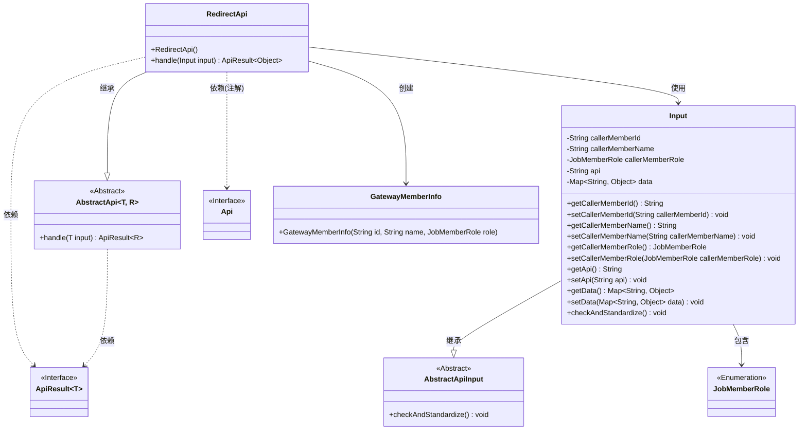

# 基础信息

|      |      |
|------|------|
| 名称 | RedirectApi |
| 编码语言 | .java |
| 代码路径 | WeFe/board/board-service/src/main/java/com/welab/wefe/board/service/api/gateway/RedirectApi.java |
| 包名 | com.welab.wefe.board.service.api.gateway |
| 依赖项 | ['com.welab.wefe.common.exception.StatusCodeWithException', 'com.welab.wefe.common.util.JObject', 'com.welab.wefe.common.web.ApiExecutor', 'com.welab.wefe.common.web.Launcher', 'com.welab.wefe.common.web.api.base.AbstractApi', 'com.welab.wefe.common.web.api.base.Api', 'com.welab.wefe.common.web.dto.AbstractApiInput', 'com.welab.wefe.common.web.dto.ApiResult', 'com.welab.wefe.common.web.dto.GatewayMemberInfo', 'com.welab.wefe.common.wefe.enums.JobMemberRole', 'java.util.Map', 'java.util.TreeMap'] |
| 概述说明 | RedirectApi类用于将网关请求重定向到内部API，处理输入参数并补全调用者信息，执行目标API后记录响应日志。输入类包含调用者信息和API数据。 |

# 说明

RedirectApi类是一个用于将网关请求重定向到内部API的接口，允许带签名访问。它继承自AbstractApi，处理输入类型为Input，输出类型为Object。主要功能包括：通过输入参数获取目标API实例，将调用者成员信息加入输入数据，执行目标API并返回结果。由于直接调用目标API会跳过响应日志记录，该类补充了日志记录功能。Input类包含调用者ID、名称、角色、目标API名称和数据映射等字段，提供校验和标准化方法，确保数据非空，并包含完整的getter和setter方法。

# 类列表 Class Summary

| 名称   | 类型  | 说明 |
|-------|------|-------------|
| RedirectApi | class | RedirectApi类用于将网关请求重定向到内部API，处理输入参数并记录响应日志。输入包含调用者信息和目标API数据。 |

## 类 RedirectApi

|      |      |
|------|------|
| 访问范围 | @Api(path = "gateway/redirect", name = "Redirect requests from gateway to internal api", allowAccessWithSign = true);public |
| 类型 | class |
| 名称 | RedirectApi |
| 说明 | RedirectApi类用于将网关请求重定向到内部API，处理输入参数并记录响应日志。输入包含调用者信息和目标API数据。 |

### UML类图

这段代码展示了一个网关重定向API的实现结构。RedirectApi继承自泛型抽象类AbstractApi，专门处理从网关到内部API的请求转发。核心类包含输入参数处理类Input（继承自AbstractApiInput）、用户信息封装类GatewayMemberInfo和角色枚举JobMemberRole。通过Spring上下文获取目标API实例，添加调用者信息后执行请求，并补充响应日志记录功能。整个设计体现了清晰的层次结构和职责分离，Input类通过getter/setter提供标准化的参数访问方式，并包含数据校验逻辑。

### 内部方法调用关系图

```mermaid
graph TD
    A["类RedirectApi"]
    B["父类: AbstractApi<Input, Object>"]
    C["方法: handle(Input input)"]
    D["获取API实例: Launcher.CONTEXT.getBean"]
    E["构造GatewayMemberInfo"]
    F["调用API: api.execute"]
    G["获取注解: api.getClass().getAnnotation"]
    H["记录日志: ApiExecutor.logResponse"]
    I["返回结果: return result"]
    J["嵌套类Input"]
    K["方法: checkAndStandardize"]
    L["校验数据: super.checkAndStandardize"]
    M["初始化data: new TreeMap"]
    N["Getter/Setter方法"]

    A --> B
    A --> C
    C --> D
    C --> E
    C --> F
    C --> G
    G --> H
    C --> I
    A --> J
    J --> K
    K --> L
    K --> M
    J --> N
```

流程图描述：该流程图展示了RedirectApi类的核心结构和处理流程。类继承自AbstractApi，主要处理方法是handle()，该方法首先通过Spring上下文获取目标API实例，然后构建调用者信息并执行目标API，最后补记响应日志。嵌套类Input负责请求参数的标准化校验，包含数据初始化和标准getter/setter方法。整个流程实现了网关请求到内部API的透明转发和日志补全功能。

### 字段列表 Field List

| 名称  | 类型  | 说明 |
|-------|-------|------|

### 方法列表

| 名称  | 类型  | 说明 |
|-------|-------|------|
| handle | ApiResult<Object> | 处理API请求：获取指定API实例，注入调用者成员信息，执行并记录响应日志，返回结果。 |

