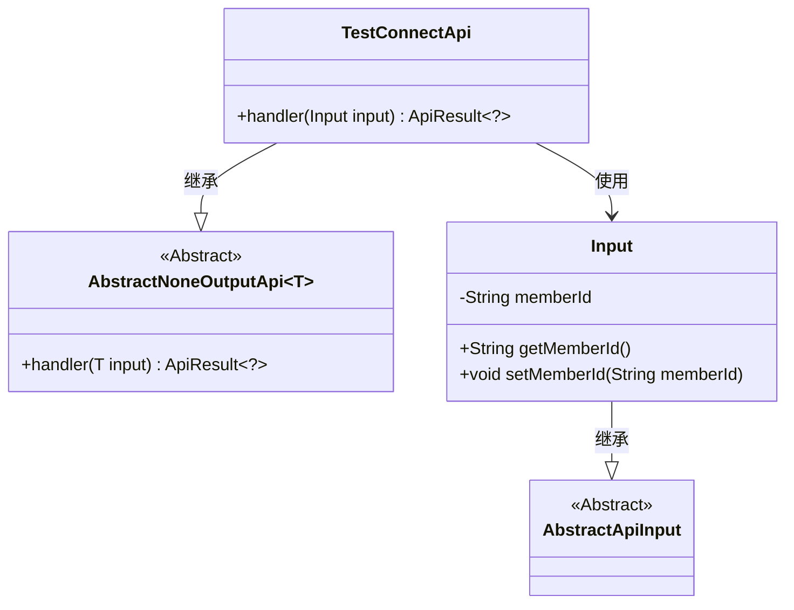

# 基础信息

|      |      |
|------|------|
| 名称 | TestConnectApi |
| 编码语言 | .java |
| 代码路径 | WeFe/board/board-service/src/main/java/com/welab/wefe/board/service/api/gateway/TestConnectApi.java |
| 包名 | com.welab.wefe.board.service.api.gateway |
| 依赖项 | ['com.welab.wefe.common.exception.StatusCodeWithException', 'com.welab.wefe.common.fieldvalidate.annotation.Check', 'com.welab.wefe.common.web.api.base.AbstractNoneOutputApi', 'com.welab.wefe.common.web.api.base.Api', 'com.welab.wefe.common.web.dto.AbstractApiInput', 'com.welab.wefe.common.web.dto.ApiResult'] |
| 概述说明 | 网关连通性测试接口，输入含成员ID，无输出，用于检测网关与板间连接状态。 |

# 说明

该代码定义了一个名为TestConnectApi的API类，用于检查网关与电路板之间的连接性。API路径为gateway/test_route_connect，功能描述明确。该类继承自AbstractNoneOutputApi，输入参数为Input类，包含一个成员ID字段memberId，并带有校验注解。处理逻辑简单，直接返回成功结果。整体设计简洁，专注于连接性检查功能。

# 类列表 Class Summary

| 名称   | 类型  | 说明 |
|-------|------|-------------|
| TestConnectApi | class | 接口类TestConnectApi用于检测网关与板间的连通性，输入参数为memberId，无输出。 |

## 类 TestConnectApi

|      |      |
|------|------|
| 访问范围 | @Api(path = "gateway/test_route_connect", name = "Check the connectivity interface between the gateway and the board", desc = "Check the connectivity interface between the gateway and the board");public |
| 类型 | class |
| 名称 | TestConnectApi |
| 说明 | 接口类TestConnectApi用于检测网关与板间的连通性，输入参数为memberId，无输出。 |

### UML类图

这段代码展示了一个网关连接测试API的实现结构。TestConnectApi继承自AbstractNoneOutputApi泛型类，指定Input作为泛型参数，并重写了handler方法。Input类继承自AbstractApiInput，包含memberId字段及其getter/setter方法。类图清晰地反映了继承关系和类之间的依赖，其中TestConnectApi依赖于Input类作为其输入参数类型。整个设计遵循了模板方法模式，通过抽象基类规范API行为。

### 内部方法调用关系图

```mermaid
graph TD
    A["类TestConnectApi"]
    B["父类: AbstractNoneOutputApi<Input>"]
    C["注解: @Api"]
    D["方法: handler(Input input)"]
    E["嵌套类Input"]
    F["父类: AbstractApiInput"]
    G["属性: String memberId"]
    H["注解: @Check"]
    I["方法: getMemberId()"]
    J["方法: setMemberId(String memberId)"]
    K["返回: ApiResult<?>"]

    A --> B
    A --> C
    A --> D
    A --> E
    E --> F
    E --> G
    E --> H
    E --> I
    E --> J
    D --> K
```

该流程图展示了TestConnectApi类的结构及其内部关系。TestConnectApi继承自AbstractNoneOutputApi<Input>类，包含一个handler方法和一个嵌套的Input类。Input类继承自AbstractApiInput，具有memberId属性和对应的getter/setter方法，其中memberId带有@Check注解。handler方法处理输入参数并返回ApiResult对象。整个类通过@Api注解定义了接口路径、名称和描述信息。

### 字段列表 Field List

| 名称  | 类型  | 说明 |
|-------|-------|------|

### 方法列表

| 名称  | 类型  | 说明 |
|-------|-------|------|
| handler | ApiResult<?> | Java方法重写，处理输入并返回成功结果，可能抛出状态码异常。 |

