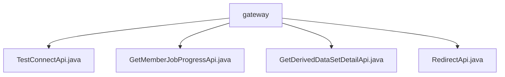

# 基础信息

|      |      |
|------|------|
| 名称 | gateway |
| 编码语言 | .java |
| 代码路径 | WeFe/board/board-service/src/main/java/com/welab/wefe/board/service/api/gateway |
| 包名 | docs.board.board-service.src.main.java.com.welab.wefe.board.service.api.gateway |
| 概述说明 | TestConnectApi检查网关与电路板连接性。GetMemberJobProgressApi获取任务进度。GetDerivedDataSetDetailApi获取派生数据集详情。RedirectApi重定向网关请求到内部API并补充日志。 |

# 说明

## 概述  
该模块是网关服务API集合，核心职责是提供网关与电路板连接性检查、任务进度查询、派生数据集详情获取及请求重定向功能。接口规范统一继承AbstractApi基类，支持签名访问，路径均以gateway开头，例如gateway/test_route_connect。关键数据结构包括带校验注解的Input类（含memberId/jobId等字段）和各类Output模型（如JobProgressOutput）。外部依赖涉及FlowJobService和ProjectDataSetService等内部服务。例如TestConnectApi直接返回成功结果，RedirectApi则类似代理模式补充日志功能。

## 主要业务场景  
模块支持四类典型交互：连接测试（无输出）、任务进度跟踪（如通过jobId查询）、派生数据集查询（需项目ID和数据集ID）和API路由转发（类似网关透传）。业务流程均遵循"参数校验→服务调用→结果封装"模式，例如GetDerivedDataSetDetailApi通过ProjectDataSetService获取数据。集成案例覆盖状态检查（TestConnectApi）、异步任务监控（GetMemberJobProgressApi）和数据服务（GetDerivedDataSetDetailApi），RedirectApi则作为统一入口实现请求分发。

### 包内部结构视图

该流程图展示了WeFe项目中gateway目录下的API文件结构。根节点为gateway文件夹，包含4个Java接口文件：TestConnectApi、GetMemberJobProgressApi、GetDerivedDataSetDetailApi和RedirectApi。这些文件都属于board-service模块的网关API层，用于处理不同业务场景的接口请求。

# 文件列表

| 名称   | 类型  | 说明 |
|-------|------|-------------|
| [TestConnectApi.java](TestConnectApi.md) | file | 网关连通性测试接口，输入含成员ID，无输出，用于检测网关与板间连接状态。 |
| [GetMemberJobProgressApi.java](GetMemberJobProgressApi.md) | file | 获取任务进度API，路径gateway/get_job_progress，需任务ID和角色参数，返回任务进度信息。 |
| [GetDerivedDataSetDetailApi.java](GetDerivedDataSetDetailApi.md) | file | 获取项目衍生数据集详情的API，需项目ID、数据集ID和成员角色参数，返回数据集详情。 |
| [RedirectApi.java](RedirectApi.md) | file | RedirectApi类用于将网关请求重定向到内部API，处理输入参数并补全调用者信息，执行目标API后记录响应日志。输入类包含调用者信息和API数据。 |

