# 基础信息

|      |      |
|------|------|
| 名称 | GetGlobalConfigApi |
| 编码语言 | .java |
| 代码路径 | WeFe/board/board-service/src/main/java/com/welab/wefe/board/service/api/global_config/GetGlobalConfigApi.java |
| 包名 | com.welab.wefe.board.service.api.global_config |
| 依赖项 | ['com.welab.wefe.board.service.service.globalconfig.GlobalConfigService', 'com.welab.wefe.common.exception.StatusCodeWithException', 'com.welab.wefe.common.fieldvalidate.annotation.Check', 'com.welab.wefe.common.web.api.base.AbstractApi', 'com.welab.wefe.common.web.api.base.Api', 'com.welab.wefe.common.web.dto.AbstractApiInput', 'com.welab.wefe.common.web.dto.ApiResult', 'com.welab.wefe.common.wefe.dto.global_config.base.AbstractConfigModel', 'org.springframework.beans.factory.annotation.Autowired', 'java.util.HashMap', 'java.util.List', 'java.util.Map'] |
| 概述说明 | 获取系统全局配置的API类，通过输入组名列表返回对应配置模型。使用GlobalConfigService处理请求，返回Map格式结果。输入需包含非空组名列表。 |

# 说明

这是一个名为GetGlobalConfigApi的Java类，用于获取系统全局配置。它继承自AbstractApi类，接受Input类型的输入参数，返回包含配置数据的Map。类上标注了Api注解，指定路径为global_config/get，名称为get system global configs。类中注入了GlobalConfigService用于获取配置数据。handle方法处理请求，遍历输入中的groups列表，通过服务获取每个组的配置模型并存入Map返回。Input内部类继承AbstractApiInput，包含一个必填的groups字段，用于接收配置组名列表。整个类实现了通过组名批量获取系统配置的功能。

# 类列表 Class Summary

| 名称   | 类型  | 说明 |
|-------|------|-------------|
| GetGlobalConfigApi | class | 这是一个获取系统全局配置的API类，路径为"global_config/get"。它接收组名列表作为输入，返回对应组的配置模型映射。处理逻辑通过GlobalConfigService获取配置并封装结果。输入参数groups为必填项。 |


## 类 GetGlobalConfigApi

|      |      |
|------|------|
| 访问范围 | @Api(path = "global_config/get", name = "get system global configs");public |
| 类型 | class |
| 名称 | GetGlobalConfigApi |
| 说明 | 这是一个获取系统全局配置的API类，路径为"global_config/get"。它接收组名列表作为输入，返回对应组的配置模型映射。处理逻辑通过GlobalConfigService获取配置并封装结果。输入参数groups为必填项。 |


### UML类图

```mermaid
classDiagram
    class GetGlobalConfigApi {
        -GlobalConfigService globalConfigService
        +handle(Input input) ApiResult~Map~String,AbstractConfigModel~~
    }
    <<interface>> GetGlobalConfigApi {
        <<Api>>
    }
    class AbstractApi~Input, Map~String, AbstractConfigModel~~ {
        <<abstract>>
    }
    class Input {
        +List~String~ groups
    }
    class AbstractApiInput {
        <<abstract>>
    }
    class GlobalConfigService {
        +getModel(String group) AbstractConfigModel
    }
    class AbstractConfigModel {
        <<abstract>>
    }
    class ApiResult~T~ {
    }

    GetGlobalConfigApi --|> AbstractApi : 继承
    Input --|> AbstractApiInput : 继承
    GetGlobalConfigApi --> GlobalConfigService : 依赖
    GetGlobalConfigApi --> Input : 使用
    AbstractApi --> ApiResult : 返回
    GlobalConfigService --> AbstractConfigModel : 返回
```

类图描述：该图展示了GetGlobalConfigApi类的结构及其关联关系。GetGlobalConfigApi继承自泛型类AbstractApi，处理Input参数并返回包含配置模型的ApiResult。它依赖GlobalConfigService来获取配置数据，Input类继承自AbstractApiInput并包含配置组列表。GlobalConfigService返回抽象配置模型AbstractConfigModel，整个结构体现了配置获取的层级关系和依赖流程。


### 内部方法调用关系图

```mermaid
graph TD
    A["类GetGlobalConfigApi"]
    B["注解: @Api(path='global_config/get', name='get system global configs')"]
    C["继承: AbstractApi<Input, Map<String, AbstractConfigModel>>"]
    D["依赖注入: @Autowired GlobalConfigService globalConfigService"]
    E["重写方法: handle(Input input)"]
    F["内部类: Input extends AbstractApiInput"]
    G["注解校验: @Check(name='配置项的组名', require=true)"]
    H["字段: List<String> groups"]
    I["方法逻辑: 遍历groups获取配置模型"]
    J["返回结果: success(output)"]

    A --> B
    A --> C
    A --> D
    A --> E
    E --> I
    I --> J
    A --> F
    F --> G
    F --> H
```



这段代码流程图展示了GetGlobalConfigApi类的核心结构，它是一个带有@Api注解的REST接口类，继承自AbstractApi模板类。主要功能是通过handle方法处理输入参数Input（包含需要查询的配置组名列表groups），使用globalConfigService服务按组名获取配置模型，最终返回包含配置数据的Map。内部类Input继承AbstractApiInput并包含经过@Check校验的groups字段，确保参数合法性。整体流程清晰展现了从参数校验到业务处理的完整调用链。

### 字段列表 Field List

| 名称  | 类型  | 说明 |
|-------|-------|------|
| globalConfigService | GlobalConfigService | 使用@Autowired自动注入GlobalConfigService实例。 |

### 方法列表

| 名称  | 类型  | 说明 |
|-------|-------|------|
| handle | ApiResult<Map<String, AbstractConfigModel>> | 重写方法处理输入，遍历组别获取配置模型存入Map，返回成功结果。 |


