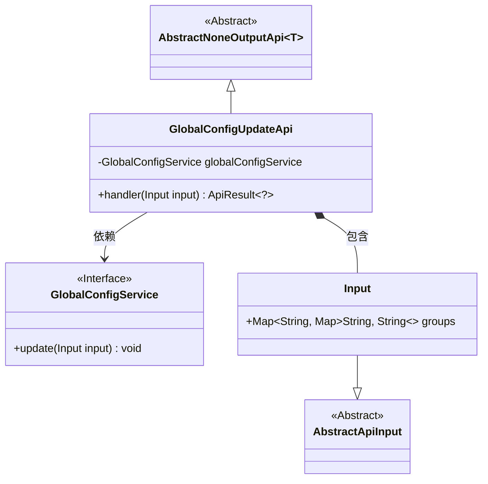

# 基础信息

|      |      |
|------|------|
| 名称 | GlobalConfigUpdateApi |
| 编码语言 | .java |
| 代码路径 | WeFe/board/board-service/src/main/java/com/welab/wefe/board/service/api/global_config/GlobalConfigUpdateApi.java |
| 包名 | com.welab.wefe.board.service.api.global_config |
| 依赖项 | ['com.welab.wefe.board.service.service.globalconfig.GlobalConfigService', 'com.welab.wefe.common.fieldvalidate.annotation.Check', 'com.welab.wefe.common.web.api.base.AbstractNoneOutputApi', 'com.welab.wefe.common.web.api.base.Api', 'com.welab.wefe.common.web.dto.AbstractApiInput', 'com.welab.wefe.common.web.dto.ApiResult', 'org.springframework.beans.factory.annotation.Autowired', 'java.util.Map'] |
| 概述说明 | 更新系统全局配置的API类，通过GlobalConfigService处理输入配置项组并返回成功结果。 |

# 说明

这是一个用于更新系统全局配置的API类，路径为global_config/update。该类继承自AbstractNoneOutputApi，泛型参数为内部类Input。通过Autowired注入GlobalConfigService服务，在handler方法中调用update方法完成配置更新并返回成功结果。Input类继承AbstractApiInput，包含一个必填的Map类型字段groups，用于接收配置项组数据，该字段有校验注解Check标记为必填项且名称为"配置项组"。整个API实现了配置更新的核心功能。

# 类列表 Class Summary

| 名称   | 类型  | 说明 |
|-------|------|-------------|
| GlobalConfigUpdateApi | class | Java类GlobalConfigUpdateApi用于更新系统全局配置，通过GlobalConfigService处理输入参数groups并返回成功结果。输入参数为必填的配置项组Map。 |

## 类 GlobalConfigUpdateApi

|      |      |
|------|------|
| 访问范围 | @Api(path = "global_config/update", name = "update system global configs");public |
| 类型 | class |
| 名称 | GlobalConfigUpdateApi |
| 说明 | Java类GlobalConfigUpdateApi用于更新系统全局配置，通过GlobalConfigService处理输入参数groups并返回成功结果。输入参数为必填的配置项组Map。 |

### UML类图

该代码展示了一个用于更新全局配置的API类结构。GlobalConfigUpdateApi继承自泛型抽象类AbstractNoneOutputApi，并实现了handler方法来处理输入参数。输入参数Input是一个嵌套类，包含一个分组的配置项映射，并继承自AbstractApiInput。GlobalConfigUpdateApi通过依赖注入的GlobalConfigService接口来实际执行配置更新操作。整个设计采用了分层抽象和依赖注入的模式，实现了配置更新功能的封装。

### 内部方法调用关系图

```mermaid
graph TD
    A["GlobalConfigUpdateApi类"]
    B["继承关系: AbstractNoneOutputApi<Input>"]
    C["依赖注入: @Autowired GlobalConfigService"]
    D["重写方法: handler(Input input)"]
    E["内部类: Input extends AbstractApiInput"]
    F["校验注解: @Check groups属性"]
    G["业务操作: globalConfigService.update(input)"]
    H["返回结果: success()"]

    A --> B
    A --> C
    A --> D
    D --> G
    D --> H
    A --> E
    E --> F
```

这段代码展示了一个Spring风格的API控制器类，用于更新全局配置。流程图清晰地呈现了类继承结构、关键方法调用和输入参数校验关系。GlobalConfigUpdateApi通过handler方法处理请求，调用GlobalConfigService执行更新操作，其Input内部类使用@Check注解强制校验配置项组参数。整个流程体现了从请求处理到服务调用的完整链路，同时保持了输入参数的强校验机制。

### 字段列表 Field List

| 名称  | 类型  | 说明 |
|-------|-------|------|
| globalConfigService | GlobalConfigService | 使用@Autowired自动注入GlobalConfigService实例。 |

### 方法列表

| 名称  | 类型  | 说明 |
|-------|-------|------|
| handler | ApiResult<?> | Java方法重写，调用globalConfigService更新输入配置，成功后返回ApiResult。 |

