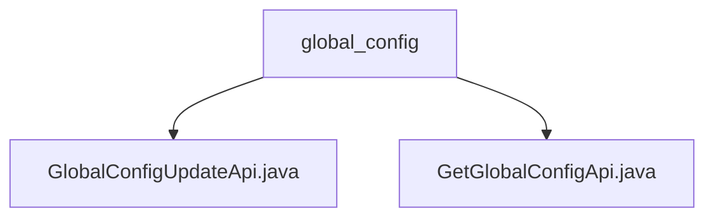

# 基础信息

|      |      |
|------|------|
| 名称 | global_config |
| 编码语言 | .java |
| 代码路径 | WeFe/board/board-service/src/main/java/com/welab/wefe/board/service/api/global_config |
| 包名 | docs.board.board-service.src.main.java.com.welab.wefe.board.service.api.global_config |
| 概述说明 | GlobalConfigUpdateApi用于更新系统配置，路径global_config/update，接收必填Map类型groups字段。GetGlobalConfigApi用于获取配置，路径global_config/get，接收必填groups列表，返回配置数据Map。两者均依赖GlobalConfigService实现功能。 |

# 说明

## 概述  
该模块核心职责是管理系统全局配置，提供配置更新和查询功能。接口规范包含两个API：`global_config/update`用于更新配置（类似配置中心写入模式），`global_config/get`用于批量查询配置。关键数据结构包括带`@Check`注解的Map类型`groups`字段和配置组名列表。外部依赖仅为`GlobalConfigService`服务。例如更新API通过泛型`Input`类接收配置项组数据，查询API返回包含配置模型的Map。

## 主要业务场景  
典型场景包括系统初始化配置更新和运行时动态获取配置。交互模式遵循标准API规范，通过`Input`内部类校验必填参数后调用服务层操作。功能完整性体现在支持批量组操作，例如可同时更新多个配置组或按组名列表查询。API类型包含无返回值的更新操作和返回Map的查询操作，集成案例类似配置中心的双向交互模式。

### 包内部结构视图

该流程图展示了global_config目录下的两个Java文件：GlobalConfigUpdateApi.java和GetGlobalConfigApi.java。这两个文件都直接隶属于global_config目录，没有更深层次的嵌套结构。图中清晰地呈现了文件与父目录之间的从属关系，符合Mermaid语法规范且节点命名简洁。

# 文件列表

| 名称   | 类型  | 说明 |
|-------|------|-------------|
| [GlobalConfigUpdateApi.java](GlobalConfigUpdateApi.md) | file | 更新系统全局配置的API类，通过GlobalConfigService处理输入配置项组并返回成功结果。 |
| [GetGlobalConfigApi.java](GetGlobalConfigApi.md) | file | 获取系统全局配置的API类，通过输入组名列表返回对应配置模型。使用GlobalConfigService处理请求，返回Map格式结果。输入需包含非空组名列表。 |

