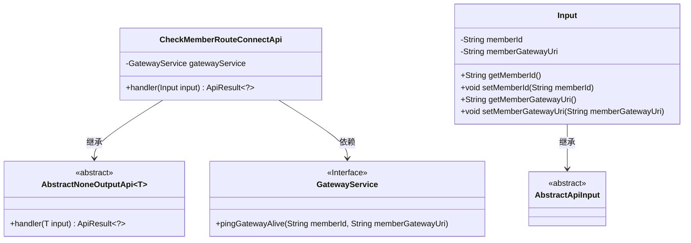

# 基础信息

|      |      |
|------|------|
| 名称 | CheckMemberRouteConnectApi |
| 编码语言 | .java |
| 代码路径 | WeFe/board/board-service/src/main/java/com/welab/wefe/board/service/api/member/CheckMemberRouteConnectApi.java |
| 包名 | com.welab.wefe.board.service.api.member |
| 依赖项 | ['com.welab.wefe.board.service.service.GatewayService', 'com.welab.wefe.common.exception.StatusCodeWithException', 'com.welab.wefe.common.fieldvalidate.annotation.Check', 'com.welab.wefe.common.web.api.base.AbstractNoneOutputApi', 'com.welab.wefe.common.web.api.base.Api', 'com.welab.wefe.common.web.dto.AbstractApiInput', 'com.welab.wefe.common.web.dto.ApiResult', 'org.springframework.beans.factory.annotation.Autowired'] |
| 概述说明 | 检查会员网关路由连接的API，需会员ID和网关地址，调用GatewayService的ping方法验证连通性。 |

# 说明

该代码定义了一个名为CheckMemberRouteConnectApi的API类，用于检查会员网关的路由连接。API路径为member/check_route_connect，功能描述为检查会员网关的路由连接。该类继承自AbstractNoneOutputApi，使用GatewayService的pingGatewayAlive方法验证指定会员ID和网关URI的连接状态。输入参数Input包含两个必填字段：memberId和memberGatewayUri，后者用于直接测试自身网关的存活状态。处理成功后返回空结果。

# 类列表 Class Summary

| 名称   | 类型  | 说明 |
|-------|------|-------------|
| CheckMemberRouteConnectApi | class | 检查会员网关路由连接的API，需会员ID和网关地址，调用服务验证连通性后返回成功结果。 |

## 类 CheckMemberRouteConnectApi

|      |      |
|------|------|
| 访问范围 | @Api(path = "member/check_route_connect", name = "Check route connect of member gateway", desc = "Check route connect of member gateway");public |
| 类型 | class |
| 名称 | CheckMemberRouteConnectApi |
| 说明 | 检查会员网关路由连接的API，需会员ID和网关地址，调用服务验证连通性后返回成功结果。 |

### UML类图

该代码展示了一个检查成员网关路由连接的API实现。核心类CheckMemberRouteConnectApi继承自泛型抽象类AbstractNoneOutputApi，并依赖GatewayService接口进行网关存活检测。Input类作为内部类继承AbstractApiInput，包含成员ID和网关URI两个必填字段。整体设计遵循了分层抽象原则，通过继承和依赖关系实现功能解耦。

### 内部方法调用关系图

```mermaid
graph TD
    A["类CheckMemberRouteConnectApi"]
    B["注解: @Api"]
    C["继承: AbstractNoneOutputApi<Input>"]
    D["依赖注入: @Autowired GatewayService"]
    E["重写方法: handler(Input input)"]
    F["调用: gatewayService.pingGatewayAlive"]
    G["返回: success()"]
    H["嵌套类Input"]
    I["继承: AbstractApiInput"]
    J["字段: @Check String memberId"]
    K["字段: @Check String memberGatewayUri"]
    L["Getter/Setter方法"]

    A --> B
    A --> C
    A --> D
    A --> E
    E --> F
    E --> G
    A --> H
    H --> I
    H --> J
    H --> K
    H --> L
```

这段代码定义了一个名为CheckMemberRouteConnectApi的API类，用于检查成员网关的路由连接。该类继承自AbstractNoneOutputApi，通过@Autowired注入GatewayService，并重写了handler方法处理输入参数。输入参数通过嵌套类Input定义，包含两个必填字段memberId和memberGatewayUri，并提供了相应的Getter/Setter方法。handler方法会调用gatewayService的pingGatewayAlive方法检查网关存活状态，最后返回成功结果。整个流程清晰地展示了API请求处理的数据流转和依赖关系。

### 字段列表 Field List

| 名称  | 类型  | 说明 |
|-------|-------|------|
| gatewayService | GatewayService | 使用@Autowired自动注入GatewayService实例。 |

### 方法列表

| 名称  | 类型  | 说明 |
|-------|-------|------|
| handler | ApiResult<?> | 该方法处理输入，调用网关服务检查成员网关存活状态，成功则返回成功结果。 |

