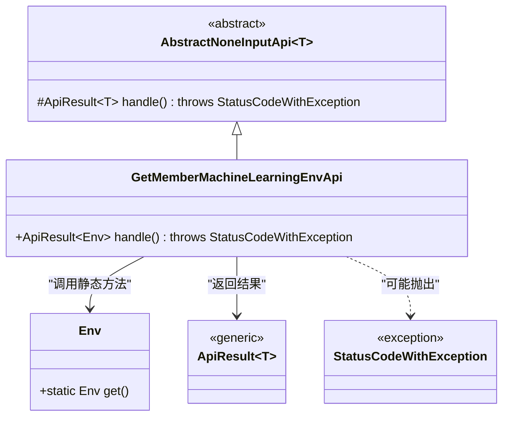
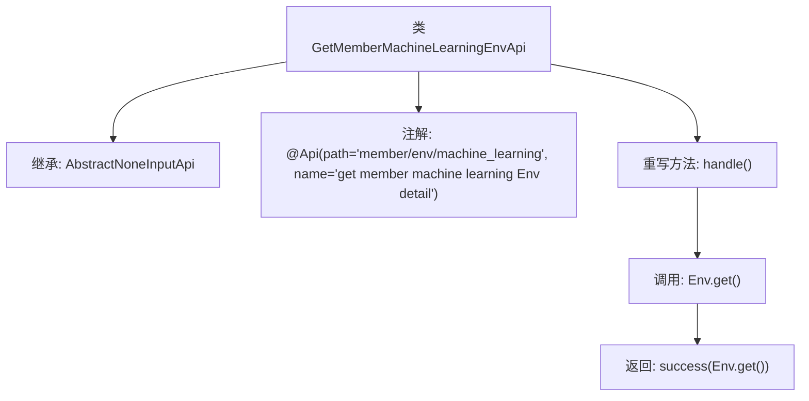

# 基础信息

|      |      |
|------|------|
| 名称 | GetMemberMachineLearningEnvApi |
| 编码语言 | .java |
| 代码路径 | WeFe/board/board-service/src/main/java/com/welab/wefe/board/service/api/member/GetMemberMachineLearningEnvApi.java |
| 包名 | com.welab.wefe.board.service.api.member |
| 依赖项 | ['com.welab.wefe.board.service.dto.kernel.machine_learning.Env', 'com.welab.wefe.common.exception.StatusCodeWithException', 'com.welab.wefe.common.web.api.base.AbstractNoneInputApi', 'com.welab.wefe.common.web.api.base.Api', 'com.welab.wefe.common.web.dto.ApiResult'] |
| 概述说明 | 获取成员机器学习环境详情的API类，继承自无输入抽象类，返回Env对象。 |

# 说明

这是一个名为GetMemberMachineLearningEnvApi的API类，路径为member/env/machine_learning，用于获取成员机器学习环境详情。它继承自AbstractNoneInputApi类，泛型指定返回Env类型。该API无需输入参数，通过handle方法直接调用Env.get()获取环境信息，并以ApiResult封装返回。整个实现简洁明了，仅包含核心业务逻辑。

# 类列表 Class Summary

| 名称   | 类型  | 说明 |
|-------|------|-------------|
| GetMemberMachineLearningEnvApi | class | 获取成员机器学习环境详情的API类，继承自无输入抽象类，直接返回Env对象。 |

## 类 GetMemberMachineLearningEnvApi

|      |      |
|------|------|
| 访问范围 | @Api(path = "member/env/machine_learning", name = "get member machine learning Env detail");public |
| 类型 | class |
| 名称 | GetMemberMachineLearningEnvApi |
| 说明 | 获取成员机器学习环境详情的API类，继承自无输入抽象类，直接返回Env对象。 |

### UML类图

这段类图展示了GetMemberMachineLearningEnvApi继承自泛型抽象类AbstractNoneInputApi，并实现了其handle方法。该API通过调用Env类的静态方法获取环境信息，返回封装在ApiResult中的结果，可能抛出StatusCodeWithException异常。图中清晰呈现了类的继承关系、方法调用和异常处理机制，体现了模板方法模式的应用。Env作为独立类提供环境数据，ApiResult作为泛型容器承载返回结果。

### 内部方法调用关系图

该流程图展示了GetMemberMachineLearningEnvApi类的结构，它继承自AbstractNoneInputApi<Env>类，并带有特定的API注解。类中重写了handle()方法，该方法调用Env.get()获取环境信息，并通过success()方法返回结果。整个流程清晰地描述了从方法调用到结果返回的步骤，体现了API处理请求的核心逻辑。

### 字段列表 Field List

| 名称  | 类型  | 说明 |
|-------|-------|------|

### 方法列表

| 名称  | 类型  | 说明 |
|-------|-------|------|
| handle | ApiResult<Env> | 该方法重写父类逻辑，直接返回Env对象的成功结果，不处理异常。 |

