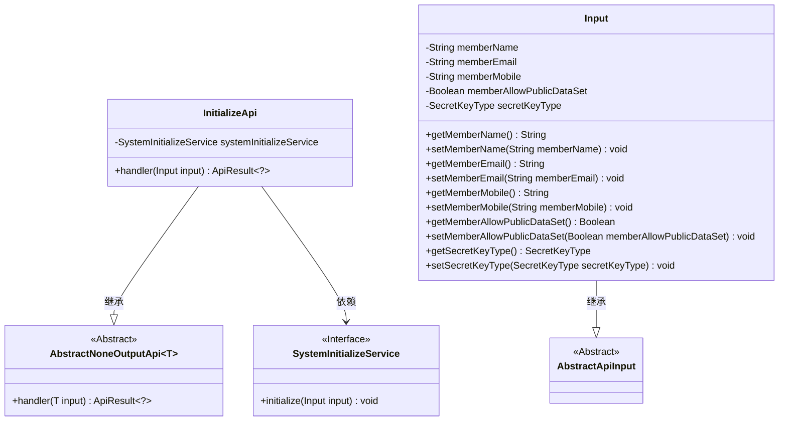

# 基础信息

|      |      |
|------|------|
| 名称 | InitializeApi |
| 编码语言 | .java |
| 代码路径 | WeFe/board/board-service/src/main/java/com/welab/wefe/board/service/api/member/InitializeApi.java |
| 包名 | com.welab.wefe.board.service.api.member |
| 依赖项 | ['com.welab.wefe.board.service.service.SystemInitializeService', 'com.welab.wefe.common.constant.SecretKeyType', 'com.welab.wefe.common.exception.StatusCodeWithException', 'com.welab.wefe.common.fieldvalidate.StandardFieldType', 'com.welab.wefe.common.fieldvalidate.annotation.Check', 'com.welab.wefe.common.web.api.base.AbstractNoneOutputApi', 'com.welab.wefe.common.web.api.base.Api', 'com.welab.wefe.common.web.dto.AbstractApiInput', 'com.welab.wefe.common.web.dto.ApiResult', 'org.springframework.beans.factory.annotation.Autowired'] |
| 概述说明 | 初始化系统API，路径为"member/initialize"。输入参数包括成员名称（3-12位中英文数字）、邮箱、电话、是否公开数据集及密钥类型（默认rsa）。调用SystemInitializeService进行初始化。 |

# 说明

该代码定义了一个名为InitializeApi的API类，用于初始化系统。API路径为member/initialize，继承自AbstractNoneOutputApi，输入参数为内部类Input。Input包含五个字段：memberName（必填，支持中英文数字，长度3-12）、memberEmail（邮箱格式）、memberMobile（电话格式）、memberAllowPublicDataSet（必填布尔值）和secretKeyType（默认rsa）。通过SystemInitializeService执行初始化操作，成功时返回空结果。所有字段均有校验规则和getter/setter方法。

# 类列表 Class Summary

| 名称   | 类型  | 说明 |
|-------|------|-------------|
| InitializeApi | class | 初始化系统API，路径为member/initialize，输入包括成员名称（3-12位中英文数字）、邮箱、电话、是否公开数据集及密钥类型，默认RSA。 |

## 类 InitializeApi

|      |      |
|------|------|
| 访问范围 | @Api(path = "member/initialize", name = "initialize system");public |
| 类型 | class |
| 名称 | InitializeApi |
| 说明 | 初始化系统API，路径为member/initialize，输入包括成员名称（3-12位中英文数字）、邮箱、电话、是否公开数据集及密钥类型，默认RSA。 |

### UML类图

这段代码展示了一个联邦成员初始化API的实现结构。InitializeApi继承自AbstractNoneOutputApi，处理包含成员名称、邮箱、电话等验证字段的Input参数，通过SystemInitializeService接口完成初始化操作。类图清晰地呈现了继承关系（InitializeApi→AbstractNoneOutputApi、Input→AbstractApiInput）和依赖关系（InitializeApi→SystemInitializeService），其中输入参数类Input包含多个带有正则校验规则的字段，并通过getter/setter方法暴露属性。整个设计体现了分层架构和依赖注入的思想。

### 内部方法调用关系图

```mermaid
graph TD
    A["类InitializeApi"]
    B["注解: @Api(path='member/initialize', name='initialize system')"]
    C["继承: AbstractNoneOutputApi<Input>"]
    D["依赖注入: @Autowired SystemInitializeService"]
    E["重写方法: handler(Input input)"]
    F["内部类: Input"]
    G["校验注解: @Check memberName"]
    H["校验注解: @Check memberEmail"]
    I["校验注解: @Check memberMobile"]
    J["校验注解: @Check memberAllowPublicDataSet"]
    K["校验注解: @Check secretKeyType"]
    L["getter/setter方法组"]
    M["调用: systemInitializeService.initialize(input)"]
    N["返回: success()"]

    A --> B
    A --> C
    A --> D
    A --> E
    E --> M
    E --> N
    A --> F
    F --> G
    F --> H
    F --> I
    F --> J
    F --> K
    F --> L
```

该流程图展示了InitializeApi类的完整结构，包含API注解、服务注入、输入参数校验和核心处理逻辑。类继承AbstractNoneOutputApi并实现handler方法，通过SystemInitializeService执行初始化操作。Input内部类包含5个带校验规则的字段，每个字段都有严格的格式验证要求。流程清晰呈现了从请求处理到服务调用的完整链路，特别突出了参数校验环节的重要性。

### 字段列表 Field List

| 名称  | 类型  | 说明 |
|-------|-------|------|
| systemInitializeService | SystemInitializeService | 使用@Autowired自动注入SystemInitializeService实例。 |

### 方法列表

| 名称  | 类型  | 说明 |
|-------|-------|------|
| handler | ApiResult<?> | 该方法重写父类handler，接收Input参数，调用systemInitializeService初始化输入，成功则返回ApiResult。异常时抛出StatusCodeWithException。 |

