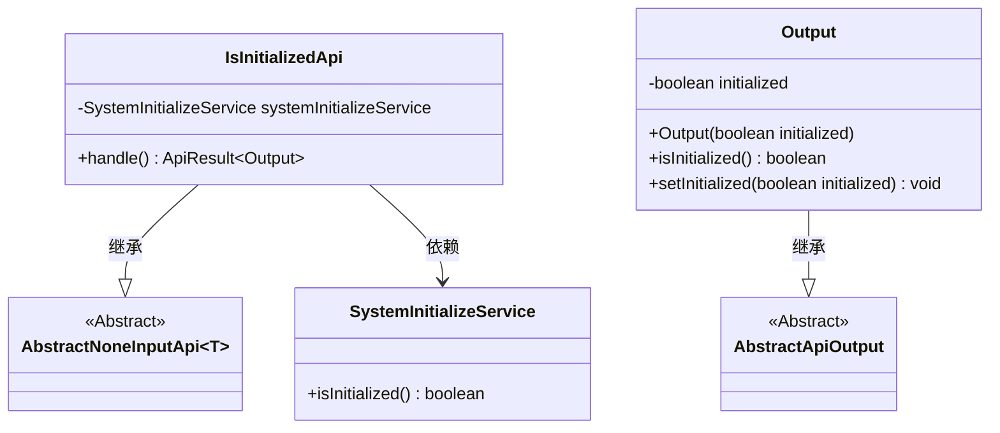
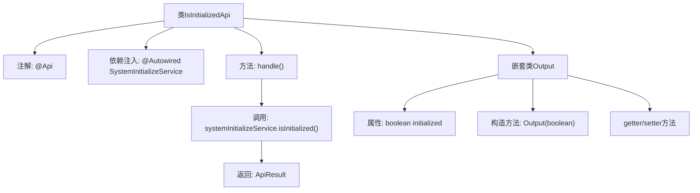

# 基础信息

|      |      |
|------|------|
| 名称 | IsInitializedApi |
| 编码语言 | .java |
| 代码路径 | WeFe/board/board-service/src/main/java/com/welab/wefe/board/service/api/member/IsInitializedApi.java |
| 包名 | com.welab.wefe.board.service.api.member |
| 依赖项 | ['com.welab.wefe.board.service.service.SystemInitializeService', 'com.welab.wefe.common.exception.StatusCodeWithException', 'com.welab.wefe.common.web.api.base.AbstractNoneInputApi', 'com.welab.wefe.common.web.api.base.Api', 'com.welab.wefe.common.web.dto.AbstractApiOutput', 'com.welab.wefe.common.web.dto.ApiResult', 'org.springframework.beans.factory.annotation.Autowired'] |
| 概述说明 | 这是一个检查系统是否初始化的API，路径为"member/is_initialized"。若未初始化，系统无法访问功能模块。返回结果包含初始化状态布尔值。 |

# 说明

这是一个名为IsInitializedApi的API类，用于检查系统是否已完成初始化。该API路径为member/is_initialized，功能描述指出系统在初始化前无法访问任何功能模块。该类继承自AbstractNoneInputApi，使用SystemInitializeService来获取初始化状态，并返回包含boolean类型initialized字段的Output对象。Output类提供了initialized的getter和setter方法。

# 类列表 Class Summary

| 名称   | 类型  | 说明 |
|-------|------|-------------|
| IsInitializedApi | class | 这是一个检查系统是否初始化的API类，通过调用SystemInitializeService判断状态并返回布尔值结果。 |

## 类 IsInitializedApi

|      |      |
|------|------|
| 访问范围 | @Api(;        path = "member/is_initialized",;        name = "is the system initialized",;        desc = "The system cannot access any functional modules before initialization";);public |
| 类型 | class |
| 名称 | IsInitializedApi |
| 说明 | 这是一个检查系统是否初始化的API类，通过调用SystemInitializeService判断状态并返回布尔值结果。 |

### UML类图

这段代码描述了一个检查系统是否初始化的API类结构。IsInitializedApi继承自泛型类AbstractNoneInputApi，其泛型参数为内部类Output。该类通过SystemInitializeService获取初始化状态，并返回包含boolean结果的Output对象。Output继承自AbstractApiOutput，封装了initialized状态字段及其访问方法。整体结构体现了API层与服务层的依赖关系，以及输出数据的封装逻辑。

### 内部方法调用关系图

这段代码定义了一个检查系统是否初始化的API类IsInitializedApi，继承自AbstractNoneInputApi。核心流程是通过handle方法调用SystemInitializeService的isInitialized方法，返回包含初始化状态的ApiResult。嵌套类Output用于封装初始化状态，提供标准的getter/setter方法。整个类通过@Api注解定义了API路径和描述信息，体现了典型的Spring Boot控制器设计模式。

### 字段列表 Field List

| 名称  | 类型  | 说明 |
|-------|-------|------|
| systemInitializeService | SystemInitializeService | 自动注入系统初始化服务实例。 |

### 方法列表

| 名称  | 类型  | 说明 |
|-------|-------|------|
| handle | ApiResult<Output> | 代码重写handle方法，返回系统初始化状态的ApiResult结果。 |

