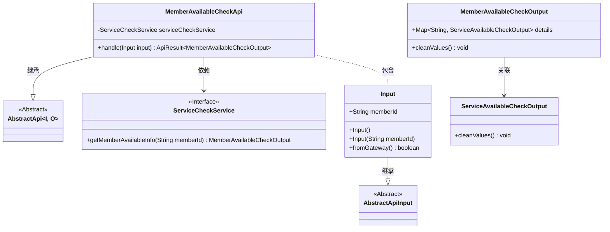

# 基础信息

|      |      |
|------|------|
| 名称 | MemberAvailableCheckApi |
| 编码语言 | .java |
| 代码路径 | WeFe/board/board-service/src/main/java/com/welab/wefe/board/service/api/member/MemberAvailableCheckApi.java |
| 包名 | com.welab.wefe.board.service.api.member |
| 依赖项 | ['com.welab.wefe.board.service.service.ServiceCheckService', 'com.welab.wefe.common.exception.StatusCodeWithException', 'com.welab.wefe.common.fieldvalidate.annotation.Check', 'com.welab.wefe.common.web.api.base.AbstractApi', 'com.welab.wefe.common.web.api.base.Api', 'com.welab.wefe.common.web.dto.AbstractApiInput', 'com.welab.wefe.common.web.dto.ApiResult', 'com.welab.wefe.common.wefe.checkpoint.dto.MemberAvailableCheckOutput', 'com.welab.wefe.common.wefe.checkpoint.dto.ServiceAvailableCheckOutput', 'org.springframework.beans.factory.annotation.Autowired'] |
| 概述说明 | 检查成员系统服务可用性的API，接收成员ID，返回服务状态信息，网关请求时清理细节值。 |

# 说明

该代码定义了一个名为MemberAvailableCheckApi的API类，用于检查成员系统服务的可用性。API路径为"member/available"，继承自AbstractApi，输入类型为MemberAvailableCheckApi.Input，输出类型为MemberAvailableCheckOutput。类中注入了ServiceCheckService用于获取成员可用性信息。handle方法处理输入参数，调用服务获取输出结果，并根据是否来自网关决定是否清理输出细节。Input内部类继承AbstractApiInput，包含必填的memberId字段，并提供无参和有参构造方法。整个API专注于验证成员服务状态，返回处理后的可用性信息。

# 类列表 Class Summary

| 名称   | 类型  | 说明 |
|-------|------|-------------|
| MemberAvailableCheckApi | class | 成员服务可用性检查API，通过memberId验证系统服务状态，支持网关过滤敏感信息。 |

## 类 MemberAvailableCheckApi

|      |      |
|------|------|
| 访问范围 | @Api(path = "member/available", name = "Check whether the member’s system services are available");public |
| 类型 | class |
| 名称 | MemberAvailableCheckApi |
| 说明 | 成员服务可用性检查API，通过memberId验证系统服务状态，支持网关过滤敏感信息。 |

### UML类图

类图展示了会员可用性检查API的结构。MemberAvailableCheckApi继承自泛型抽象类AbstractApi，依赖ServiceCheckService接口进行服务检查，并包含嵌套类Input。Input继承自AbstractApiInput，包含会员ID字段。MemberAvailableCheckOutput类通过Map关联ServiceAvailableCheckOutput，提供清理细节数据的方法。整体设计体现了分层和组合关系，支持网关调用的特殊处理逻辑。

### 内部方法调用关系图

```mermaid
graph TD
    A["类MemberAvailableCheckApi"]
    B["继承: AbstractApi<Input, MemberAvailableCheckOutput>"]
    C["注解: @Api(path='member/available', name='Check whether the member’s system services are available')"]
    D["依赖注入: @Autowired ServiceCheckService"]
    E["重写方法: handle(Input input)"]
    F["调用: serviceCheckService.getMemberAvailableInfo(input.memberId)"]
    G["条件判断: input.fromGateway()"]
    H["操作: output.details.values().forEach(ServiceAvailableCheckOutput::cleanValues)"]
    I["返回: success(output)"]
    J["嵌套类Input"]
    K["继承: AbstractApiInput"]
    L["注解: @Check(name='成员id', require=true)"]
    M["属性: String memberId"]
    N["构造方法: Input()"]
    O["构造方法: Input(String memberId)"]

    A --> B
    A --> C
    A --> D
    A --> E
    E --> F
    E --> G
    G -->|是| H
    H --> I
    G -->|否| I
    A --> J
    J --> K
    J --> L
    J --> M
    J --> N
    J --> O
```

这段代码描述了一个检查成员系统服务可用性的API类MemberAvailableCheckApi，它继承自AbstractApi并处理输入输出。主要流程包括：通过serviceCheckService获取成员可用信息，根据输入来源决定是否清理输出细节，最后返回成功结果。嵌套类Input定义了成员ID字段及其校验规则，包含两个构造方法。整个流程展示了从请求处理到结果返回的完整逻辑链。

### 字段列表 Field List

| 名称  | 类型  | 说明 |
|-------|-------|------|
| serviceCheckService | ServiceCheckService | 自动注入ServiceCheckService服务实例。 |

### 方法列表

| 名称  | 类型  | 说明 |
|-------|-------|------|
| handle | ApiResult<MemberAvailableCheckOutput> | 该方法处理成员可用性检查请求，调用服务获取信息，若来自网关则清理敏感数据，最后返回结果。 |

