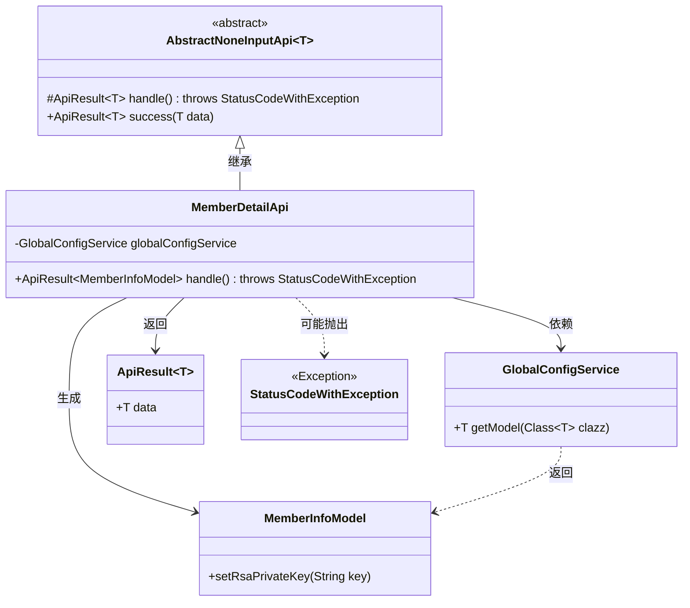
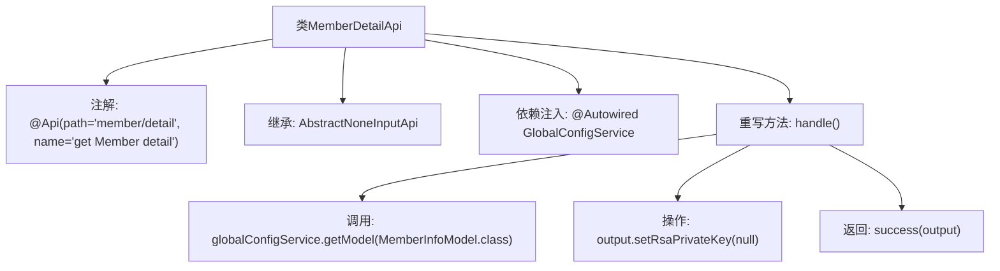

# 基础信息

|      |      |
|------|------|
| 名称 | MemberDetailApi |
| 编码语言 | .java |
| 代码路径 | WeFe/board/board-service/src/main/java/com/welab/wefe/board/service/api/member/MemberDetailApi.java |
| 包名 | com.welab.wefe.board.service.api.member |
| 依赖项 | ['com.welab.wefe.board.service.service.globalconfig.GlobalConfigService', 'com.welab.wefe.common.exception.StatusCodeWithException', 'com.welab.wefe.common.web.api.base.AbstractNoneInputApi', 'com.welab.wefe.common.web.api.base.Api', 'com.welab.wefe.common.web.dto.ApiResult', 'com.welab.wefe.common.wefe.dto.global_config.MemberInfoModel', 'org.springframework.beans.factory.annotation.Autowired'] |
| 概述说明 | 成员详情API类，继承抽象无输入API，通过全局配置服务获取MemberInfoModel，清除私钥后返回结果。 |

# 说明

这是一个名为MemberDetailApi的Java类，用于获取会员详细信息。该类继承自AbstractNoneInputApi，泛型指定返回MemberInfoModel类型。通过@Api注解定义了API路径为"member/detail"和名称为"get Member detail"。类中注入了GlobalConfigService服务，在handle方法中调用该服务获取MemberInfoModel实例，并将rsaPrivateKey字段设为null后返回。整个API不接收输入参数，直接返回处理后的会员信息模型。

# 类列表 Class Summary

| 名称   | 类型  | 说明 |
|-------|------|-------------|
| MemberDetailApi | class | 成员详情API类，路径"member/detail"，无输入参数，返回MemberInfoModel数据。处理逻辑：通过globalConfigService获取模型并清空私钥后返回。 |

## 类 MemberDetailApi

|      |      |
|------|------|
| 访问范围 | @Api(path = "member/detail", name = "get Member detail");public |
| 类型 | class |
| 名称 | MemberDetailApi |
| 说明 | 成员详情API类，路径"member/detail"，无输入参数，返回MemberInfoModel数据。处理逻辑：通过globalConfigService获取模型并清空私钥后返回。 |

### UML类图

类图描述：该图展示了一个会员详情API的实现结构，MemberDetailApi继承自泛型抽象类AbstractNoneInputApi，通过GlobalConfigService获取MemberInfoModel数据模型，并返回包含处理结果的ApiResult对象。其中涉及异常处理StatusCodeWithException，且MemberInfoModel会清除RSA私钥信息。各组件间通过依赖关系和继承关系组织，形成清晰的业务逻辑链路。

### 内部方法调用关系图

该流程图展示了MemberDetailApi类的核心结构和工作流程。类通过@Api注解定义接口路径，继承抽象模板类处理无输入参数的请求。主要逻辑在handle()方法中实现：通过全局配置服务获取会员信息模型，清除敏感字段后返回成功响应。流程清晰展现了从依赖注入到业务处理的完整调用链，突出了Spring框架的注解驱动特性和模板方法模式的应用。

### 字段列表 Field List

| 名称  | 类型  | 说明 |
|-------|-------|------|
| globalConfigService | GlobalConfigService | 使用@Autowired自动注入GlobalConfigService实例。 |

### 方法列表

| 名称  | 类型  | 说明 |
|-------|-------|------|
| handle | ApiResult<MemberInfoModel> | 该方法重写父类逻辑，获取MemberInfoModel实例并清除其RSA私钥后返回成功结果。 |

