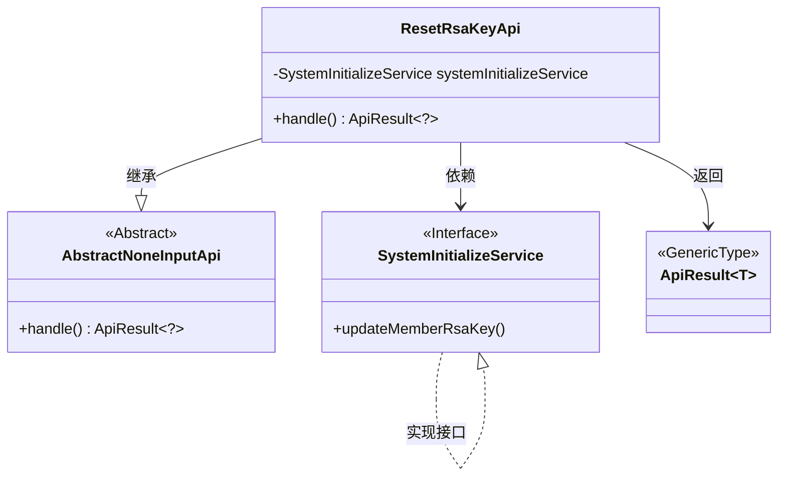
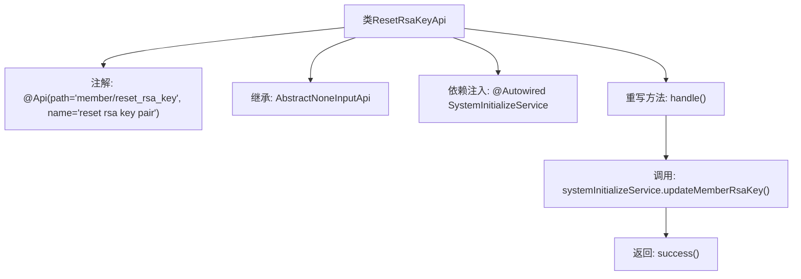

# 基础信息

|      |      |
|------|------|
| 名称 | ResetRsaKeyApi |
| 编码语言 | .java |
| 代码路径 | WeFe/board/board-service/src/main/java/com/welab/wefe/board/service/api/member/ResetRsaKeyApi.java |
| 包名 | com.welab.wefe.board.service.api.member |
| 依赖项 | ['com.welab.wefe.board.service.service.SystemInitializeService', 'com.welab.wefe.common.exception.StatusCodeWithException', 'com.welab.wefe.common.web.api.base.AbstractNoneInputApi', 'com.welab.wefe.common.web.api.base.Api', 'com.welab.wefe.common.web.dto.ApiResult', 'org.springframework.beans.factory.annotation.Autowired'] |
| 概述说明 | 该代码定义了一个名为ResetRsaKeyApi的API类，用于重置成员的RSA密钥对。通过调用systemInitializeService的updateMemberRsaKey方法实现功能，成功后返回ApiResult。 |

# 说明

该代码定义了一个名为ResetRsaKeyApi的API类，用于重置RSA密钥对。它继承自AbstractNoneInputApi，表明该接口不需要输入参数。通过@Api注解指定了路径为member/reset_rsa_key，并命名为reset rsa key pair。类中注入了SystemInitializeService服务，在handle方法中调用其updateMemberRsaKey方法来更新成员RSA密钥，最后返回成功结果。整个API功能明确，结构简洁，专注于执行RSA密钥重置操作。

# 类列表 Class Summary

| 名称   | 类型  | 说明 |
|-------|------|-------------|
| ResetRsaKeyApi | class | 重置会员RSA密钥的API类，调用SystemInitializeService更新密钥，无输入参数，返回成功结果。 |

## 类 ResetRsaKeyApi

|      |      |
|------|------|
| 访问范围 | @Api(path = "member/reset_rsa_key", name = "reset rsa key pair");public |
| 类型 | class |
| 名称 | ResetRsaKeyApi |
| 说明 | 重置会员RSA密钥的API类，调用SystemInitializeService更新密钥，无输入参数，返回成功结果。 |

### UML类图

类图描述：ResetRsaKeyApi继承自AbstractNoneInputApi抽象类，依赖SystemInitializeService接口实现密钥更新功能。通过handle()方法返回泛型ApiResult结果，整体结构展示了一个典型的Spring Boot控制器层实现，包含依赖注入、抽象方法重写和接口调用关系。

### 内部方法调用关系图

这段代码展示了一个名为ResetRsaKeyApi的类，它继承自AbstractNoneInputApi，并通过注解定义了API路径和名称。类中通过@Autowired注入了SystemInitializeService，并重写了handle方法，在该方法中调用了updateMemberRsaKey()来更新成员的RSA密钥对，最后返回一个成功的ApiResult。流程图清晰地展示了类的结构、依赖关系和方法调用流程。

### 字段列表 Field List

| 名称  | 类型  | 说明 |
|-------|-------|------|
| systemInitializeService | SystemInitializeService | 自动注入系统初始化服务实例。 |

### 方法列表

| 名称  | 类型  | 说明 |
|-------|-------|------|
| handle | ApiResult<?> | 该方法重写父类逻辑，调用服务更新成员RSA密钥，成功返回空结果。异常时抛出状态码异常。 |

