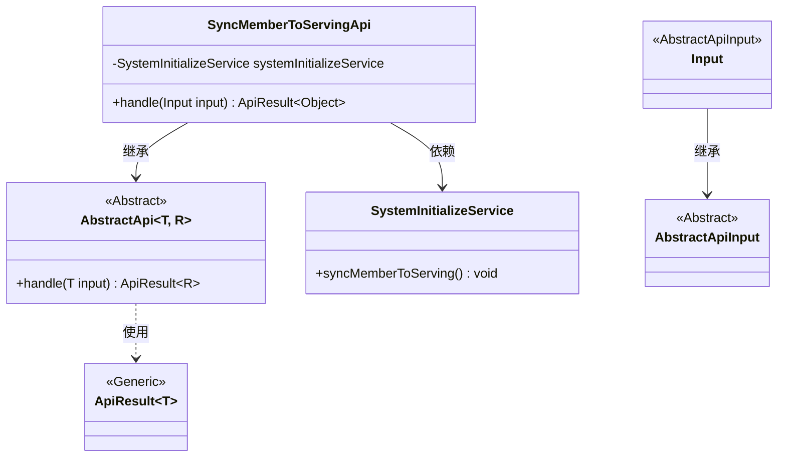
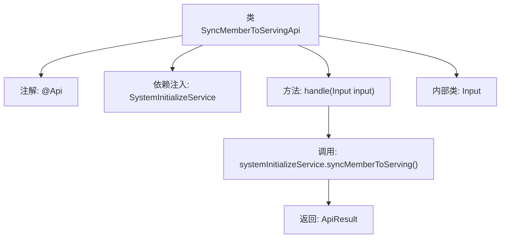

# 基础信息

|      |      |
|------|------|
| 名称 | SyncMemberToServingApi |
| 编码语言 | .java |
| 代码路径 | WeFe/board/board-service/src/main/java/com/welab/wefe/board/service/api/member/SyncMemberToServingApi.java |
| 包名 | com.welab.wefe.board.service.api.member |
| 依赖项 | ['com.welab.wefe.board.service.service.SystemInitializeService', 'com.welab.wefe.common.web.api.base.AbstractApi', 'com.welab.wefe.common.web.api.base.Api', 'com.welab.wefe.common.web.dto.AbstractApiInput', 'com.welab.wefe.common.web.dto.ApiResult', 'org.springframework.beans.factory.annotation.Autowired'] |
| 概述说明 | 同步会员信息至服务端，用于联盟数据丢失后的会员恢复。 |

# 说明

该代码定义了一个名为SyncMemberToServingApi的API类，用于将成员信息同步到服务端，主要解决联盟数据丢失后的会员恢复问题。API路径为member/sync_to_serving，继承自AbstractApi类，使用泛型指定输入类型为内部类Input，返回类型为Object。通过Autowired注入SystemInitializeService服务，在handle方法中调用syncMemberToServing方法完成同步操作，并返回成功结果。Input类继承自AbstractApiInput，未定义额外字段。

# 类列表 Class Summary

| 名称   | 类型  | 说明 |
|-------|------|-------------|
| SyncMemberToServingApi | class | 同步会员信息至服务端，用于联盟数据丢失后的会员恢复。 |

## 类 SyncMemberToServingApi

|      |      |
|------|------|
| 访问范围 | @Api(;        path = "member/sync_to_serving",;        name = "Synchronize member information to union",;        desc = "Used for membership recovery after union data loss";);public |
| 类型 | class |
| 名称 | SyncMemberToServingApi |
| 说明 | 同步会员信息至服务端，用于联盟数据丢失后的会员恢复。 |

### UML类图

该代码展示了一个会员信息同步API的实现结构，SyncMemberToServingApi继承自泛型抽象类AbstractApi，通过SystemInitializeService完成核心同步逻辑。Input作为内部类继承AbstractApiInput，处理请求参数。整体设计采用分层架构，抽象类定义模板方法，具体API实现业务逻辑，符合面向对象设计原则。

### 内部方法调用关系图

该流程图展示了SyncMemberToServingApi类的核心结构，包含类注解、依赖注入的服务、主要处理方法及内部输入类。handle方法通过调用systemInitializeService完成成员同步，最终返回封装结果。流程清晰体现了从请求处理到服务调用的完整链路，符合API类设计的典型模式。

### 字段列表 Field List

| 名称  | 类型  | 说明 |
|-------|-------|------|
| systemInitializeService | SystemInitializeService | 使用@Autowired自动注入SystemInitializeService实例。 |

### 方法列表

| 名称  | 类型  | 说明 |
|-------|-------|------|
| handle | ApiResult<Object> | 方法重写处理输入，调用服务同步成员数据，返回成功结果。 |

