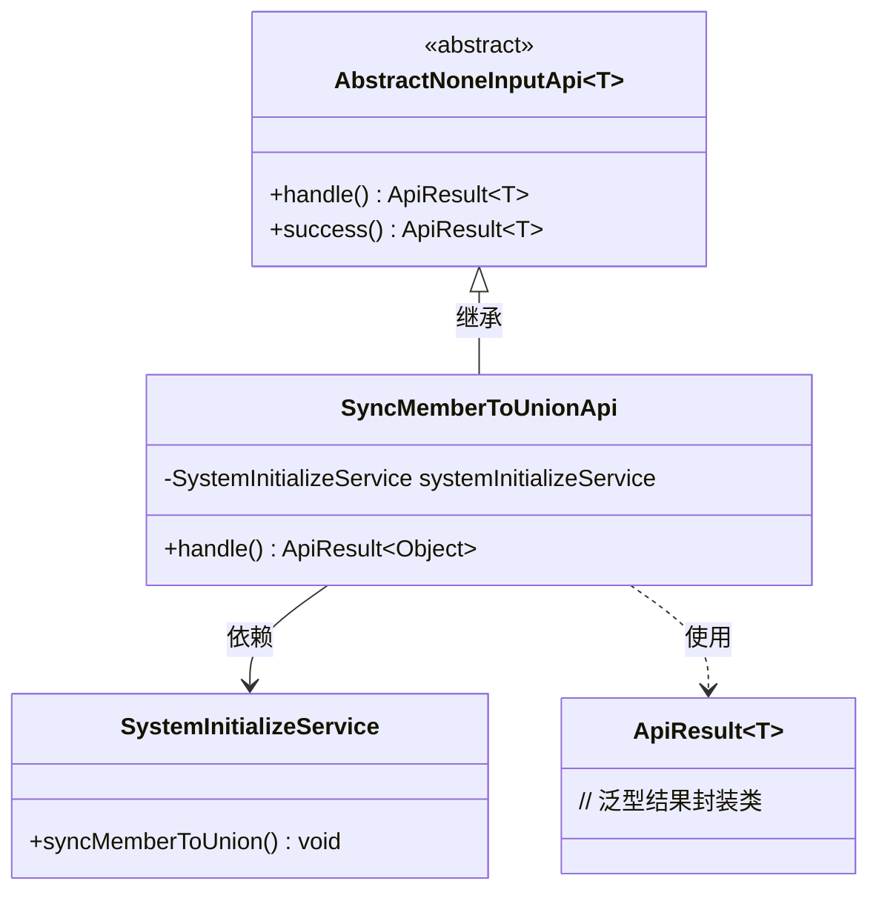
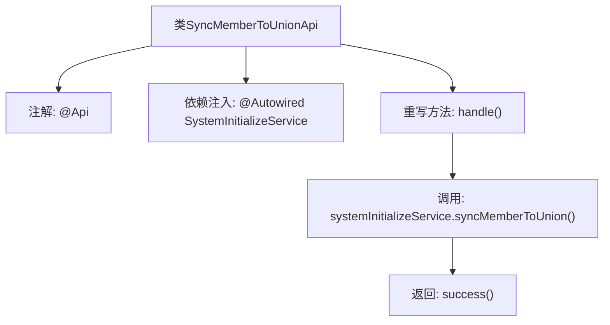

# 基础信息

|      |      |
|------|------|
| 名称 | SyncMemberToUnionApi |
| 编码语言 | .java |
| 代码路径 | WeFe/board/board-service/src/main/java/com/welab/wefe/board/service/api/member/SyncMemberToUnionApi.java |
| 包名 | com.welab.wefe.board.service.api.member |
| 依赖项 | ['com.welab.wefe.board.service.service.SystemInitializeService', 'com.welab.wefe.common.exception.StatusCodeWithException', 'com.welab.wefe.common.web.api.base.AbstractNoneInputApi', 'com.welab.wefe.common.web.api.base.Api', 'com.welab.wefe.common.web.dto.ApiResult', 'org.springframework.beans.factory.annotation.Autowired'] |
| 概述说明 | 同步会员信息至联盟的API，用于联盟数据丢失后的会员恢复，调用SystemInitializeService实现同步功能。 |

# 说明

这是一个名为SyncMemberToUnionApi的API类，用于将成员信息同步到联盟系统。该API的主要用途是在联盟数据丢失后进行会员信息恢复。它继承自AbstractNoneInputApi基类，表示该接口不需要输入参数。类中通过自动注入SystemInitializeService服务，调用syncMemberToUnion方法实现同步功能。处理成功后返回空结果对象。API路径为member/sync_to_union，功能描述明确说明了其数据恢复用途。整个实现简洁直接，仅包含必要的业务逻辑调用和成功返回。

# 类列表 Class Summary

| 名称   | 类型  | 说明 |
|-------|------|-------------|
| SyncMemberToUnionApi | class | 同步会员信息至联盟的API，用于联盟数据丢失后的会员恢复。 |

## 类 SyncMemberToUnionApi

|      |      |
|------|------|
| 访问范围 | @Api(;        path = "member/sync_to_union",;        name = "Synchronize member information to union",;        desc = "Used for membership recovery after union data loss";);public |
| 类型 | class |
| 名称 | SyncMemberToUnionApi |
| 说明 | 同步会员信息至联盟的API，用于联盟数据丢失后的会员恢复。 |

### UML类图

该代码展示了一个用于成员信息同步的API实现类SyncMemberToUnionApi，继承自泛型抽象类AbstractNoneInputApi。通过依赖SystemInitializeService完成核心业务逻辑，返回封装在ApiResult中的空结果。类图清晰呈现了继承关系、服务依赖和泛型结果封装，体现了Spring依赖注入和模板方法模式的应用。

### 内部方法调用关系图

这段代码定义了一个名为SyncMemberToUnionApi的API类，用于将成员信息同步到联盟系统。类通过@Api注解定义了路径、名称和描述信息，继承自AbstractNoneInputApi并重写了handle方法。在handle方法中调用了systemInitializeService的syncMemberToUnion方法完成同步操作，最后返回成功结果。流程图展示了从类定义到方法调用的完整执行路径。

### 字段列表 Field List

| 名称  | 类型  | 说明 |
|-------|-------|------|
| systemInitializeService | SystemInitializeService | 自动注入系统初始化服务实例。 |

### 方法列表

| 名称  | 类型  | 说明 |
|-------|-------|------|
| handle | ApiResult<Object> | 覆盖方法处理同步成员到联盟，成功返回结果。 |

