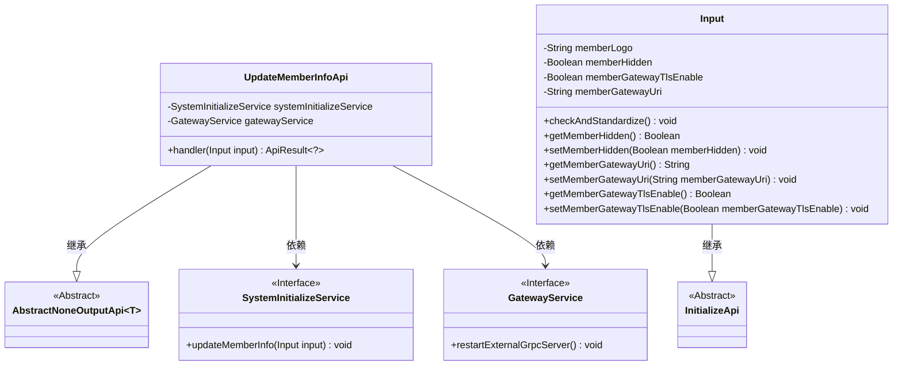

# 基础信息

|      |      |
|------|------|
| 名称 | UpdateMemberInfoApi |
| 编码语言 | .java |
| 代码路径 | WeFe/board/board-service/src/main/java/com/welab/wefe/board/service/api/member/UpdateMemberInfoApi.java |
| 包名 | com.welab.wefe.board.service.api.member |
| 依赖项 | ['com.welab.wefe.board.service.service.GatewayService', 'com.welab.wefe.board.service.service.SystemInitializeService', 'com.welab.wefe.common.Convert', 'com.welab.wefe.common.StatusCode', 'com.welab.wefe.common.exception.StatusCodeWithException', 'com.welab.wefe.common.fieldvalidate.annotation.Check', 'com.welab.wefe.common.web.api.base.AbstractNoneOutputApi', 'com.welab.wefe.common.web.api.base.Api', 'com.welab.wefe.common.web.dto.ApiResult', 'org.springframework.beans.factory.annotation.Autowired'] |
| 概述说明 | 更新成员信息的API类，包含成员logo、隐身状态、TLS通信和网关地址等输入参数，校验网关地址端口有效性，调用服务更新信息并通知网关刷新缓存。 |

# 说明

该代码定义了一个名为UpdateMemberInfoApi的API类，用于更新成员信息。API路径为"member/update"，继承自AbstractNoneOutputApi，输入类型为内部类Input。主要功能包括调用systemInitializeService更新成员信息，并通过gatewayService重启外部gRPC服务器以刷新缓存。Input类包含成员logo、隐身状态、TLS通信开关和必填的网关通信地址等字段，其中网关地址需校验端口范围（1-65535）。类中提供了各字段的getter和setter方法，并在checkAndStandardize方法中执行参数标准化和验证逻辑。

# 类列表 Class Summary

| 名称   | 类型  | 说明 |
|-------|------|-------------|
| UpdateMemberInfoApi | class | 更新成员信息的API类，包含成员logo、隐身状态、TLS通信和网关地址等输入参数，校验网关地址端口有效性，调用服务更新信息并通知网关刷新缓存。 |

## 类 UpdateMemberInfoApi

|      |      |
|------|------|
| 访问范围 | @Api(path = "member/update", name = "update member info");public |
| 类型 | class |
| 名称 | UpdateMemberInfoApi |
| 说明 | 更新成员信息的API类，包含成员logo、隐身状态、TLS通信和网关地址等输入参数，校验网关地址端口有效性，调用服务更新信息并通知网关刷新缓存。 |

### UML类图

这段代码展示了一个成员信息更新API的实现。UpdateMemberInfoApi继承自AbstractNoneOutputApi，处理成员信息更新请求，通过SystemInitializeService更新成员信息，并通过GatewayService重启外部gRPC服务。Input类继承自InitializeApi，包含成员logo、隐身状态、TLS通信开关和网关地址等字段，并提供了参数校验逻辑。类图清晰地展示了类之间的继承和依赖关系。

### 内部方法调用关系图

```mermaid
graph TD
    A["类UpdateMemberInfoApi"]
    B["注解: @Api(path='member/update', name='update member info')"]
    C["继承: AbstractNoneOutputApi<Input>"]
    D["依赖注入: @Autowired SystemInitializeService"]
    E["依赖注入: @Autowired GatewayService"]
    F["重写方法: handler(Input input)"]
    G["调用: systemInitializeService.updateMemberInfo"]
    H["调用: gatewayService.restartExternalGrpcServer"]
    I["返回: success()"]
    J["嵌套类: Input"]
    K["继承: InitializeApi.Input"]
    L["字段: @Check memberLogo"]
    M["字段: @Check memberHidden"]
    N["字段: @Check memberGatewayTlsEnable"]
    O["字段: @Check memberGatewayUri"]
    P["方法: checkAndStandardize()"]
    Q["校验: 端口范围1~65535"]
    R["抛出异常: StatusCodeWithException"]

    A --> B
    A --> C
    A --> D
    A --> E
    A --> F
    F --> G
    F --> H
    F --> I
    A --> J
    J --> K
    J --> L
    J --> M
    J --> N
    J --> O
    J --> P
    P --> Q
    Q -->|无效端口| R
```

这段代码是用于更新成员信息的API类，继承自抽象基类并实现了核心处理逻辑。流程图展示了类结构关系，包括依赖注入的服务、主要处理方法和输入参数的校验过程。其中handler方法会调用两个服务进行成员信息更新和网关重启，Input类通过继承和字段校验确保参数合法性，特别对网关URI的端口进行了严格范围检查。

### 字段列表 Field List

| 名称  | 类型  | 说明 |
|-------|-------|------|
| gatewayService | GatewayService | 自动注入GatewayService实例。 |
| systemInitializeService | SystemInitializeService | 自动注入系统初始化服务实例。 |

### 方法列表

| 名称  | 类型  | 说明 |
|-------|-------|------|
| handler | ApiResult<?> | 处理输入并更新成员信息，通知网关刷新缓存，最后返回成功结果。 |

