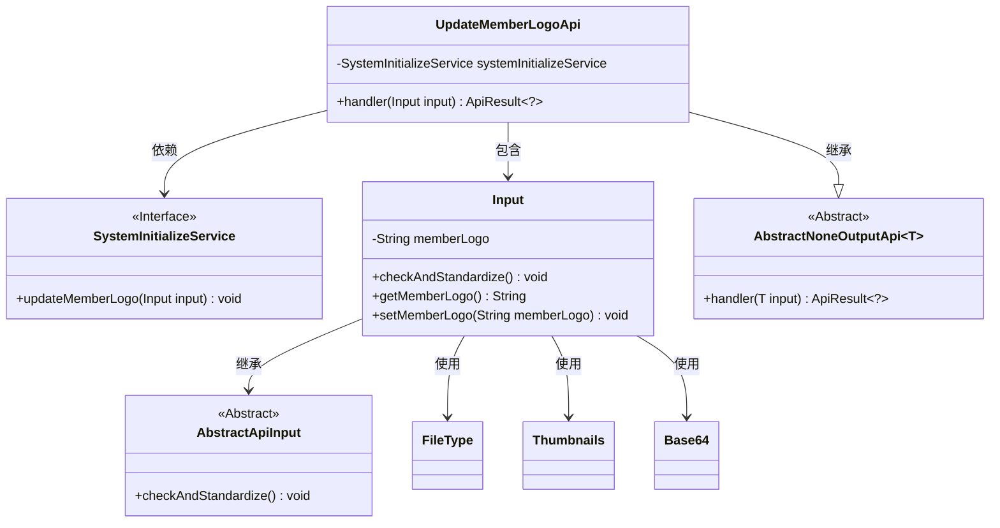
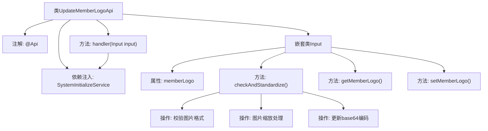

# 基础信息

|      |      |
|------|------|
| 名称 | UpdateMemberLogoApi |
| 编码语言 | .java |
| 代码路径 | WeFe/board/board-service/src/main/java/com/welab/wefe/board/service/api/member/UpdateMemberLogoApi.java |
| 包名 | com.welab.wefe.board.service.api.member |
| 依赖项 | ['com.welab.wefe.board.service.service.SystemInitializeService', 'com.welab.wefe.common.StatusCode', 'com.welab.wefe.common.exception.StatusCodeWithException', 'com.welab.wefe.common.fieldvalidate.annotation.Check', 'com.welab.wefe.common.util.FileType', 'com.welab.wefe.common.util.StringUtil', 'com.welab.wefe.common.web.api.base.AbstractNoneOutputApi', 'com.welab.wefe.common.web.api.base.Api', 'com.welab.wefe.common.web.dto.AbstractApiInput', 'com.welab.wefe.common.web.dto.ApiResult', 'net.coobird.thumbnailator.Thumbnails', 'org.apache.commons.codec.binary.Base64', 'org.springframework.beans.factory.annotation.Autowired', 'java.io.ByteArrayInputStream', 'java.io.ByteArrayOutputStream', 'java.io.IOException'] |
| 概述说明 | 更新成员logo的API，接收base64图片，校验格式并缩放处理，防止恶意内容。 |

# 说明

该代码定义了一个名为UpdateMemberLogoApi的API类，用于更新成员logo。API路径为member/update_logo，接受一个包含成员logo的输入参数。输入参数memberLogo需为Base64编码的图片数据，系统会校验图片格式，并对图片进行缩放处理以过滤潜在恶意内容。处理完成后，返回成功结果。输入类Input继承自AbstractApiInput，包含参数校验和标准化逻辑，确保图片数据有效且安全。

# 类列表 Class Summary

| 名称   | 类型  | 说明 |
|-------|------|-------------|
| UpdateMemberLogoApi | class | 更新成员logo的API，验证图片格式并处理，防止恶意内容。 |

## 类 UpdateMemberLogoApi

|      |      |
|------|------|
| 访问范围 | @Api(path = "member/update_logo", name = "update member logo");public |
| 类型 | class |
| 名称 | UpdateMemberLogoApi |
| 说明 | 更新成员logo的API，验证图片格式并处理，防止恶意内容。 |

### UML类图

类图描述：该图展示了UpdateMemberLogoApi及其相关类的结构。UpdateMemberLogoApi继承自泛型类AbstractNoneOutputApi，包含一个内部类Input。Input继承自AbstractApiInput，负责验证和处理成员logo图片数据。UpdateMemberLogoApi通过SystemInitializeService接口更新成员logo，依赖Base64、Thumbnails等工具类进行图片处理。整体结构体现了API请求处理、输入验证和业务逻辑分离的设计。

### 内部方法调用关系图

流程图描述了UpdateMemberLogoApi类的结构和主要处理流程。该类是一个API接口，用于更新成员logo图片。核心流程包括：通过handler方法接收输入参数，调用系统服务处理请求；Input嵌套类负责参数校验，其中checkAndStandardize方法会验证图片格式、进行安全缩放处理，并重新生成base64编码。整个过程包含图片格式验证、安全处理和编码转换三个关键步骤。

### 字段列表 Field List

| 名称  | 类型  | 说明 |
|-------|-------|------|
| systemInitializeService | SystemInitializeService | 自动注入系统初始化服务实例。 |

### 方法列表

| 名称  | 类型  | 说明 |
|-------|-------|------|
| handler | ApiResult<?> | 方法重写处理输入，调用服务更新成员标志，成功返回结果。 |

