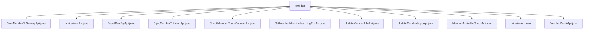

# 基础信息

|      |      |
|------|------|
| 名称 | member |
| 编码语言 | .java |
| 代码路径 | WeFe/board/board-service/src/main/java/com/welab/wefe/board/service/api/member |
| 包名 | docs.board.board-service.src.main.java.com.welab.wefe.board.service.api.member |
| 概述说明 | SyncMemberToServingApi同步会员信息到服务端。IsInitializedApi检查系统初始化状态。ResetRsaKeyApi重置RSA密钥。SyncMemberToUnionApi同步会员到联盟。CheckMemberRouteConnectApi检查会员路由连接。GetMemberMachineLearningEnvApi获取会员机器学习环境。UpdateMemberInfoApi更新会员信息。UpdateMemberLogoApi更新会员logo。MemberAvailableCheckApi检查会员服务可用性。InitializeApi初始化系统。MemberDetailApi获取会员详情。 |

# 说明

## 概述  
该模块核心职责为管理联盟成员信息，包括初始化、同步、状态检查和属性更新等功能，类似会员管理中心。接口规范遵循RESTful风格，路径均以`member/`开头，继承AbstractApi系列基类，输入输出类型明确。关键数据结构包括Input类（含字段校验）、Output类（如Env/MemberInfoModel）和MemberAvailableCheckOutput等。外部依赖包括SystemInitializeService、GatewayService和GlobalConfigService等。例如SyncMemberToServingApi通过SystemInitializeService同步数据，UpdateMemberInfoApi依赖GatewayService刷新缓存。

## 主要业务场景  
模块支持成员生命周期管理：初始化（InitializeApi）、数据同步（SyncMemberToXxxApi）、状态监控（MemberAvailableCheckApi）和属性维护（UpdateMemberXxxApi）。交互模式以服务调用为主，如SystemInitializeService处理核心逻辑，GatewayService验证连接。典型应用包括联盟数据恢复、密钥重置（ResetRsaKeyApi）和网关检查（CheckMemberRouteConnectApi）。API类型涵盖查询（IsInitializedApi）、操作（ResetRsaKeyApi）和混合型（UpdateMemberLogoApi需校验Base64图片）。例如InitializeApi严格校验成员名称长度，UpdateMemberLogoApi过滤恶意图片。

### 包内部结构视图

该流程图展示了WeFe项目中member目录下的API文件结构。根节点"member"下直接连接了11个Java API文件，包括成员同步、初始化检查、密钥重置、路由检测等功能模块。所有文件均位于同一层级，没有嵌套子目录结构，清晰地呈现了成员管理相关的API接口布局。

# 文件列表

| 名称   | 类型  | 说明 |
|-------|------|-------------|
| [SyncMemberToServingApi.java](SyncMemberToServingApi.md) | file | 同步会员信息至服务端，用于联盟数据丢失后的会员恢复。 |
| [IsInitializedApi.java](IsInitializedApi.md) | file | 这是一个检查系统是否初始化的API，路径为"member/is_initialized"。若未初始化，系统无法访问功能模块。返回结果包含初始化状态布尔值。 |
| [ResetRsaKeyApi.java](ResetRsaKeyApi.md) | file | 该代码定义了一个名为ResetRsaKeyApi的API类，用于重置成员的RSA密钥对。通过调用systemInitializeService的updateMemberRsaKey方法实现功能，成功后返回ApiResult。 |
| [SyncMemberToUnionApi.java](SyncMemberToUnionApi.md) | file | 同步会员信息至联盟的API，用于联盟数据丢失后的会员恢复，调用SystemInitializeService实现同步功能。 |
| [CheckMemberRouteConnectApi.java](CheckMemberRouteConnectApi.md) | file | 检查会员网关路由连接的API，需会员ID和网关地址，调用GatewayService的ping方法验证连通性。 |
| [GetMemberMachineLearningEnvApi.java](GetMemberMachineLearningEnvApi.md) | file | 获取成员机器学习环境详情的API类，继承自无输入抽象类，返回Env对象。 |
| [UpdateMemberInfoApi.java](UpdateMemberInfoApi.md) | file | 更新成员信息的API类，包含成员logo、隐身状态、TLS通信和网关地址等输入参数，校验网关地址端口有效性，调用服务更新信息并通知网关刷新缓存。 |
| [UpdateMemberLogoApi.java](UpdateMemberLogoApi.md) | file | 更新成员logo的API，接收base64图片，校验格式并缩放处理，防止恶意内容。 |
| [MemberAvailableCheckApi.java](MemberAvailableCheckApi.md) | file | 检查成员系统服务可用性的API，接收成员ID，返回服务状态信息，网关请求时清理细节值。 |
| [InitializeApi.java](InitializeApi.md) | file | 初始化系统API，路径为"member/initialize"。输入参数包括成员名称（3-12位中英文数字）、邮箱、电话、是否公开数据集及密钥类型（默认rsa）。调用SystemInitializeService进行初始化。 |
| [MemberDetailApi.java](MemberDetailApi.md) | file | 成员详情API类，继承抽象无输入API，通过全局配置服务获取MemberInfoModel，清除私钥后返回结果。 |

