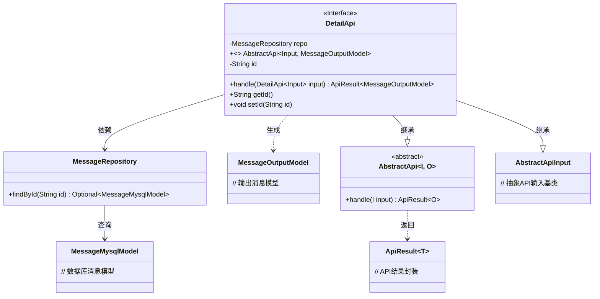
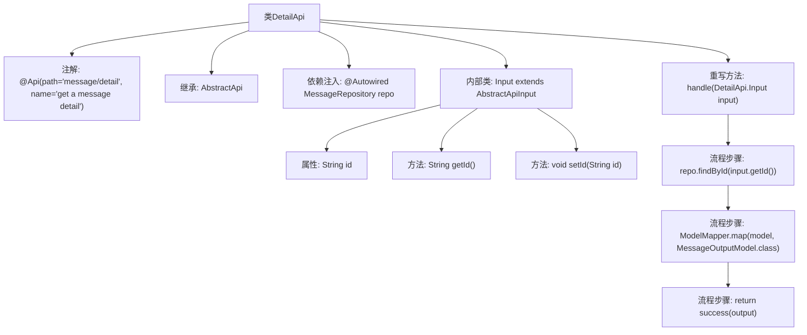

# 基础信息

|      |      |
|------|------|
| 名称 | DetailApi |
| 编码语言 | .java |
| 代码路径 | WeFe/board/board-service/src/main/java/com/welab/wefe/board/service/api/message/DetailApi.java |
| 包名 | com.welab.wefe.board.service.api.message |
| 依赖项 | ['com.welab.wefe.board.service.database.entity.MessageMysqlModel', 'com.welab.wefe.board.service.database.repository.MessageRepository', 'com.welab.wefe.board.service.dto.entity.MessageOutputModel', 'com.welab.wefe.common.exception.StatusCodeWithException', 'com.welab.wefe.common.web.api.base.AbstractApi', 'com.welab.wefe.common.web.api.base.Api', 'com.welab.wefe.common.web.dto.AbstractApiInput', 'com.welab.wefe.common.web.dto.ApiResult', 'com.welab.wefe.common.web.util.ModelMapper', 'org.springframework.beans.factory.annotation.Autowired'] |
| 概述说明 | DetailApi类通过id查询消息详情，调用MessageRepository获取数据并转换为MessageOutputModel返回。输入参数为id。 |

# 说明

该代码定义了一个名为DetailApi的API类，用于获取消息详情。它继承自AbstractApi，接受DetailApi.Input作为输入，返回MessageOutputModel。类上标注了API路径为"message/detail"，名称为"get a message detail"。通过自动注入的MessageRepository查询数据库，根据输入ID获取消息数据，并使用ModelMapper映射为输出模型。输入类Input包含一个字符串类型的id字段及其getter/setter方法。处理逻辑中若未找到对应消息则返回null，成功则返回映射后的输出模型。

# 类列表 Class Summary

| 名称   | 类型  | 说明 |
|-------|------|-------------|
| DetailApi | class | DetailApi类处理获取消息详情的请求，通过id查询数据库并返回消息详情，输入为id，输出为MessageOutputModel。 |

## 类 DetailApi

|      |      |
|------|------|
| 访问范围 | @Api(path = "message/detail", name = "get a message detail");public |
| 类型 | class |
| 名称 | DetailApi |
| 说明 | DetailApi类处理获取消息详情的请求，通过id查询数据库并返回消息详情，输入为id，输出为MessageOutputModel。 |

### UML类图

该代码实现了一个获取消息详情的API接口，继承自泛型抽象类AbstractApi，使用MessageRepository进行数据库查询。DetailApi包含嵌套的Input类作为输入参数，通过handle方法处理请求并返回MessageOutputModel。类图展示了核心类之间的继承、依赖和关联关系，包括抽象基类、数据库操作、模型映射等关键组件，体现了清晰的层级结构和职责划分。

### 内部方法调用关系图

该流程图展示了DetailApi类的结构和主要处理流程。DetailApi是一个带有API注解的类，继承自AbstractApi并重写了handle方法。内部类Input用于封装请求参数。handle方法通过MessageRepository查询数据，使用ModelMapper进行模型转换，最后返回成功结果。整个流程清晰地呈现了从输入处理到结果返回的完整链路。

### 字段列表 Field List

| 名称  | 类型  | 说明 |
|-------|-------|------|
| repo | MessageRepository | 使用@Autowired自动注入MessageRepository实例repo。 |

### 方法列表

| 名称  | 类型  | 说明 |
|-------|-------|------|
| handle | ApiResult<MessageOutputModel> | 该方法根据输入ID查询数据库，映射结果后返回成功响应。若未找到数据则返回null。 |

