# 基础信息

|      |      |
|------|------|
| 名称 | QueryApi |
| 编码语言 | .java |
| 代码路径 | WeFe/board/board-service/src/main/java/com/welab/wefe/board/service/api/message/QueryApi.java |
| 包名 | com.welab.wefe.board.service.api.message |
| 依赖项 | ['com.welab.wefe.board.service.dto.base.PagingInput', 'com.welab.wefe.board.service.dto.base.PagingOutput', 'com.welab.wefe.board.service.dto.entity.MessageOutputModel', 'com.welab.wefe.board.service.service.MessageService', 'com.welab.wefe.common.exception.StatusCodeWithException', 'com.welab.wefe.common.fieldvalidate.annotation.Check', 'com.welab.wefe.common.web.api.base.AbstractApi', 'com.welab.wefe.common.web.api.base.Api', 'com.welab.wefe.common.web.dto.ApiResult', 'com.welab.wefe.common.wefe.enums.MessageEvent', 'org.springframework.beans.factory.annotation.Autowired', 'java.util.List'] |
| 概述说明 | 查询消息分页接口，继承AbstractApi，使用MessageService处理输入参数，包括消息级别、未读状态、事件列表、待办事项及完成状态，返回分页消息结果。 |

# 说明

该代码定义了一个名为QueryApi的API类，用于分页查询消息。API路径为"message/query"，接收Input类作为输入参数，返回分页的MessageOutputModel结果。Input类继承自PagingInput，包含消息级别、未读状态、事件列表、待办事项状态及处理状态等可校验字段。处理逻辑通过注入的MessageService执行查询，并返回封装后的结果。整个类继承自AbstractApi，遵循统一的API处理模式。

# 类列表 Class Summary

| 名称   | 类型  | 说明 |
|-------|------|-------------|
| QueryApi | class | 分页查询消息的API，输入包括消息级别、未读状态、事件列表、待办事项状态等，输出为分页消息列表。 |


## 类 QueryApi

|      |      |
|------|------|
| 访问范围 | @Api(path = "message/query", name = "query messages by pagination");public |
| 类型 | class |
| 名称 | QueryApi |
| 说明 | 分页查询消息的API，输入包括消息级别、未读状态、事件列表、待办事项状态等，输出为分页消息列表。 |


### UML类图

```mermaid
classDiagram
    class QueryApi {
        +MessageService service
        +handle(QueryApi~Input~ input) ApiResult~PagingOutput~MessageOutputModel~~
    }
    QueryApi --> MessageService : 依赖
    QueryApi --> PagingOutput~MessageOutputModel~ : 依赖
    QueryApi --> ApiResult~PagingOutput~MessageOutputModel~~ : 依赖
    QueryApi --> StatusCodeWithException : 依赖

    class MessageService {
        <<Interface>>
        +query(QueryApi~Input~ input) PagingOutput~MessageOutputModel~
    }

    class PagingInput {
        <<Abstract>>
    }

    class QueryApi~Input~ {
        +String level
        +Boolean unread
        +List~MessageEvent~ eventList
        +Boolean todo
        +Boolean todoComplete
    }
    QueryApi~Input~ --|> PagingInput : 继承

    class PagingOutput~T~ {
        <<Generic>>
    }

    class MessageOutputModel {
    }

    class ApiResult~T~ {
        <<Generic>>
    }

    class StatusCodeWithException {
    }

    class MessageEvent {
    }
```

这段代码展示了一个基于分页查询消息的API实现。QueryApi继承自AbstractApi，处理包含消息级别、未读状态等条件的输入参数，并返回分页的消息输出结果。类图中清晰地展示了QueryApi与MessageService的依赖关系，以及输入参数类Input继承自PagingInput的结构。整个设计采用了泛型来保持灵活性，同时通过注解进行API元数据标记和参数校验。


### 内部方法调用关系图

```mermaid
graph TD
    A["类QueryApi"]
    B["注解: @Api(path='message/query', name='query messages by pagination')"]
    C["继承: AbstractApi<Input, PagingOutput<MessageOutputModel>>"]
    D["依赖注入: @Autowired MessageService service"]
    E["重写方法: handle(Input input)"]
    F["内部类: Input"]
    G["父类: PagingInput"]
    H["字段: String level @Check('消息级别')"]
    I["字段: Boolean unread @Check('是否未读')"]
    J["字段: List<MessageEvent> eventList @Check('事件列表')"]
    K["字段: Boolean todo @Check('是否是待办事项')"]
    L["字段: Boolean todoComplete @Check('待办事项是否已处理')"]
    M["方法调用: service.query(input)"]
    N["返回: success(service.query(input))"]

    A --> B
    A --> C
    A --> D
    A --> E
    E --> M
    M --> N
    A --> F
    F --> G
    F --> H
    F --> I
    F --> J
    F --> K
    F --> L
```



这段代码定义了一个名为QueryApi的类，用于分页查询消息。该类继承自AbstractApi，并包含一个内部类Input用于封装查询参数。流程图展示了类结构、注解、继承关系、字段定义以及核心方法handle的处理流程，其中handle方法通过调用service.query(input)获取分页结果并返回成功响应。

### 字段列表 Field List

| 名称  | 类型  | 说明 |
|-------|-------|------|
| service | MessageService | 使用@Autowired自动注入MessageService实例。 |

### 方法列表

| 名称  | 类型  | 说明 |
|-------|-------|------|
| handle | ApiResult<PagingOutput<MessageOutputModel>> | 这是一个Java方法重写，处理查询输入并返回分页消息结果，成功时调用服务层查询方法。 |


