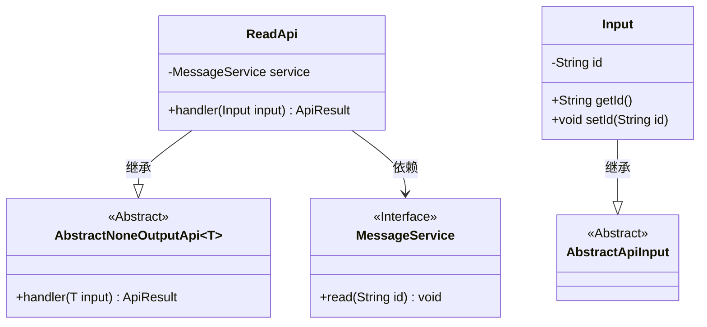
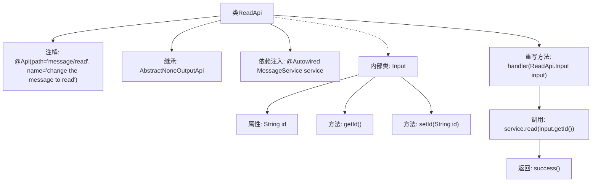

# 基础信息

|      |      |
|------|------|
| 名称 | ReadApi |
| 编码语言 | .java |
| 代码路径 | WeFe/board/board-service/src/main/java/com/welab/wefe/board/service/api/message/ReadApi.java |
| 包名 | com.welab.wefe.board.service.api.message |
| 依赖项 | ['com.welab.wefe.board.service.service.MessageService', 'com.welab.wefe.common.exception.StatusCodeWithException', 'com.welab.wefe.common.web.api.base.AbstractNoneOutputApi', 'com.welab.wefe.common.web.api.base.Api', 'com.welab.wefe.common.web.dto.AbstractApiInput', 'com.welab.wefe.common.web.dto.ApiResult', 'org.springframework.beans.factory.annotation.Autowired'] |
| 概述说明 | 这是一个消息已读API，接收消息ID并调用服务将其标记为已读，无返回值。输入类包含ID字段及其getter/setter方法。 |

# 说明

该代码定义了一个名为ReadApi的API类，用于将消息标记为已读。它继承自AbstractNoneOutputApi，泛型参数为内部类Input。API路径为message/read，功能描述为修改消息状态为已读。类中注入了MessageService服务，重写了handler方法，调用service.read处理输入参数中的id并返回成功结果。Input内部类继承AbstractApiInput，包含一个字符串类型的id属性及其getter和setter方法。

# 类列表 Class Summary

| 名称   | 类型  | 说明 |
|-------|------|-------------|
| ReadApi | class | 这是一个消息已读状态变更API，接收消息ID参数，调用服务层标记消息为已读，无返回值。 |

## 类 ReadApi

|      |      |
|------|------|
| 访问范围 | @Api(path = "message/read", name = "change the message to read");public |
| 类型 | class |
| 名称 | ReadApi |
| 说明 | 这是一个消息已读状态变更API，接收消息ID参数，调用服务层标记消息为已读，无返回值。 |

### UML类图

这段代码展示了一个消息已读API的实现结构。ReadApi继承自泛型抽象类AbstractNoneOutputApi，处理Input类型参数，通过MessageService接口实现消息已读功能。Input是内部静态类，继承自AbstractApiInput，包含消息ID字段及其访问器。整体设计遵循依赖注入和分层架构原则，通过服务接口解耦业务逻辑。

### 内部方法调用关系图

该流程图展示了ReadApi类的结构及其关键行为。ReadApi是一个带有特定路径和名称注解的API类，继承自AbstractNoneOutputApi并处理Input类型参数。核心逻辑在handler方法中，通过注入的MessageService调用read方法处理消息ID，最终返回成功结果。Input作为内部类封装了消息ID属性及其访问方法。整体流程清晰展现了从请求处理到服务调用的数据流向。

### 字段列表 Field List

| 名称  | 类型  | 说明 |
|-------|-------|------|
| service | MessageService | 使用@Autowired自动注入MessageService实例。 |

### 方法列表

| 名称  | 类型  | 说明 |
|-------|-------|------|
| handler | ApiResult<?> | Java方法重写，调用服务层读取输入ID数据，成功返回结果。 |

