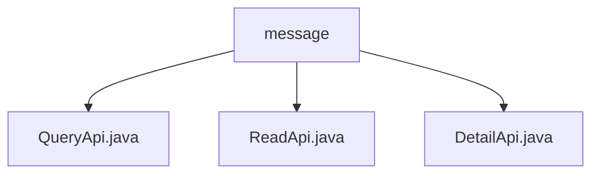

# 基础信息

|      |      |
|------|------|
| 名称 | message |
| 编码语言 | .java |
| 代码路径 | WeFe/board/board-service/src/main/java/com/welab/wefe/board/service/api/message |
| 包名 | docs.board.board-service.src.main.java.com.welab.wefe.board.service.api.message |
| 概述说明 | QueryApi用于分页查询消息，含多种筛选条件。ReadApi将消息标记为已读，需传入消息ID。DetailApi获取消息详情，根据ID查询并返回详情数据。 |

# 说明

## 概述  
该模块核心职责是提供消息系统的CRUD操作，包括分页查询、标记已读和详情获取功能。接口规范遵循RESTful风格，统一继承AbstractApi基类，路径前缀为"message"。关键数据结构包含MessageOutputModel（消息输出模型）和PagingInput（分页输入基类）。外部依赖涉及MessageService业务服务和MessageRepository持久层组件。例如QueryApi支持按状态筛选消息，ReadApi通过ID更新阅读状态。

## 主要业务场景  
模块支持消息中心的全生命周期管理，类似邮箱系统的收件箱操作。典型流程包括：用户查询消息列表（分页+过滤）、查看详情、标记已读。交互模式均为同步HTTP请求，例如DetailApi通过ID精确查询单条消息。API类型涵盖查询类（QueryApi/DetailApi）和状态修改类（ReadApi），集成案例包括未读消息红点提醒、消息列表分页加载等场景。

### 包内部结构视图

该流程图展示了message目录下的三个Java文件：QueryApi.java、ReadApi.java和DetailApi.java。这些文件都直接隶属于message目录，没有更深层次的嵌套结构。整个结构简洁明了，清晰地呈现了message目录中的API文件组织方式。

# 文件列表

| 名称   | 类型  | 说明 |
|-------|------|-------------|
| [QueryApi.java](QueryApi.md) | file | 查询消息分页接口，继承AbstractApi，使用MessageService处理输入参数，包括消息级别、未读状态、事件列表、待办事项及完成状态，返回分页消息结果。 |
| [ReadApi.java](ReadApi.md) | file | 这是一个消息已读API，接收消息ID并调用服务将其标记为已读，无返回值。输入类包含ID字段及其getter/setter方法。 |
| [DetailApi.java](DetailApi.md) | file | DetailApi类通过id查询消息详情，调用MessageRepository获取数据并转换为MessageOutputModel返回。输入参数为id。 |

