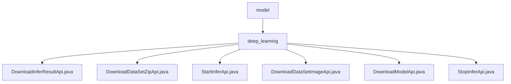

# 基础信息

|      |      |
|------|------|
| 名称 | model |
| 编码语言 | .java |
| 代码路径 | WeFe/board/board-service/src/main/java/com/welab/wefe/board/service/api/model |
| 包名 | docs.board.board-service.src.main.java.com.welab.wefe.board.service.api.model |
| 概述说明 | 定义了6个深度学习API：下载推理结果、批量推理zip、启动推理、下载推理图片、下载模型、中止推理。均需taskId参数，处理文件操作与任务校验。 |

# 说明

## 概述  
该模块提供深度学习模型推理全生命周期管理，包括启动/停止推理、结果下载和模型获取等功能。核心接口遵循RESTful规范，均继承AbstractApi基类，使用ResponseEntity统一响应。关键数据结构包含TaskId、InferSessionId等标识字段，通过Input内部类封装必填参数。外部依赖包括VisualFL服务、WeFeFileSystem和TaskResultService。例如DownloadModelApi通过VisualFL下载模型文件，StartInferApi生成压缩包并调用推理服务。

## 主要业务场景  
模块支持端到端推理流程：用户通过StartInferApi提交任务（单图或压缩包），系统生成会话ID并触发推理；DownloadInferResultApi获取JSON结果，DownloadDataSetZipApi/DownloadDataSetImageApi分别下载批量或单张结果文件。类似任务队列模式，StopInferApi可中止运行中任务。典型应用如医疗影像分析：上传CT扫描压缩包后，异步获取病变检测结果。API类型涵盖CRUD操作，集成案例包括模型版本管理与推理资源回收。

### 包内部结构视图

该流程图展示了WeFe项目中深度学习API的层级结构。顶层节点"model"包含"deep_learning"子目录，后者又包含6个具体的API实现类文件，包括下载推理结果、数据集压缩包、模型文件等不同功能的API端点。所有节点都只显示路径最后一级名称，清晰呈现了API模块的组织结构。

# 文件列表

| 名称   | 类型  | 说明 |
|-------|------|-------------|
| [deep_learning](deep_learning/_module.md) | package | 定义了6个深度学习API：下载推理结果、批量推理zip、启动推理、下载推理图片、下载模型、中止推理。均需taskId参数，处理文件操作与任务校验。 |

