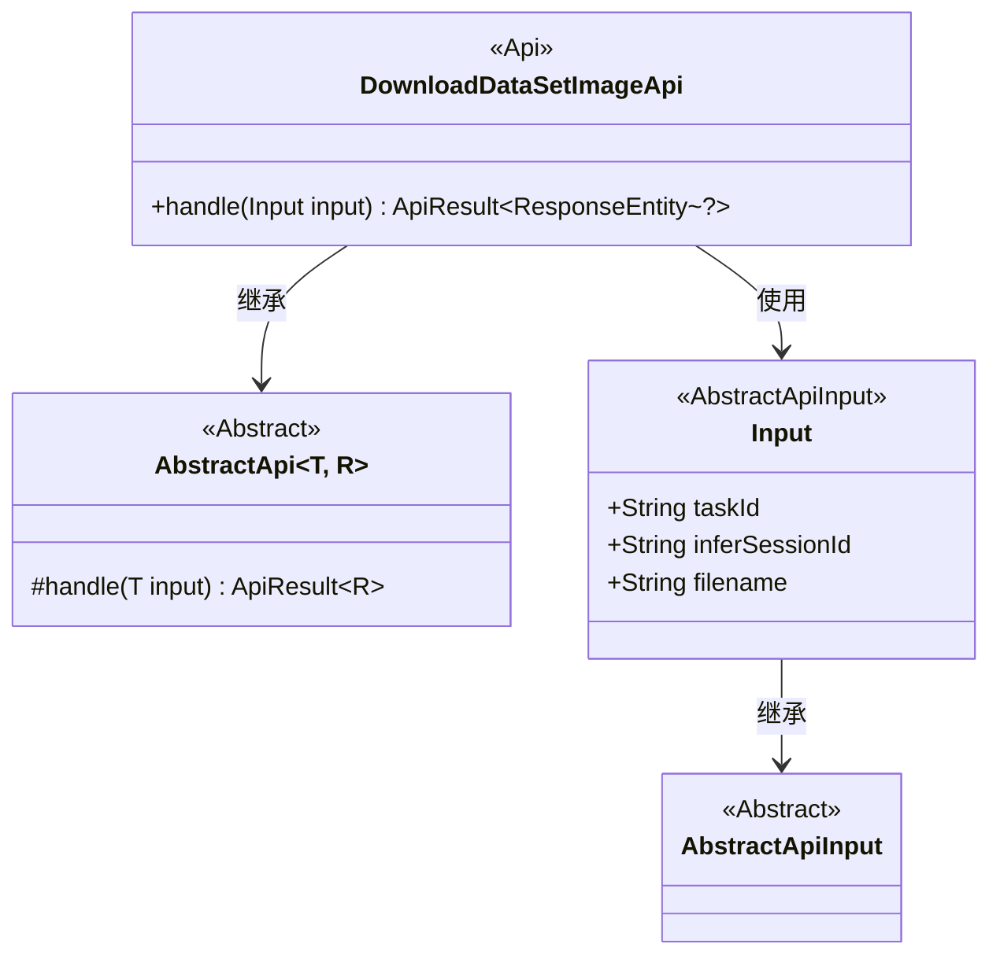

# 基础信息

|      |      |
|------|------|
| 名称 | DownloadDataSetImageApi |
| 编码语言 | .java |
| 代码路径 | WeFe/board/board-service/src/main/java/com/welab/wefe/board/service/api/model/deep_learning/DownloadDataSetImageApi.java |
| 包名 | com.welab.wefe.board.service.api.model.deep_learning |
| 依赖项 | ['com.welab.wefe.board.service.base.file_system.WeFeFileSystem', 'com.welab.wefe.common.StatusCode', 'com.welab.wefe.common.fieldvalidate.annotation.Check', 'com.welab.wefe.common.web.api.base.AbstractApi', 'com.welab.wefe.common.web.api.base.Api', 'com.welab.wefe.common.web.dto.AbstractApiInput', 'com.welab.wefe.common.web.dto.ApiResult', 'org.springframework.http.ResponseEntity', 'java.io.File'] |
| 概述说明 | 下载推理图片API，接收任务ID、会话ID和文件名，检查文件存在后返回文件。 |

# 说明

该代码定义了一个名为DownloadDataSetImageApi的API类，用于处理深度学习模型推理图片的下载请求。API路径为"model/deep_learning/call/download/image"。该类继承自AbstractApi，接受Input类型的输入参数并返回ResponseEntity。主要功能是根据输入的taskId、inferSessionId和filename定位文件路径，检查文件是否存在，若存在则返回文件，不存在则抛出文件不存在的异常。Input类包含三个必填字段：taskId、inferSessionId和filename。

# 类列表 Class Summary

| 名称   | 类型  | 说明 |
|-------|------|-------------|
| DownloadDataSetImageApi | class | DownloadDataSetImageApi用于下载推理图片，接收taskId、inferSessionId和filename参数，验证文件存在后返回文件。 |

## 类 DownloadDataSetImageApi

|      |      |
|------|------|
| 访问范围 | @Api(path = "model/deep_learning/call/download/image", name = "下载推理图片");public |
| 类型 | class |
| 名称 | DownloadDataSetImageApi |
| 说明 | DownloadDataSetImageApi用于下载推理图片，接收taskId、inferSessionId和filename参数，验证文件存在后返回文件。 |

### UML类图

类图描述：该图展示了DownloadDataSetImageApi类继承自泛型类AbstractApi，并实现了文件下载功能。Input作为内部类继承AbstractApiInput，包含任务ID、会话ID和文件名三个必填字段。AbstractApi是抽象基类，定义了核心处理方法。整体结构体现了API接口的层级关系和输入参数校验机制。

### 内部方法调用关系图

```mermaid
graph TD
    A["类DownloadDataSetImageApi"]
    B["继承: AbstractApi<Input, ResponseEntity<?>>"]
    C["注解: @Api"]
    D["方法: handle(Input input)"]
    E["获取文件路径: WeFeFileSystem.CallDeepLearningModel.getImageSimpleDir()"]
    F["解析文件名: resolve(input.filename)"]
    G["转换为File对象: toFile()"]
    H["检查文件存在性: file.exists()"]
    I["异常处理: StatusCode.FILE_DOES_NOT_EXIST.throwException()"]
    J["返回结果: file(file)"]
    K["内部类Input"]
    L["继承: AbstractApiInput"]
    M["字段: String taskId"]
    N["字段: String inferSessionId"]
    O["字段: String filename"]
    P["注解: @Check(require=true)"]

    A --> B
    A --> C
    A --> D
    D --> E
    E --> F
    F --> G
    G --> H
    H --"否"--> I
    H --"是"--> J
    A --> K
    K --> L
    K --> M
    K --> N
    K --> O
    M --> P
    N --> P
    O --> P
```

这段代码展示了一个用于下载推理图片的API类，继承自AbstractApi并处理文件下载请求。流程图清晰描述了从接收输入参数到最终返回文件响应的完整流程，包括文件路径构建、存在性检查、异常处理和结果返回等关键步骤。内部类Input定义了必需的请求参数，并通过@Check注解确保参数完整性。整个过程体现了健壮的错误处理机制和清晰的职责划分。

### 字段列表 Field List

| 名称  | 类型  | 说明 |
|-------|-------|------|

### 方法列表

| 名称  | 类型  | 说明 |
|-------|-------|------|
| handle | ApiResult<ResponseEntity<?>> | 该方法处理输入参数，检查指定任务和会话目录下的文件是否存在，若不存在则抛出异常，存在则返回文件。 |

