# 基础信息

|      |      |
|------|------|
| 名称 | DownloadDataSetZipApi |
| 编码语言 | .java |
| 代码路径 | WeFe/board/board-service/src/main/java/com/welab/wefe/board/service/api/model/deep_learning/DownloadDataSetZipApi.java |
| 包名 | com.welab.wefe.board.service.api.model.deep_learning |
| 依赖项 | ['com.welab.wefe.board.service.base.file_system.WeFeFileSystem', 'com.welab.wefe.common.fieldvalidate.annotation.Check', 'com.welab.wefe.common.web.api.base.AbstractApi', 'com.welab.wefe.common.web.api.base.Api', 'com.welab.wefe.common.web.dto.AbstractApiInput', 'com.welab.wefe.common.web.dto.ApiResult', 'org.springframework.http.ResponseEntity', 'java.io.File'] |
| 概述说明 | 这是一个用于下载批量推理所需zip文件的API接口，路径为model/deep_learning/call/download/zip，需要签名访问。输入参数为taskId和inferSessionId，返回zip文件。 |

# 说明

该代码定义了一个名为DownloadDataSetZipApi的API类，用于处理批量推理所需的zip文件下载。API路径为"model/deep_learning/call/download/zip"，允许签名访问。输入参数包括必须的taskId和inferSessionId。处理逻辑是通过WeFeFileSystem获取指定任务ID和推理会话ID对应的zip文件，并返回该文件。整个API继承自AbstractApi，使用ResponseEntity作为返回类型。

# 类列表 Class Summary

| 名称   | 类型  | 说明 |
|-------|------|-------------|
| DownloadDataSetZipApi | class | 该API用于下载批量推理所需的zip文件，需提供taskId和inferSessionId参数，支持签名访问。 |


## 类 DownloadDataSetZipApi

|      |      |
|------|------|
| 访问范围 | @Api(path = "model/deep_learning/call/download/zip", name = "下载需要批量推理的zip文件", allowAccessWithSign = true);public |
| 类型 | class |
| 名称 | DownloadDataSetZipApi |
| 说明 | 该API用于下载批量推理所需的zip文件，需提供taskId和inferSessionId参数，支持签名访问。 |


### UML类图

```mermaid
classDiagram
    class DownloadDataSetZipApi {
        <<Interface>> AbstractApi~Input, ResponseEntity~?~~
        +handle(Input input) ApiResult~ResponseEntity~?~~
    }
    
    class Input {
        <<Abstract>> AbstractApiInput
        +String taskId
        +String inferSessionId
    }

    DownloadDataSetZipApi --> Input : 使用
    DownloadDataSetZipApi ..|> AbstractApi~Input, ResponseEntity~?~~ : 继承
    Input --|> AbstractApiInput : 继承
```

这段代码展示了一个基于Spring框架的文件下载API实现。DownloadDataSetZipApi类继承自泛型抽象类AbstractApi，处理包含taskId和inferSessionId的输入参数，通过WeFeFileSystem获取ZIP文件并返回。Input作为静态嵌套类继承AbstractApiInput，包含两个必填字符串字段。类图清晰地反映了继承关系和依赖关系，体现了API接口与输入参数的交互方式。


### 内部方法调用关系图

```mermaid
graph TD
    A["类DownloadDataSetZipApi"]
    B["父类: AbstractApi<Input, ResponseEntity<?>>"]
    C["注解: @Api"]
    D["方法: handle(Input input)"]
    E["内部类: Input"]
    F["属性: String taskId"]
    G["属性: String inferSessionId"]
    H["方法调用: WeFeFileSystem.CallDeepLearningModel.getZipFile"]
    I["返回: file(zipFile)"]

    A --> B
    A --> C
    A --> D
    A --> E
    E --> F
    E --> G
    D --> H
    H --> I
```



这段代码展示了一个基于Spring框架的文件下载API实现，主要用于处理深度学习模型的批量推理数据下载请求。流程图清晰地展示了类继承关系、注解配置、输入参数验证结构以及核心文件处理逻辑。通过WeFeFileSystem获取指定任务ID和推理会话ID对应的ZIP文件，最终返回文件响应实体。输入类Input包含两个必填字段taskId和inferSessionId，通过@Check注解确保参数完整性校验。

### 字段列表 Field List

| 名称  | 类型  | 说明 |
|-------|-------|------|

### 方法列表

| 名称  | 类型  | 说明 |
|-------|-------|------|
| handle | ApiResult<ResponseEntity<?>> | 处理输入并返回压缩文件结果。 |


