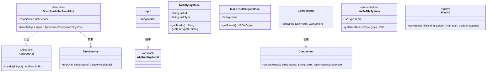
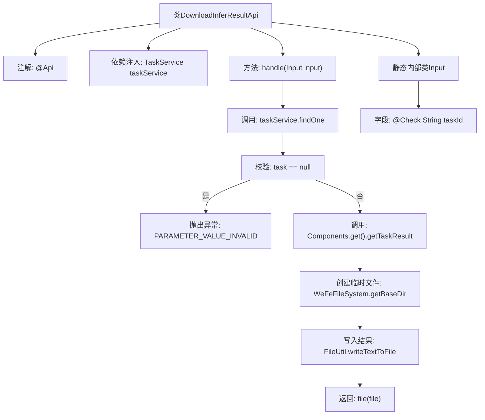

# 基础信息

|      |      |
|------|------|
| 名称 | DownloadInferResultApi |
| 编码语言 | .java |
| 代码路径 | WeFe/board/board-service/src/main/java/com/welab/wefe/board/service/api/model/deep_learning/DownloadInferResultApi.java |
| 包名 | com.welab.wefe.board.service.api.model.deep_learning |
| 依赖项 | ['com.welab.wefe.board.service.base.file_system.WeFeFileSystem', 'com.welab.wefe.board.service.component.Components', 'com.welab.wefe.board.service.database.entity.job.TaskMySqlModel', 'com.welab.wefe.board.service.dto.entity.job.TaskResultOutputModel', 'com.welab.wefe.board.service.service.TaskService', 'com.welab.wefe.common.StatusCode', 'com.welab.wefe.common.fieldvalidate.annotation.Check', 'com.welab.wefe.common.util.FileUtil', 'com.welab.wefe.common.web.api.base.AbstractApi', 'com.welab.wefe.common.web.api.base.Api', 'com.welab.wefe.common.web.dto.AbstractApiInput', 'com.welab.wefe.common.web.dto.ApiResult', 'org.springframework.beans.factory.annotation.Autowired', 'org.springframework.http.ResponseEntity', 'java.io.File', 'java.util.UUID'] |
| 概述说明 | 该API用于下载深度学习模型推理结果，接收任务ID参数，验证任务存在后获取结果并保存为JSON文件返回。 |

# 说明

该代码定义了一个名为DownloadInferResultApi的API类，用于下载模型推理结果。API路径为model/deep_learning/infer/result/download。类继承自AbstractApi，输入类型为内部类Input，输出为ResponseEntity。主要逻辑是通过taskId查询任务，获取推理结果并写入临时文件返回。输入参数taskId为必填项。处理过程中会校验任务是否存在，并通过任务类型获取对应结果组件。最终将JSON格式的结果写入随机命名的临时文件供下载。

# 类列表 Class Summary

| 名称   | 类型  | 说明 |
|-------|------|-------------|
| DownloadInferResultApi | class | 这是一个用于下载模型推理结果的API类，通过任务ID获取任务结果并保存为JSON文件返回。 |

## 类 DownloadInferResultApi

|      |      |
|------|------|
| 访问范围 | @Api(path = "model/deep_learning/infer/result/download", name = "下载模型推理结果");public |
| 类型 | class |
| 名称 | DownloadInferResultApi |
| 说明 | 这是一个用于下载模型推理结果的API类，通过任务ID获取任务结果并保存为JSON文件返回。 |

### UML类图

这段代码定义了一个用于下载模型推理结果的API接口DownloadInferResultApi，它继承自泛型抽象类AbstractApi。主要功能是通过taskId查询任务信息，获取推理结果并写入临时文件返回。类图展示了核心类关系，包括与TaskService的依赖、Input参数类的继承关系，以及辅助工具类如WeFeFileSystem和FileUtil的使用。整个设计采用分层架构，通过抽象类和接口实现扩展性。

### 内部方法调用关系图

该流程图展示了DownloadInferResultApi类的核心处理逻辑：通过taskId查询任务，校验存在性后获取推理结果，将结果写入临时JSON文件并返回。包含异常处理路径和内部类Input结构，清晰呈现了从请求处理到文件生成的全流程，涉及服务调用、组件获取、文件操作等关键步骤。

### 字段列表 Field List

| 名称  | 类型  | 说明 |
|-------|-------|------|
| taskService | TaskService | 使用@Autowired自动注入TaskService实例。 |

### 方法列表

| 名称  | 类型  | 说明 |
|-------|-------|------|
| handle | ApiResult<ResponseEntity<?>> | 处理任务结果：检查任务存在性，获取任务结果并保存为JSON文件。 |

