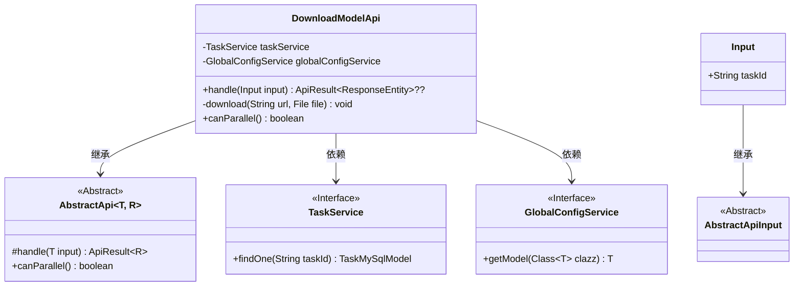
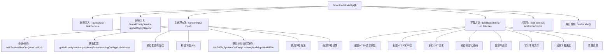

# 基础信息

|      |      |
|------|------|
| 名称 | DownloadModelApi |
| 编码语言 | .java |
| 代码路径 | WeFe/board/board-service/src/main/java/com/welab/wefe/board/service/api/model/deep_learning/DownloadModelApi.java |
| 包名 | com.welab.wefe.board.service.api.model.deep_learning |
| 依赖项 | ['com.welab.wefe.board.service.base.file_system.WeFeFileSystem', 'com.welab.wefe.board.service.database.entity.job.TaskMySqlModel', 'com.welab.wefe.board.service.service.TaskService', 'com.welab.wefe.board.service.service.globalconfig.GlobalConfigService', 'com.welab.wefe.common.InformationSize', 'com.welab.wefe.common.StatusCode', 'com.welab.wefe.common.TimeSpan', 'com.welab.wefe.common.exception.StatusCodeWithException', 'com.welab.wefe.common.fieldvalidate.annotation.Check', 'com.welab.wefe.common.util.StringUtil', 'com.welab.wefe.common.web.api.base.AbstractApi', 'com.welab.wefe.common.web.api.base.Api', 'com.welab.wefe.common.web.dto.AbstractApiInput', 'com.welab.wefe.common.web.dto.ApiResult', 'com.welab.wefe.common.wefe.dto.global_config.DeepLearningConfigModel', 'org.apache.http.client.config.RequestConfig', 'org.apache.http.client.methods.CloseableHttpResponse', 'org.apache.http.client.methods.HttpGet', 'org.apache.http.impl.client.CloseableHttpClient', 'org.apache.http.impl.client.HttpClients', 'org.springframework.beans.factory.annotation.Autowired', 'org.springframework.http.ResponseEntity', 'java.io.File', 'java.io.FileOutputStream', 'java.io.IOException', 'java.io.InputStream'] |
| 概述说明 | 该API用于下载深度学习模型，通过任务ID获取模型文件并下载，检查全局配置和VisualFL服务地址，处理下载过程中的异常和超时，记录下载进度和耗时。 |

# 说明

该代码定义了一个用于下载深度学习模型的API类DownloadModelApi，继承自AbstractApi。主要功能包括：通过taskId查询任务信息，检查全局配置中的VisualFL服务地址，构建下载URL，调用下载方法将模型文件保存到本地。下载过程中设置了超时参数和缓冲区大小，并记录下载进度和耗时。若出现异常会记录日志并抛出错误。输入参数为必填的taskId，且该API不支持并行处理。

# 类列表 Class Summary

| 名称   | 类型  | 说明 |
|-------|------|-------------|
| DownloadModelApi | class | 该API用于下载深度学习模型，通过任务ID获取模型文件，检查配置后从指定URL下载并保存到本地，处理超时和异常情况，返回下载结果。 |

## 类 DownloadModelApi

|      |      |
|------|------|
| 访问范围 | @Api(path = "model/deep_learning/download", name = "下载模型");public |
| 类型 | class |
| 名称 | DownloadModelApi |
| 说明 | 该API用于下载深度学习模型，通过任务ID获取模型文件，检查配置后从指定URL下载并保存到本地，处理超时和异常情况，返回下载结果。 |

### UML类图

这段代码展示了一个深度学习模型下载API的实现。DownloadModelApi继承自AbstractApi，通过TaskService和GlobalConfigService获取任务信息和配置，实现从远程服务器下载模型文件的功能。类图清晰地展示了类之间的继承和依赖关系，包括抽象基类、接口实现和输入参数结构。核心下载逻辑封装在私有方法中，处理了超时设置、进度跟踪和异常处理等细节。

### 内部方法调用关系图

这段代码实现了一个深度学习模型下载API，主要流程包括：通过任务ID查询任务信息，获取全局配置并验证，构建下载URL，调用HTTP客户端执行下载操作，将模型文件保存到本地，并处理各种异常情况。流程图清晰展示了从API入口到文件下载完成的完整调用链，包括服务依赖注入、输入参数验证、HTTP请求配置、流式文件写入等关键步骤，以及错误处理和日志记录等辅助功能。

### 字段列表 Field List

| 名称  | 类型  | 说明 |
|-------|-------|------|
| taskService | TaskService | 使用@Autowired自动注入TaskService实例。 |
| globalConfigService | GlobalConfigService | 使用@Autowired自动注入GlobalConfigService实例。 |

### 方法列表

| 名称  | 类型  | 说明 |
|-------|-------|------|
| download | void | 方法download通过HTTP下载文件到本地，设置10秒超时，检查状态码200，使用10KB缓冲区写入文件，记录下载进度，完成后关闭资源。 |
| handle | ApiResult<ResponseEntity<?>> | 处理输入并下载模型：检查配置，拼接URL，下载模型文件，记录耗时，异常处理并返回文件。 |
| canParallel | boolean | 方法canParallel返回false，表示不支持并行处理。 |

