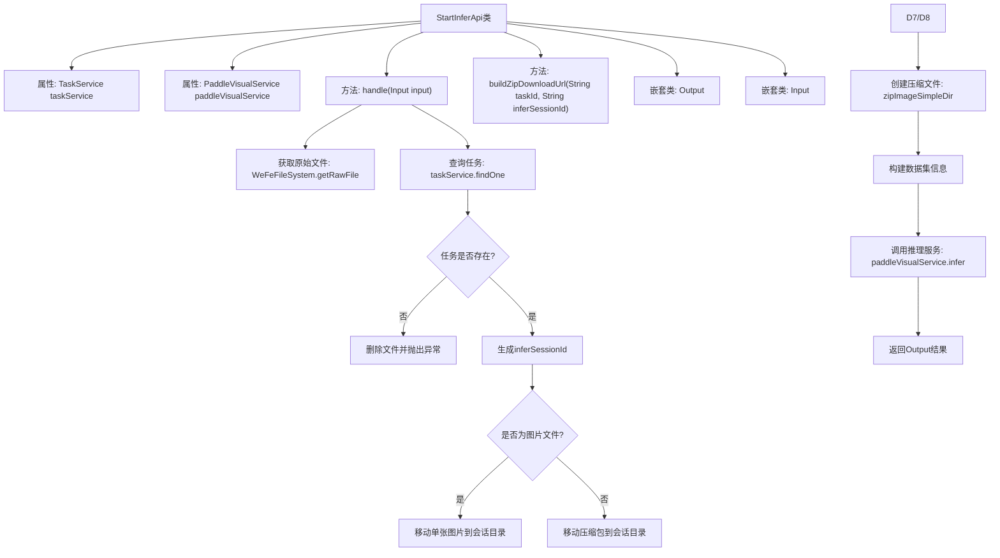
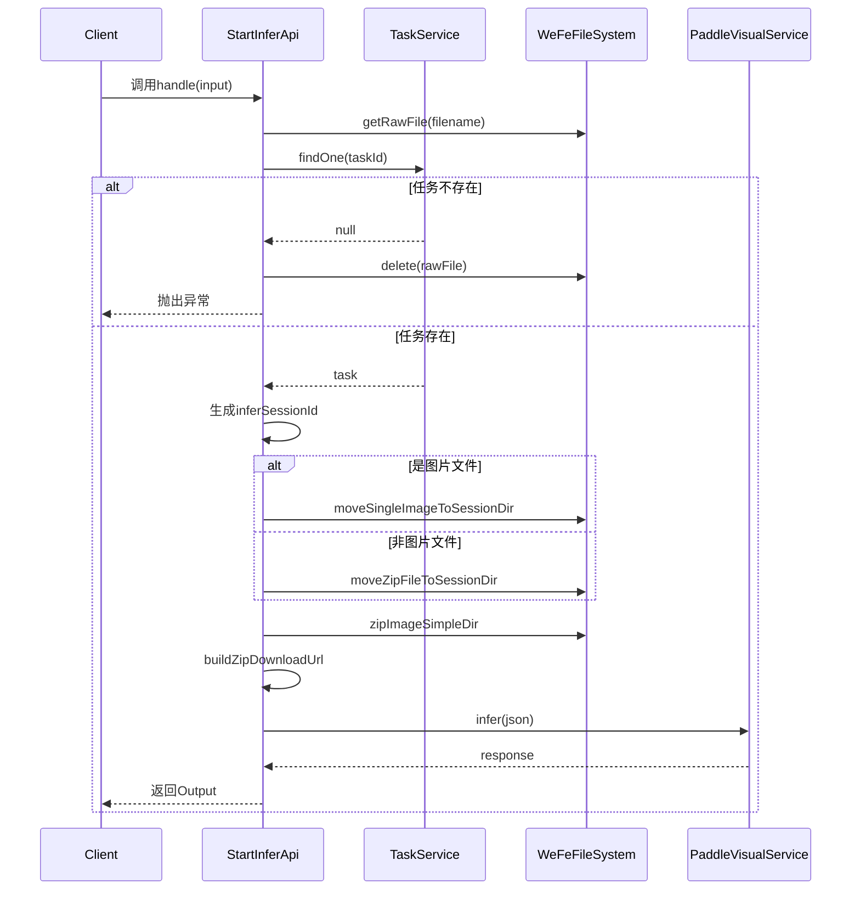

# 基础信息

|      |      |
|------|------|
| 名称 | StartInferApi |
| 编码语言 | .java |
| 代码路径 | WeFe/board/board-service/src/main/java/com/welab/wefe/board/service/api/model/deep_learning/StartInferApi.java |
| 包名 | com.welab.wefe.board.service.api.model.deep_learning |
| 依赖项 | ['com.alibaba.fastjson.JSON', 'com.alibaba.fastjson.JSONObject', 'com.welab.wefe.board.service.base.file_system.WeFeFileSystem', 'com.welab.wefe.board.service.database.entity.job.TaskMySqlModel', 'com.welab.wefe.board.service.sdk.PaddleVisualService', 'com.welab.wefe.board.service.service.TaskService', 'com.welab.wefe.board.service.service.globalconfig.GlobalConfigService', 'com.welab.wefe.common.StatusCode', 'com.welab.wefe.common.fieldvalidate.annotation.Check', 'com.welab.wefe.common.util.FileUtil', 'com.welab.wefe.common.util.JObject', 'com.welab.wefe.common.web.Launcher', 'com.welab.wefe.common.web.api.base.AbstractApi', 'com.welab.wefe.common.web.api.base.Api', 'com.welab.wefe.common.web.dto.AbstractApiInput', 'com.welab.wefe.common.web.dto.ApiResult', 'com.welab.wefe.common.wefe.dto.global_config.BoardConfigModel', 'org.springframework.beans.factory.annotation.Autowired', 'java.io.File', 'java.util.UUID'] |
| 概述说明 | 该API用于启动深度学习模型推理，处理输入文件并生成推理结果。验证任务ID后，将文件移至会话目录，调用VisualFL服务进行推理，返回会话ID和响应数据。 |

# 说明

该代码定义了一个名为StartInferApi的API类，用于启动深度学习模型推理。API路径为model/deep_learning/infer/start。它接收包含taskId和filename的输入参数，验证任务存在后生成唯一推理会话ID。根据文件类型（单张图片或压缩包）将文件移动到指定目录，并创建压缩包。随后调用VisualFL服务进行推理，返回包含会话ID和推理结果的输出。代码还包含构建压缩包下载URL的辅助方法。整个过程处理了文件操作、参数校验和并发控制。

# 类列表 Class Summary

| 名称   | 类型  | 说明 |
|-------|------|-------------|
| StartInferApi | class | StartInferApi类用于调用深度学习模型，处理输入文件（图片或压缩包），生成唯一推理会话ID，调用VisualFL服务进行推理，返回结果。包含输入验证、文件处理和结果封装功能。 |


## 类 StartInferApi

|      |      |
|------|------|
| 访问范围 | @Api(path = "model/deep_learning/infer/start", name = "调用深度学习模型");public |
| 类型 | class |
| 名称 | StartInferApi |
| 说明 | StartInferApi类用于调用深度学习模型，处理输入文件（图片或压缩包），生成唯一推理会话ID，调用VisualFL服务进行推理，返回结果。包含输入验证、文件处理和结果封装功能。 |


### UML类图

```mermaid
classDiagram
    class StartInferApi {
        -TaskService taskService
        -PaddleVisualService paddleVisualService
        +handle(StartInferApi~Input~ input) ApiResult~Output~
        -buildZipDownloadUrl(String taskId, String inferSessionId) String
    }

    class AbstractApi~T, R~ {
        <<Abstract>>
        +handle(T input) ApiResult~R~
    }

    class TaskService {
        <<Interface>>
        +findOne(String taskId) TaskMySqlModel
    }

    class PaddleVisualService {
        <<Interface>>
        +infer(JSONObject json) JObject
    }

    class StartInferApi$Input {
        +String taskId
        +String filename
    }

    class StartInferApi$Output {
        +String inferSessionId
        +JObject response
    }

    class AbstractApiInput {
        <<Abstract>>
    }

    StartInferApi --|> AbstractApi : 继承
    StartInferApi --> TaskService : 依赖
    StartInferApi --> PaddleVisualService : 依赖
    StartInferApi$Input --|> AbstractApiInput : 继承
```

该代码实现了一个深度学习模型调用API，主要功能包括：验证任务有效性、处理输入文件（图片或压缩包）、生成推理会话ID、调用PaddleVisualService进行推理。类图展示了StartInferApi继承自泛型抽象类AbstractApi，依赖TaskService和PaddleVisualService两个接口，并使用嵌套类Input和Output处理输入输出数据。Input继承自AbstractApiInput，包含任务ID和文件名两个必填字段。


### 内部方法调用关系图





这段代码实现了一个深度学习模型调用API，主要功能包括：验证任务有效性、处理输入文件（图片或压缩包）、生成唯一会话ID、调用推理服务并返回结果。流程图展示了类结构和主要方法调用关系，时序图详细描述了API调用的完整过程，包括异常处理路径和正常执行路径。代码通过严格的参数检查和文件操作确保推理任务的可靠性，同时使用UUID解决并发问题。

### 字段列表 Field List

| 名称  | 类型  | 说明 |
|-------|-------|------|
| taskService | TaskService | 使用@Autowired自动注入TaskService实例。 |
| paddleVisualService | PaddleVisualService | 自动注入PaddleVisualService实例。 |

### 方法列表

| 名称  | 类型  | 说明 |
|-------|-------|------|
| handle | ApiResult<Output> | 处理深度学习模型推理请求：检查任务有效性，生成唯一会话ID，移动文件至会话目录，打包并调用推理服务返回结果。 |
| buildZipDownloadUrl | String | 该方法构建数据集压缩包下载URL，通过任务ID和会话ID拼接内网基础路径和API路径，生成完整下载链接。 |


