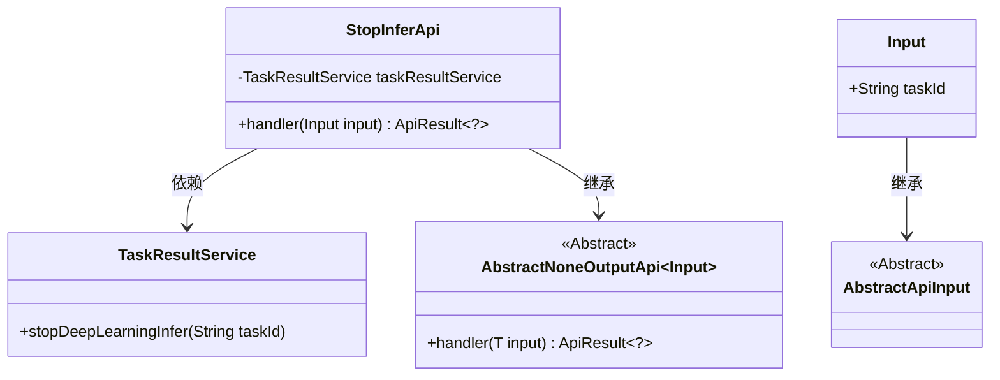
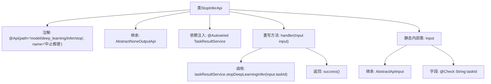

# 基础信息

|      |      |
|------|------|
| 名称 | StopInferApi |
| 编码语言 | .java |
| 代码路径 | WeFe/board/board-service/src/main/java/com/welab/wefe/board/service/api/model/deep_learning/StopInferApi.java |
| 包名 | com.welab.wefe.board.service.api.model.deep_learning |
| 依赖项 | ['com.welab.wefe.board.service.service.TaskResultService', 'com.welab.wefe.common.exception.StatusCodeWithException', 'com.welab.wefe.common.fieldvalidate.annotation.Check', 'com.welab.wefe.common.web.api.base.AbstractNoneOutputApi', 'com.welab.wefe.common.web.api.base.Api', 'com.welab.wefe.common.web.dto.AbstractApiInput', 'com.welab.wefe.common.web.dto.ApiResult', 'org.springframework.beans.factory.annotation.Autowired'] |
| 概述说明 | 这是一个用于中止深度学习推理任务的API，路径为"model/deep_learning/infer/stop"，接收任务ID作为输入，调用TaskResultService停止指定任务。 |

# 说明

这是一个用于中止深度学习推理任务的API类，路径为"model/deep_learning/infer/stop"，名称为"中止推理"。该类继承自AbstractNoneOutputApi，使用泛型指定输入类型为内部类Input。通过自动注入的TaskResultService调用stopDeepLearningInfer方法，根据传入的taskId停止指定推理任务。输入类Input继承AbstractApiInput，包含一个必填字段taskId。处理成功后返回空结果。

# 类列表 Class Summary

| 名称   | 类型  | 说明 |
|-------|------|-------------|
| StopInferApi | class | 这是一个用于中止深度学习推理任务的API类，通过taskId停止指定任务，调用TaskResultService实现功能，输入需包含必填的taskId字段。 |

## 类 StopInferApi

|      |      |
|------|------|
| 访问范围 | @Api(path = "model/deep_learning/infer/stop", name = "中止推理");public |
| 类型 | class |
| 名称 | StopInferApi |
| 说明 | 这是一个用于中止深度学习推理任务的API类，通过taskId停止指定任务，调用TaskResultService实现功能，输入需包含必填的taskId字段。 |

### UML类图

这段代码描述了一个用于中止深度学习推理任务的API类StopInferApi，它继承自泛型抽象类AbstractNoneOutputApi，并依赖TaskResultService来执行具体的中止操作。Input作为内部静态类继承自AbstractApiInput，包含必须的taskId字段。类图清晰地展示了继承关系和依赖关系，其中StopInferApi通过handler方法处理输入参数并返回结果，而具体的停止操作委托给TaskResultService完成。

### 内部方法调用关系图

该流程图展示了StopInferApi类的完整结构，包含类注解、继承关系、依赖注入的TaskResultService服务，以及核心的handler方法处理逻辑。handler方法通过调用taskResultService的stopDeepLearningInfer方法中止指定任务，最后返回成功结果。静态内部类Input继承AbstractApiInput并包含带校验注解的taskId字段，用于接收API请求参数。整个设计实现了深度学习推理任务中止的API功能。

### 字段列表 Field List

| 名称  | 类型  | 说明 |
|-------|-------|------|
| taskResultService | TaskResultService | 使用@Autowired自动注入TaskResultService实例。 |

### 方法列表

| 名称  | 类型  | 说明 |
|-------|-------|------|
| handler | ApiResult<?> | 重写handler方法，调用taskResultService停止深度学习推理任务，返回成功结果。 |

