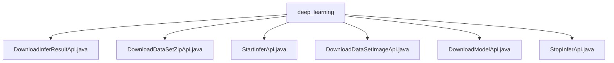

# 基础信息

|      |      |
|------|------|
| 名称 | deep_learning |
| 编码语言 | .java |
| 代码路径 | WeFe/board/board-service/src/main/java/com/welab/wefe/board/service/api/model/deep_learning |
| 包名 | docs.board.board-service.src.main.java.com.welab.wefe.board.service.api.model.deep_learning |
| 概述说明 | 定义了6个深度学习API：下载推理结果、批量推理zip、启动推理、下载推理图片、下载模型、中止推理。均需taskId参数，处理文件操作与任务校验。 |

# 说明

## 概述  
该模块提供深度学习模型推理全生命周期管理，包括启动/停止推理、结果下载和模型获取等功能。核心接口遵循RESTful规范，均继承AbstractApi基类，使用ResponseEntity统一响应。关键数据结构包含TaskId、InferSessionId等标识字段，通过Input内部类封装必填参数。外部依赖包括VisualFL服务、WeFeFileSystem和TaskResultService。例如DownloadModelApi通过VisualFL下载模型文件，StartInferApi生成压缩包并调用推理服务。

## 主要业务场景  
模块支持端到端推理流程：用户通过StartInferApi提交任务（单图或压缩包），系统生成会话ID并触发推理；DownloadInferResultApi获取JSON结果，DownloadDataSetZipApi/DownloadDataSetImageApi分别下载批量或单张结果文件。类似任务队列模式，StopInferApi可中止运行中任务。典型应用如医疗影像分析：上传CT扫描压缩包后，异步获取病变检测结果。API类型涵盖CRUD操作，集成案例包括模型版本管理与推理资源回收。

### 包内部结构视图

该流程图展示了深度学习模型服务API的层级结构，根节点为deep_learning文件夹，包含6个Java接口文件：DownloadInferResultApi、DownloadDataSetZipApi、StartInferApi等，这些文件都直接隶属于deep_learning目录下，没有中间子目录层级，形成了清晰的平级关系结构。

# 文件列表

| 名称   | 类型  | 说明 |
|-------|------|-------------|
| [DownloadInferResultApi.java](DownloadInferResultApi.md) | file | 该API用于下载深度学习模型推理结果，接收任务ID参数，验证任务存在后获取结果并保存为JSON文件返回。 |
| [DownloadDataSetZipApi.java](DownloadDataSetZipApi.md) | file | 这是一个用于下载批量推理所需zip文件的API接口，路径为model/deep_learning/call/download/zip，需要签名访问。输入参数为taskId和inferSessionId，返回zip文件。 |
| [StartInferApi.java](StartInferApi.md) | file | 该API用于启动深度学习模型推理，处理输入文件并生成推理结果。验证任务ID后，将文件移至会话目录，调用VisualFL服务进行推理，返回会话ID和响应数据。 |
| [DownloadDataSetImageApi.java](DownloadDataSetImageApi.md) | file | 下载推理图片API，接收任务ID、会话ID和文件名，检查文件存在后返回文件。 |
| [DownloadModelApi.java](DownloadModelApi.md) | file | 该API用于下载深度学习模型，通过任务ID获取模型文件并下载，检查全局配置和VisualFL服务地址，处理下载过程中的异常和超时，记录下载进度和耗时。 |
| [StopInferApi.java](StopInferApi.md) | file | 这是一个用于中止深度学习推理任务的API，路径为"model/deep_learning/infer/stop"，接收任务ID作为输入，调用TaskResultService停止指定任务。 |

