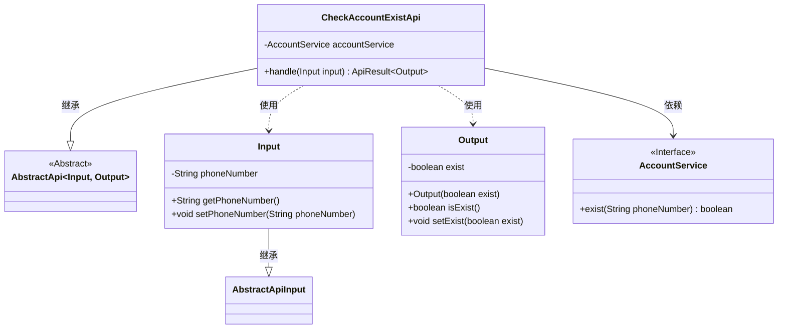
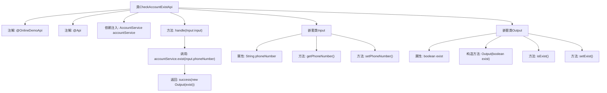

# 基础信息

|      |      |
|------|------|
| 名称 | CheckAccountExistApi |
| 编码语言 | .java |
| 代码路径 | WeFe/board/board-service/src/main/java/com/welab/wefe/board/service/api/online_demo/CheckAccountExistApi.java |
| 包名 | com.welab.wefe.board.service.api.online_demo |
| 依赖项 | ['com.welab.wefe.board.service.base.OnlineDemoApi', 'com.welab.wefe.board.service.service.account.AccountService', 'com.welab.wefe.common.exception.StatusCodeWithException', 'com.welab.wefe.common.fieldvalidate.annotation.Check', 'com.welab.wefe.common.web.api.base.AbstractApi', 'com.welab.wefe.common.web.api.base.Api', 'com.welab.wefe.common.web.dto.AbstractApiInput', 'com.welab.wefe.common.web.dto.ApiResult', 'org.springframework.beans.factory.annotation.Autowired'] |
| 概述说明 | 检查账号是否存在的API，路径为account/online_demo/exist，无需登录，输入手机号，返回是否存在。 |

# 说明

该代码定义了一个名为CheckAccountExistApi的API类，用于检查账号是否存在。API路径为account/online_demo/exist，无需登录即可访问。输入参数Input包含一个经过校验的手机号字段phoneNumber，输出参数Output包含一个布尔值exist表示账号是否存在。处理逻辑通过AccountService的exist方法验证手机号是否已注册，并返回验证结果。整个API继承自AbstractApi，采用标准的输入输出结构和异常处理机制。

# 类列表 Class Summary

| 名称   | 类型  | 说明 |
|-------|------|-------------|
| CheckAccountExistApi | class | 检查账号是否存在的API，路径为account/online_demo/exist，无需登录，通过手机号查询账号是否存在，返回布尔结果。 |

## 类 CheckAccountExistApi

|      |      |
|------|------|
| 访问范围 | @OnlineDemoApi;@Api(path = "account/online_demo/exist", name = "check if account already exists", login = false);public |
| 类型 | class |
| 名称 | CheckAccountExistApi |
| 说明 | 检查账号是否存在的API，路径为account/online_demo/exist，无需登录，通过手机号查询账号是否存在，返回布尔结果。 |

### UML类图

该类图展示了一个检查账号是否存在的API实现结构。核心类CheckAccountExistApi继承自泛型抽象类AbstractApi，处理Input输入参数并返回Output结果。Input类包含手机号字段及其访问器，继承自AbstractApiInput；Output类封装布尔型存在状态。CheckAccountExistApi通过依赖注入的AccountService接口实现业务逻辑，该接口声明了exist()方法。整体设计符合分层架构，Input/Output作为数据传输对象，服务层通过接口解耦。

### 内部方法调用关系图

这段代码定义了一个名为CheckAccountExistApi的API类，用于检查账户是否存在。该类继承自AbstractApi，包含输入(Input)和输出(Output)两个嵌套类。主要流程是通过accountService.exist方法验证手机号是否存在，并返回结果。流程图展示了类结构、注解、依赖注入和方法调用关系，清晰地呈现了从请求处理到结果返回的完整过程。

### 字段列表 Field List

| 名称  | 类型  | 说明 |
|-------|-------|------|
| accountService | AccountService | 使用@Autowired自动注入AccountService实例。 |

### 方法列表

| 名称  | 类型  | 说明 |
|-------|-------|------|
| handle | ApiResult<Output> | 代码重写handle方法，检查手机号是否存在并返回结果。 |

