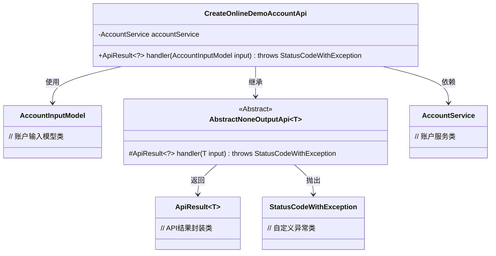
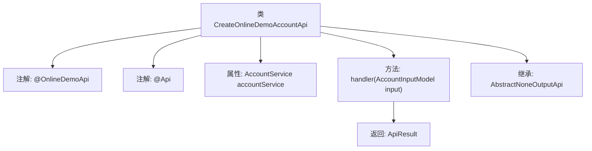

# 基础信息

|      |      |
|------|------|
| 名称 | CreateOnlineDemoAccountApi |
| 编码语言 | .java |
| 代码路径 | WeFe/board/board-service/src/main/java/com/welab/wefe/board/service/api/online_demo/CreateOnlineDemoAccountApi.java |
| 包名 | com.welab.wefe.board.service.api.online_demo |
| 依赖项 | ['com.welab.wefe.board.service.base.OnlineDemoApi', 'com.welab.wefe.board.service.dto.vo.AccountInputModel', 'com.welab.wefe.board.service.service.account.AccountService', 'com.welab.wefe.common.exception.StatusCodeWithException', 'com.welab.wefe.common.web.api.base.AbstractNoneOutputApi', 'com.welab.wefe.common.web.api.base.Api', 'com.welab.wefe.common.web.dto.ApiResult', 'com.welab.wefe.common.wefe.enums.BoardUserSource', 'org.springframework.beans.factory.annotation.Autowired'] |
| 概述说明 | 这是一个创建体验账号的API类，路径为"account/online_demo/create"，无需登录，调用AccountService处理输入参数AccountInputModel并返回成功结果。 |

# 说明

这是一个名为CreateOnlineDemoAccountApi的Java类，用于创建体验账号的在线演示API。该类继承自AbstractNoneOutputApi，泛型参数为AccountInputModel。通过@OnlineDemoApi和@Api注解定义了API路径为"account/online_demo/create"，名称为"open an experience account"，且无需登录即可访问。类中注入了AccountService服务，并重写了handler方法处理输入参数AccountInputModel，返回成功的ApiResult。整个类设计简洁，专注于创建体验账号的功能实现。

# 类列表 Class Summary

| 名称   | 类型  | 说明 |
|-------|------|-------------|
| CreateOnlineDemoAccountApi | class | 创建体验账号的API，无需登录，调用AccountService处理输入参数AccountInputModel，返回成功结果。 |

## 类 CreateOnlineDemoAccountApi

|      |      |
|------|------|
| 访问范围 | @OnlineDemoApi;@Api(path = "account/online_demo/create", name = "open an experience account", login = false);public |
| 类型 | class |
| 名称 | CreateOnlineDemoAccountApi |
| 说明 | 创建体验账号的API，无需登录，调用AccountService处理输入参数AccountInputModel，返回成功结果。 |

### UML类图

该类图展示了一个创建体验账户的API实现结构。CreateOnlineDemoAccountApi继承自泛型抽象类AbstractNoneOutputApi，处理AccountInputModel类型参数，依赖AccountService进行业务操作。通过ApiResult返回统一响应格式，可能抛出StatusCodeWithException异常。注解表明这是一个无需登录的在线演示接口，符合RESTful风格设计。整体架构体现了清晰的层次关系和职责分离。

### 内部方法调用关系图

这段代码定义了一个创建在线演示账户的API类，继承自AbstractNoneOutputApi基类。类上标注了两个注解@OnlineDemoApi和@Api，后者定义了API路径为"account/online_demo/create"且不需要登录。类中注入了AccountService服务，并重写了handler方法处理AccountInputModel输入参数，返回ApiResult结果。整个流程展示了从类定义到方法实现的完整结构，体现了Spring Boot API的典型设计模式。

### 字段列表 Field List

| 名称  | 类型  | 说明 |
|-------|-------|------|
| accountService | AccountService | 使用@Autowired自动注入AccountService实例。 |

### 方法列表

| 名称  | 类型  | 说明 |
|-------|-------|------|
| handler | ApiResult<?> | Java方法重写，处理AccountInputModel输入，返回ApiResult成功结果，可能抛出StatusCodeWithException异常。 |

