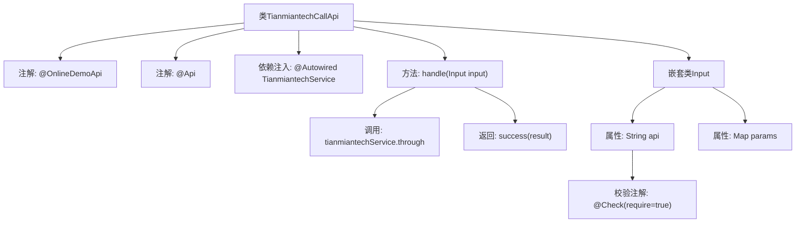

# 基础信息

|      |      |
|------|------|
| 名称 | TianmiantechCallApi |
| 编码语言 | .java |
| 代码路径 | WeFe/board/board-service/src/main/java/com/welab/wefe/board/service/api/online_demo/TianmiantechCallApi.java |
| 包名 | com.welab.wefe.board.service.api.online_demo |
| 依赖项 | ['com.welab.wefe.board.service.base.OnlineDemoApi', 'com.welab.wefe.board.service.onlinedemo.TianmiantechService', 'com.welab.wefe.common.exception.StatusCodeWithException', 'com.welab.wefe.common.fieldvalidate.annotation.Check', 'com.welab.wefe.common.util.JObject', 'com.welab.wefe.common.web.api.base.AbstractApi', 'com.welab.wefe.common.web.api.base.Api', 'com.welab.wefe.common.web.dto.AbstractApiInput', 'com.welab.wefe.common.web.dto.ApiResult', 'org.springframework.beans.factory.annotation.Autowired', 'java.io.IOException', 'java.util.Map'] |
| 概述说明 | TianmiantechCallApi是一个在线API类，调用天眠科技服务接口，接收api和params参数，返回JSON结果。 |

# 说明

这是一个名为TianmiantechCallApi的在线API类，用于调用天眠科技服务接口。它继承自AbstractApi，接受Input类型的输入参数并返回JObject类型结果。类上标注了@OnlineDemoApi和@Api注解，指定了API路径和名称。内部通过自动注入的TianmiantechService服务处理请求，调用through方法并返回结果。Input内部类定义了必需的api字符串参数和可选的params映射参数。整个API封装了调用第三方服务的通用处理逻辑。

# 类列表 Class Summary

| 名称   | 类型  | 说明 |
|-------|------|-------------|
| TianmiantechCallApi | class | 天眠科技API调用类，通过输入api和params参数调用tianmiantechService服务，返回JObject结果。 |


## 类 TianmiantechCallApi

|      |      |
|------|------|
| 访问范围 | @OnlineDemoApi;@Api(path = "tianmiantech/call_api", name = "call tianmiantech service api");public |
| 类型 | class |
| 名称 | TianmiantechCallApi |
| 说明 | 天眠科技API调用类，通过输入api和params参数调用tianmiantechService服务，返回JObject结果。 |


### UML类图

```mermaid
classDiagram
    class TianmiantechCallApi {
        -TianmiantechService tianmiantechService
        +handle(Input input) ApiResult~JObject~
    }
    class AbstractApi~TianmiantechCallApi.Input, JObject~ {
        <<Abstract>>
        +handle(Input input) ApiResult~JObject~
    }
    class TianmiantechCallApi$Input {
        +String api
        +Map~String, Object~ params
    }
    class AbstractApiInput {
        <<Abstract>>
    }
    class JObject {
    }
    class ApiResult~R~ {
        <<Generic>>
    }
    class TianmiantechService {
        <<Interface>>
        +through(String api, Map~String, Object~ params) JObject
    }

    TianmiantechCallApi --> AbstractApi~TianmiantechCallApi.Input, JObject~ : 继承
    TianmiantechCallApi --> TianmiantechService : 依赖
    TianmiantechCallApi$Input --> AbstractApiInput : 继承
    TianmiantechCallApi ..> TianmiantechCallApi$Input : 包含
    AbstractApi~TianmiantechCallApi.Input, JObject~ ..> ApiResult~JObject~ : 使用
    TianmiantechService ..> JObject : 返回
```

这段代码展示了一个调用天眠科技服务的API类结构。TianmiantechCallApi继承自泛型抽象类AbstractApi，处理包含api路径和参数的Input输入类，通过TianmiantechService接口调用远程服务并返回JObject格式结果。类图中清晰展示了继承关系、依赖注入和服务调用流程，体现了Spring风格的API封装模式，其中包含嵌套的Input静态类作为参数载体。


### 内部方法调用关系图



这段代码展示了一个基于Spring框架的API类TianmiantechCallApi，用于调用第三方服务。类通过@OnlineDemoApi和@Api注解标记，继承AbstractApi并实现handle方法处理请求。方法内调用TianmiantechService的through接口并返回结果。嵌套类Input定义了API所需的参数结构，包含必填的api字段和可选params映射，通过@Check注解实现参数校验。整体流程清晰展现了从请求处理到服务调用的链路。

### 字段列表 Field List

| 名称  | 类型  | 说明 |
|-------|-------|------|
| tianmiantechService | TianmiantechService | 自动注入TianmiantechService服务实例。 |

### 方法列表

| 名称  | 类型  | 说明 |
|-------|-------|------|
| handle | ApiResult<JObject> | Java方法重写，调用天冕科技服务处理输入并返回结果，成功时返回封装对象，可能抛出异常或IO错误。 |


