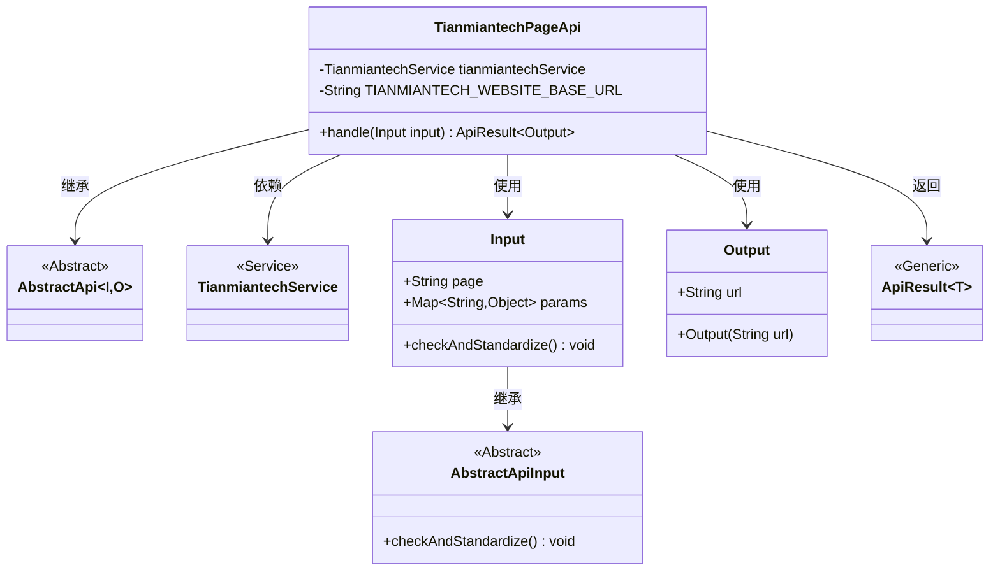
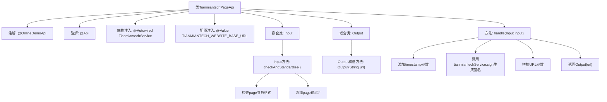

# 基础信息

|      |      |
|------|------|
| 名称 | TianmiantechPageApi |
| 编码语言 | .java |
| 代码路径 | WeFe/board/board-service/src/main/java/com/welab/wefe/board/service/api/online_demo/TianmiantechPageApi.java |
| 包名 | com.welab.wefe.board.service.api.online_demo |
| 依赖项 | ['com.welab.wefe.board.service.base.OnlineDemoApi', 'com.welab.wefe.board.service.onlinedemo.TianmiantechService', 'com.welab.wefe.common.exception.StatusCodeWithException', 'com.welab.wefe.common.fieldvalidate.annotation.Check', 'com.welab.wefe.common.util.UrlUtil', 'com.welab.wefe.common.web.api.base.AbstractApi', 'com.welab.wefe.common.web.api.base.Api', 'com.welab.wefe.common.web.dto.AbstractApiInput', 'com.welab.wefe.common.web.dto.ApiResult', 'org.springframework.beans.factory.annotation.Autowired', 'org.springframework.beans.factory.annotation.Value', 'java.io.IOException', 'java.util.Map'] |
| 概述说明 | 天眠科技页面API类，用于生成带签名和时间戳的网站URL。输入需包含页面路径和参数，输出为完整URL。自动处理参数校验和标准化。 |

# 说明

这是一个名为TianmiantechPageApi的API类，用于生成天眠科技网站页面URL。它继承自AbstractApi，接收Input参数并返回包含URL的Output结果。主要功能包括：自动添加时间戳和签名到请求参数，拼接基础URL和页面路径，并对输入参数进行校验和标准化处理。通过@Autowired注入TianmiantechService服务，使用@Value获取配置的基础URL。输入类Input包含必填的page字段和params映射，输出类Output包含生成的URL字符串。

# 类列表 Class Summary

| 名称   | 类型  | 说明 |
|-------|------|-------------|
| TianmiantechPageApi | class | 天眠科技页面API类，用于生成带签名和时间戳的网站URL。输入包含页面路径和参数，输出为完整URL。自动校验并标准化输入，确保安全访问。 |

## 类 TianmiantechPageApi

|      |      |
|------|------|
| 访问范围 | @OnlineDemoApi;@Api(path = "tianmiantech/page_url", name = "create tianmiantech website page url");public |
| 类型 | class |
| 名称 | TianmiantechPageApi |
| 说明 | 天眠科技页面API类，用于生成带签名和时间戳的网站URL。输入包含页面路径和参数，输出为完整URL。自动校验并标准化输入，确保安全访问。 |

### UML类图

该代码展示了一个用于生成天冕科技网站页面URL的API类结构。TianmiantechPageApi继承自泛型AbstractApi，处理Input参数并返回包含URL的Output结果。Input类负责参数校验和标准化，Output类封装生成的URL。整个结构通过依赖注入使用TianmiantechService进行签名计算，体现了清晰的职责划分和分层设计。

### 内部方法调用关系图

这段代码是一个API处理类，主要功能是生成天眠科技网站的页面URL。流程图展示了类结构、注解使用、依赖注入关系以及核心处理逻辑。handle方法处理输入参数，添加时间戳和签名后拼接完整URL；Input类负责参数校验和标准化；Output类封装最终生成的URL。整个过程体现了参数验证、安全签名和URL构造的完整流程。

### 字段列表 Field List

| 名称  | 类型  | 说明 |
|-------|-------|------|
| TIANMIANTECH_WEBSITE_BASE_URL | String | 代码片段定义了一个私有字符串变量TIANMIANTECH_WEBSITE_BASE_URL，其值通过@Value注解从配置项tianmiantech.website.base-url注入，默认值为空。 |
| tianmiantechService | TianmiantechService | 使用@Autowired自动注入TianmiantechService实例。 |

### 方法列表

| 名称  | 类型  | 说明 |
|-------|-------|------|
| handle | ApiResult<Output> | 处理输入参数，添加时间戳和签名，生成带参数的URL并返回结果。 |

