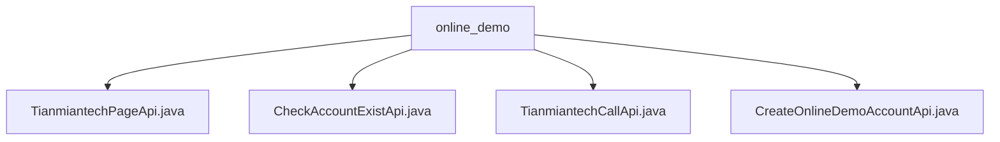

# 基础信息

|      |      |
|------|------|
| 名称 | online_demo |
| 编码语言 | .java |
| 代码路径 | WeFe/board/board-service/src/main/java/com/welab/wefe/board/service/api/online_demo |
| 包名 | docs.board.board-service.src.main.java.com.welab.wefe.board.service.api.online_demo |
| 概述说明 | TianmiantechPageApi生成天眠科技网站URL，含校验和签名。CheckAccountExistApi检查账号是否存在，输入手机号返回布尔值。TianmiantechCallApi调用天眠科技服务接口，返回JObject结果。CreateOnlineDemoAccountApi创建体验账号，无需登录。 |

# 说明

## 概述  
该模块核心职责是为天眠科技网站提供在线演示功能，包括URL生成、账号校验和第三方服务调用。接口规范遵循标准输入输出结构，采用@OnlineDemoApi注解标记无需登录的API。关键数据结构包含Input（含page/params字段）和Output（含URL/exist布尔值）。外部依赖包括TianmiantechService和AccountService。例如TianmiantechPageApi自动添加签名生成URL，CheckAccountExistApi通过手机号验证账号存在性。

## 主要业务场景  
模块支持四种典型交互：页面URL构建（类似网关路由）、账号状态检查、第三方服务透传（类似代理模式）和体验账号创建。业务流程涵盖参数校验（如手机号格式）、服务调用（如AccountService.exist）和结果封装。例如TianmiantechCallApi将输入透传给天眠科技服务，CreateOnlineDemoAccountApi实现无返回值的账号创建。所有API均继承AbstractApi，统一异常处理和日志记录。

### 包内部结构视图

该流程图展示了online_demo目录下的4个API文件结构。顶层节点为online_demo文件夹，它直接包含4个Java接口文件，分别处理天冕科技页面、账户存在检查、天冕科技调用和创建在线演示账户等功能。所有文件都位于同一层级，没有更深层次的嵌套关系。

# 文件列表

| 名称   | 类型  | 说明 |
|-------|------|-------------|
| [TianmiantechPageApi.java](TianmiantechPageApi.md) | file | 天眠科技页面API类，用于生成带签名和时间戳的网站URL。输入需包含页面路径和参数，输出为完整URL。自动处理参数校验和标准化。 |
| [CheckAccountExistApi.java](CheckAccountExistApi.md) | file | 检查账号是否存在的API，路径为account/online_demo/exist，无需登录，输入手机号，返回是否存在。 |
| [TianmiantechCallApi.java](TianmiantechCallApi.md) | file | TianmiantechCallApi是一个在线API类，调用天眠科技服务接口，接收api和params参数，返回JSON结果。 |
| [CreateOnlineDemoAccountApi.java](CreateOnlineDemoAccountApi.md) | file | 这是一个创建体验账号的API类，路径为"account/online_demo/create"，无需登录，调用AccountService处理输入参数AccountInputModel并返回成功结果。 |

