# 基础信息

|      |      |
|------|------|
| 名称 | LogQueryApi |
| 编码语言 | .java |
| 代码路径 | WeFe/board/board-service/src/main/java/com/welab/wefe/board/service/api/operation/LogQueryApi.java |
| 包名 | com.welab.wefe.board.service.api.operation |
| 依赖项 | ['com.welab.wefe.board.service.dto.base.PagingInput', 'com.welab.wefe.board.service.dto.base.PagingOutput', 'com.welab.wefe.board.service.dto.entity.OperationLogOutputModel', 'com.welab.wefe.board.service.service.OperationLogService', 'com.welab.wefe.common.exception.StatusCodeWithException', 'com.welab.wefe.common.fieldvalidate.annotation.Check', 'com.welab.wefe.common.web.api.base.AbstractApi', 'com.welab.wefe.common.web.api.base.Api', 'com.welab.wefe.common.web.dto.ApiResult', 'org.springframework.beans.factory.annotation.Autowired'] |
| 概述说明 | LogQueryApi提供分页查询操作日志功能，输入包含接口名、操作员ID和时间范围，输出操作日志分页结果。 |

# 说明

LogQueryApi是一个用于查询操作日志的API类，继承自AbstractApi，处理输入类型为Input，输出为分页的OperationLogOutputModel。API路径为"log/query"，名称为"query log"。通过OperationLogService的query方法处理请求，返回分页结果。Input类继承自PagingInput，包含日志接口名称、操作人员ID、开始时间和结束时间等查询条件，其中开始时间和结束时间通过getter和setter方法访问。所有字段均通过Check注解进行校验。

# 类列表 Class Summary

| 名称   | 类型  | 说明 |
|-------|------|-------------|
| LogQueryApi | class | LogQueryApi是一个查询日志的API类，继承自AbstractApi，使用OperationLogService处理分页查询请求。输入参数包括接口名、操作人员ID、起止时间，返回分页的操作日志结果。 |


## 类 LogQueryApi

|      |      |
|------|------|
| 访问范围 | @Api(path = "log/query", name = "query log");public |
| 类型 | class |
| 名称 | LogQueryApi |
| 说明 | LogQueryApi是一个查询日志的API类，继承自AbstractApi，使用OperationLogService处理分页查询请求。输入参数包括接口名、操作人员ID、起止时间，返回分页的操作日志结果。 |


### UML类图

```mermaid
classDiagram
    class LogQueryApi {
        -OperationLogService service
        +handle(Input input) ApiResult~PagingOutput~OperationLogOutputModel~~
    }
    LogQueryApi --> OperationLogService : 依赖
    LogQueryApi --> Input : 包含

    class Input {
        +String logInterface
        +String operatorId
        -Long startTime
        -Long endTime
        +Long getStartTime()
        +void setStartTime(Long startTime)
        +Long getEndTime()
        +void setEndTime(Long endTime)
    }
    Input --|> PagingInput : 继承

    class OperationLogService {
        <<Interface>>
        +query(Input input) PagingOutput~OperationLogOutputModel~
    }

    class AbstractApi~T, R~ {
        <<Abstract>>
        +handle(T input) ApiResult~R~
    }
    LogQueryApi --|> AbstractApi~Input, PagingOutput~OperationLogOutputModel~~ : 继承

    class PagingInput {
        <<Abstract>>
    }

    class PagingOutput~T~ {
    }

    class OperationLogOutputModel {
    }

    class ApiResult~T~ {
    }
```

这段代码展示了一个日志查询API的实现结构。LogQueryApi继承自泛型抽象类AbstractApi，处理Input参数并返回分页的OperationLogOutputModel结果。Input类继承自PagingInput，包含日志查询条件字段。OperationLogService作为接口提供查询功能。整体架构体现了分层设计，通过泛型实现了类型安全的API处理流程。


### 内部方法调用关系图

```mermaid
graph TD
    A["类LogQueryApi"]
    B["注解: @Api(path='log/query', name='query log')"]
    C["继承: AbstractApi<Input, PagingOutput<OperationLogOutputModel>>"]
    D["依赖注入: @Autowired OperationLogService service"]
    E["重写方法: handle(Input input)"]
    F["内部类: Input"]
    G["父类: PagingInput"]
    H["字段: @Check String logInterface"]
    I["字段: @Check String operatorId"]
    J["字段: Long startTime/endTime"]
    K["方法: get/setStartTime()"]
    L["方法: get/setEndTime()"]
    M["调用: service.query(input)"]
    N["返回: success(结果)"]

    A --> B
    A --> C
    A --> D
    A --> E
    E --> M
    M --> N
    A -.-> F
    F --> G
    F --> H
    F --> I
    F --> J
    J --> K
    J --> L
```



这段代码是一个日志查询API的实现类，继承自抽象基类AbstractApi，通过OperationLogService处理分页查询请求。内部类Input定义了查询参数，包含接口名称、操作人员ID和时间范围等字段，并继承分页参数基类。主要流程是通过handle方法调用服务层查询，返回封装后的结果。注解标注了API路径和名称，字段校验通过@Check实现。

### 字段列表 Field List

| 名称  | 类型  | 说明 |
|-------|-------|------|
| service | OperationLogService | 使用@Autowired自动注入OperationLogService服务实例。 |

### 方法列表

| 名称  | 类型  | 说明 |
|-------|-------|------|
| handle | ApiResult<PagingOutput<OperationLogOutputModel>> | 这是一个Java方法重写，调用service.query处理输入并返回分页的操作日志结果，成功时包装为ApiResult。 |


