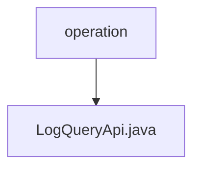

# 基础信息

|      |      |
|------|------|
| 名称 | operation |
| 编码语言 | .java |
| 代码路径 | WeFe/board/board-service/src/main/java/com/welab/wefe/board/service/api/operation |
| 包名 | docs.board.board-service.src.main.java.com.welab.wefe.board.service.api.operation |
| 概述说明 | LogQueryApi提供分页查询操作日志功能，输入包含接口名、操作员ID和时间范围，输出操作日志分页结果。 |

# 说明

LogQueryApi是一个用于查询操作日志的API类，继承自AbstractApi，处理输入类型为Input，输出为分页的OperationLogOutputModel。API路径为"log/query"，名称为"query log"。通过OperationLogService的query方法处理请求，返回分页结果。Input类继承自PagingInput，包含日志接口名称、操作人员ID、开始时间和结束时间等查询条件，其中开始时间和结束时间通过getter和setter方法访问。所有字段均通过Check注解进行校验。

### 包内部结构视图

该流程图展示了WeFe项目中board-service模块的API操作路径结构。operation作为父节点，包含一个子节点LogQueryApi.java，表示这是一个操作相关的API接口文件。整个结构简洁明了，体现了单一API文件与其所属操作目录的层级关系。

# 文件列表

| 名称   | 类型  | 说明 |
|-------|------|-------------|
| [LogQueryApi.java](LogQueryApi.md) | file | LogQueryApi提供分页查询操作日志功能，输入包含接口名、操作员ID和时间范围，输出操作日志分页结果。 |

