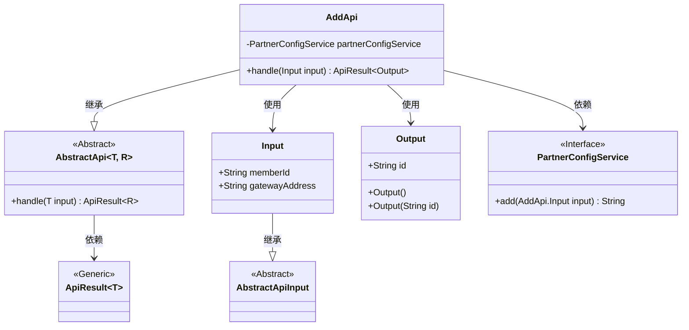
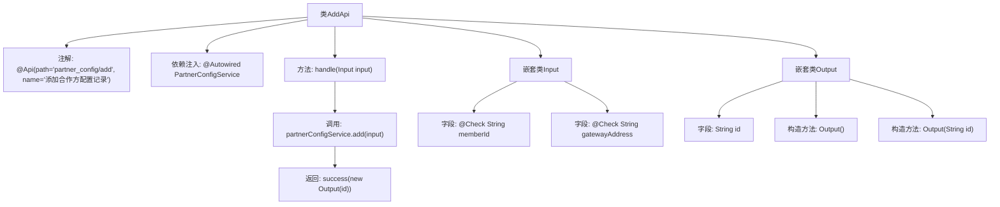

# 基础信息

|      |      |
|------|------|
| 名称 | AddApi |
| 编码语言 | .java |
| 代码路径 | WeFe/board/board-service/src/main/java/com/welab/wefe/board/service/api/partner_config/AddApi.java |
| 包名 | com.welab.wefe.board.service.api.partner_config |
| 依赖项 | ['com.welab.wefe.board.service.service.PartnerConfigService', 'com.welab.wefe.common.fieldvalidate.annotation.Check', 'com.welab.wefe.common.web.api.base.AbstractApi', 'com.welab.wefe.common.web.api.base.Api', 'com.welab.wefe.common.web.dto.AbstractApiInput', 'com.welab.wefe.common.web.dto.ApiResult', 'org.springframework.beans.factory.annotation.Autowired'] |
| 概述说明 | 添加合作方配置的API类，包含输入参数memberId和gatewayAddress，输出返回生成的配置ID。 |

# 说明

这是一个名为AddApi的Java类，用于添加合作方配置记录。它继承自AbstractApi，定义了输入Input和输出Output两个内部类。输入包含必填的memberId和gatewayAddress字段，输出包含生成的id。类通过注入的PartnerConfigService调用add方法处理请求，并返回包含id的成功结果。整个API路径为"partner_config/add"。

# 类列表 Class Summary

| 名称   | 类型  | 说明 |
|-------|------|-------------|
| AddApi | class | 添加合作方配置的API类，接收memberId和gatewayAddress参数，调用PartnerConfigService添加记录并返回生成的ID。 |

## 类 AddApi

|      |      |
|------|------|
| 访问范围 | @Api(path = "partner_config/add", name = "添加合作方配置记录");public |
| 类型 | class |
| 名称 | AddApi |
| 说明 | 添加合作方配置的API类，接收memberId和gatewayAddress参数，调用PartnerConfigService添加记录并返回生成的ID。 |

### UML类图

类图描述：该图展示了AddApi类继承自泛型抽象类AbstractApi，并依赖PartnerConfigService接口完成业务逻辑。Input和Output作为内部类分别继承和封装数据，其中Input继承自AbstractApiInput。PartnerConfigService接口定义了添加配置的核心方法，ApiResult作为泛型结果包装类被AbstractApi使用。整个结构体现了清晰的层级关系和职责划分。

### 内部方法调用关系图

流程图描述了AddApi类的结构及其内部关系。该类是一个API接口，通过@Api注解定义路径和名称，依赖PartnerConfigService处理业务逻辑。handle方法调用服务层添加配置并返回结果，包含两个嵌套类Input（带校验的输入参数）和Output（输出结果结构）。流程清晰展示了从请求处理到结果返回的完整链路。

### 字段列表 Field List

| 名称  | 类型  | 说明 |
|-------|-------|------|
| partnerConfigService | PartnerConfigService | 自动注入PartnerConfigService实例。 |

### 方法列表

| 名称  | 类型  | 说明 |
|-------|-------|------|
| handle | ApiResult<Output> | 该方法处理输入并调用服务添加配置，返回包含生成ID的成功结果。 |

