# 基础信息

|      |      |
|------|------|
| 名称 | DeleteApi |
| 编码语言 | .java |
| 代码路径 | WeFe/board/board-service/src/main/java/com/welab/wefe/board/service/api/partner_config/DeleteApi.java |
| 包名 | com.welab.wefe.board.service.api.partner_config |
| 依赖项 | ['com.welab.wefe.board.service.service.PartnerConfigService', 'com.welab.wefe.common.fieldvalidate.annotation.Check', 'com.welab.wefe.common.web.api.base.AbstractApi', 'com.welab.wefe.common.web.api.base.Api', 'com.welab.wefe.common.web.dto.AbstractApiInput', 'com.welab.wefe.common.web.dto.ApiResult', 'org.springframework.beans.factory.annotation.Autowired'] |
| 概述说明 | 删除合作方配置记录的API类，继承抽象类处理输入输出，调用服务删除指定ID记录。输入需包含ID字段，输出为空。 |

# 说明

这是一个名为DeleteApi的API类，用于删除合作方配置记录。它继承自AbstractApi，泛型参数为Input和Output。类上标注了Api注解，指定路径为partner_config/delete。内部注入了PartnerConfigService服务。handle方法处理输入参数，调用partnerConfigService的delete方法删除指定ID的记录，返回成功结果。Input内部类继承AbstractApiInput，包含一个必填的字符串类型id字段。Output内部类为空，表示无返回数据。

# 类列表 Class Summary

| 名称   | 类型  | 说明 |
|-------|------|-------------|
| DeleteApi | class | 删除合作方配置API，接收ID参数，调用服务删除记录，返回成功结果。 |


## 类 DeleteApi

|      |      |
|------|------|
| 访问范围 | @Api(path = "partner_config/delete", name = "删除合作方配置记录");public |
| 类型 | class |
| 名称 | DeleteApi |
| 说明 | 删除合作方配置API，接收ID参数，调用服务删除记录，返回成功结果。 |


### UML类图

```mermaid
classDiagram
    class DeleteApi {
        -PartnerConfigService partnerConfigService
        +handle(Input input) ApiResult~Output~
    }
    
    class PartnerConfigService {
        <<Interface>>
        +delete(String id) void
    }
    
    class AbstractApi~I,O~ {
        <<Abstract>>
        +handle(I input) ApiResult~O~
    }
    
    class ApiResult~T~ {
        <<Generic>>
    }
    
    class DeleteApi$Input {
        +String id
    }
    
    class DeleteApi$Output {
    }
    
    class AbstractApiInput {
    }
    
    DeleteApi --> PartnerConfigService : 依赖
    DeleteApi --|> AbstractApi~Input,Output~ : 继承
    DeleteApi$Input --|> AbstractApiInput : 继承
```

这段代码展示了一个删除合作方配置记录的API实现。DeleteApi继承自泛型抽象类AbstractApi，定义了Input和Output两个静态内部类作为参数和返回类型。Input继承自AbstractApiInput并包含必填的id字段，Output为空结构体。DeleteApi通过依赖注入的PartnerConfigService接口实现删除功能，核心逻辑在handle方法中完成。整体设计遵循了分层架构，Input参数通过注解进行校验，体现了清晰的职责划分和类型安全。


### 内部方法调用关系图

```mermaid
graph TD
    A["类DeleteApi"]
    B["注解: @Api(path='partner_config/delete', name='删除合作方配置记录')"]
    C["继承: AbstractApi<Input, Output>"]
    D["依赖注入: @Autowired PartnerConfigService"]
    E["重写方法: handle(Input input)"]
    F["内部类: Input"]
    G["内部类: Output"]
    H["Input属性: @Check(require=true) String id"]
    I["方法调用: partnerConfigService.delete(input.id)"]
    J["返回: success()"]

    A --> B
    A --> C
    A --> D
    A --> E
    A --> F
    A --> G
    F --> H
    E --> I
    E --> J
```



这段代码流程图展示了DeleteApi类的结构和执行流程。该类是一个带有API注解的控制器，继承自AbstractApi模板类，通过依赖注入获取PartnerConfigService服务。核心处理逻辑在handle方法中，调用服务层的delete方法删除指定ID的记录后返回成功结果。Input内部类定义了必须的ID参数校验，Output作为空响应体。整个流程清晰地呈现了从请求处理到业务操作的关键路径。

### 字段列表 Field List

| 名称  | 类型  | 说明 |
|-------|-------|------|
| partnerConfigService | PartnerConfigService | 自动注入PartnerConfigService服务实例。 |

### 方法列表

| 名称  | 类型  | 说明 |
|-------|-------|------|
| handle | ApiResult<Output> | 删除指定ID的合作伙伴配置并返回成功结果。 |


