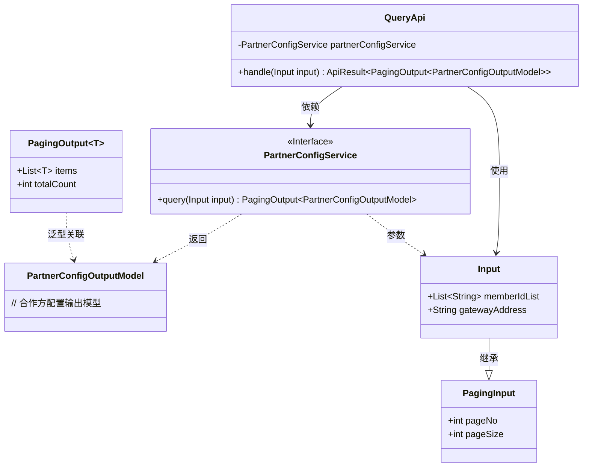

# 基础信息

|      |      |
|------|------|
| 名称 | QueryApi |
| 编码语言 | .java |
| 代码路径 | WeFe/board/board-service/src/main/java/com/welab/wefe/board/service/api/partner_config/QueryApi.java |
| 包名 | com.welab.wefe.board.service.api.partner_config |
| 依赖项 | ['com.welab.wefe.board.service.dto.base.PagingInput', 'com.welab.wefe.board.service.dto.base.PagingOutput', 'com.welab.wefe.board.service.dto.entity.PartnerConfigOutputModel', 'com.welab.wefe.board.service.service.PartnerConfigService', 'com.welab.wefe.common.web.api.base.AbstractApi', 'com.welab.wefe.common.web.api.base.Api', 'com.welab.wefe.common.web.dto.ApiResult', 'org.springframework.beans.factory.annotation.Autowired', 'java.util.List'] |
| 概述说明 | QueryApi类用于分页查询合作方配置记录，接收包含memberIdList和gatewayAddress的Input参数，返回分页结果PartnerConfigOutputModel，调用PartnerConfigService的query方法处理请求。 |

# 说明

这是一个名为QueryApi的Java类，用于分页查询合作方配置记录。它继承自AbstractApi基类，泛型参数指定输入类型为内部类Input，输出类型为分页的PartnerConfigOutputModel。类通过@Api注解定义了API路径和名称。内部类Input扩展了PagingInput，包含memberIdList和gatewayAddress两个查询参数。实际业务逻辑委托给自动注入的PartnerConfigService处理，其query方法接收Input参数并返回分页结果。handle方法包装服务层调用，返回成功的ApiResult。整个类结构清晰，职责明确，实现了分页查询合作方配置的功能。

# 类列表 Class Summary

| 名称   | 类型  | 说明 |
|-------|------|-------------|
| QueryApi | class | 这是一个名为QueryApi的Java类，用于分页查询合作方配置记录。它继承自AbstractApi，接受Input参数并返回分页结果。Input包含memberIdList和gatewayAddress字段。实际查询通过PartnerConfigService完成。 |

## 类 QueryApi

|      |      |
|------|------|
| 访问范围 | @Api(path = "partner_config/query", name = "分页查询合作方配置记录");public |
| 类型 | class |
| 名称 | QueryApi |
| 说明 | 这是一个名为QueryApi的Java类，用于分页查询合作方配置记录。它继承自AbstractApi，接受Input参数并返回分页结果。Input包含memberIdList和gatewayAddress字段。实际查询通过PartnerConfigService完成。 |

### UML类图

这段代码展示了一个查询合作方配置记录的API实现。QueryApi继承自AbstractApi，通过PartnerConfigService服务处理分页查询请求。Input类继承PagingInput并扩展了memberIdList和gatewayAddress字段，用于接收查询参数。PartnerConfigService接口定义了查询方法，返回包含PartnerConfigOutputModel的分页结果。整个结构体现了清晰的依赖关系和分层设计，Input参数与输出模型通过泛型PagingOutput进行解耦。

### 内部方法调用关系图

```mermaid
graph TD
    A["类QueryApi"]
    B["注解: @Api(path='partner_config/query', name='分页查询合作方配置记录')"]
    C["继承: AbstractApi<Input, PagingOutput<PartnerConfigOutputModel>>"]
    D["依赖注入: @Autowired PartnerConfigService"]
    E["重写方法: handle(Input input)"]
    F["静态内部类: Input"]
    G["父类: PagingInput"]
    H["字段: List<String> memberIdList"]
    I["字段: String gatewayAddress"]
    J["方法调用: partnerConfigService.query(input)"]
    K["返回结果: success(...)"]

    A --> B
    A --> C
    A --> D
    A --> E
    E --> J
    J --> K
    A -.-> F
    F --> G
    F --> H
    F --> I
```

这段代码展示了一个基于Spring框架的分页查询API实现。QueryApi类继承自AbstractApi，通过@Api注解定义接口路径和名称，使用@Autowired注入PartnerConfigService服务。核心逻辑在handle方法中，调用partnerConfigService.query()进行分页查询，并返回包装后的结果。Input作为静态内部类继承PagingInput，包含memberIdList和gatewayAddress两个查询参数字段。整体设计体现了分层架构和依赖注入的思想。

### 字段列表 Field List

| 名称  | 类型  | 说明 |
|-------|-------|------|
| partnerConfigService | PartnerConfigService | 使用@Autowired自动注入PartnerConfigService实例。 |

### 方法列表

| 名称  | 类型  | 说明 |
|-------|-------|------|
| handle | ApiResult<PagingOutput<PartnerConfigOutputModel>> | Java方法重写，调用服务查询并返回分页结果。 |

