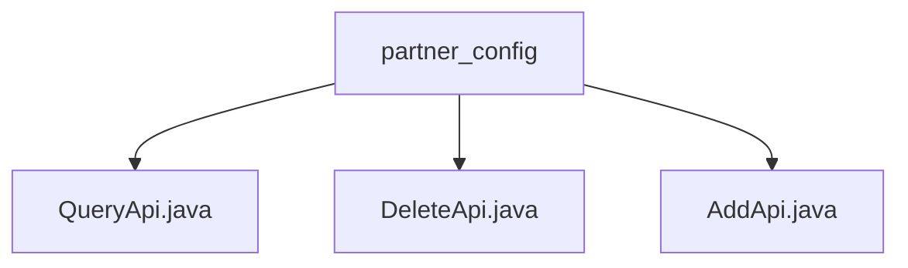

# 基础信息

|      |      |
|------|------|
| 名称 | partner_config |
| 编码语言 | .java |
| 代码路径 | WeFe/board/board-service/src/main/java/com/welab/wefe/board/service/api/partner_config |
| 包名 | docs.board.board-service.src.main.java.com.welab.wefe.board.service.api.partner_config |
| 概述说明 | QueryApi实现分页查询合作方配置，Input含memberIdList和gatewayAddress，返回分页结果。DeleteApi处理删除操作，需传入id。AddApi用于添加记录，需memberId和gatewayAddress，返回生成id。均继承AbstractApi，通过PartnerConfigService执行业务逻辑。 |

# 说明

## 概述  
该模块核心职责是管理合作方配置的CRUD操作，包括分页查询、删除和新增记录。接口规范遵循统一设计：继承AbstractApi基类，使用@Api注解定义路径，通过PartnerConfigService委托业务逻辑。关键数据结构包括分页查询的PartnerConfigOutputModel、删除操作的ID参数和新增记录的返回ID。外部依赖仅为PartnerConfigService。例如QueryApi处理带memberIdList的分页查询，DeleteApi按ID删除记录，AddApi新增配置并返回ID。

## 主要业务场景  
模块完整支持合作方配置全生命周期管理，类似后台管理系统的基础数据维护。典型流程包括：查询配置列表（分页）、删除无效配置、添加新合作方。交互模式均为同步HTTP调用，返回标准ApiResult。例如前端分页展示配置列表时调用QueryApi，管理员删除记录触发DeleteApi，新增网关地址使用AddApi。所有API均通过服务层PartnerConfigService实现数据持久化。

### 包内部结构视图

该流程图展示了partner_config目录下的三个Java文件：QueryApi.java、DeleteApi.java和AddApi.java。这三个文件都直接隶属于partner_config目录，没有更深层次的嵌套结构，形成了简单的单层树状关系。

# 文件列表

| 名称   | 类型  | 说明 |
|-------|------|-------------|
| [QueryApi.java](QueryApi.md) | file | QueryApi类用于分页查询合作方配置记录，接收包含memberIdList和gatewayAddress的Input参数，返回分页结果PartnerConfigOutputModel，调用PartnerConfigService的query方法处理请求。 |
| [DeleteApi.java](DeleteApi.md) | file | 删除合作方配置记录的API类，继承抽象类处理输入输出，调用服务删除指定ID记录。输入需包含ID字段，输出为空。 |
| [AddApi.java](AddApi.md) | file | 添加合作方配置的API类，包含输入参数memberId和gatewayAddress，输出返回生成的配置ID。 |

