# 基础信息

|      |      |
|------|------|
| 名称 | project |
| 编码语言 | .java |
| 代码路径 | WeFe/board/board-service/src/main/java/com/welab/wefe/board/service/api/project |
| 包名 | docs.board.board-service.src.main.java.com.welab.wefe.board.service.api.project |
| 概述说明 | 模块提供建模信息查询API，支持分页和详情获取。任务管理模块实现全生命周期控制，包括创建、暂停、恢复等。数据集模块管理CRUD操作及审核流程。项目管理模块涵盖CRUD、状态变更及统计分析。流程管理模块处理流程编排与状态控制。成员管理模块处理增删改查及审核。联邦学习模块管理对齐任务和数据融合。节点模块负责节点信息维护和合规检查。 |

# 说明

## 概述  
该模块核心职责是构建联邦学习项目的全生命周期管理体系，涵盖项目管理、流程编排、成员协作、数据治理和任务监控五大核心功能，类似工作流引擎与数据中台的结合体。接口规范统一采用RESTful风格，继承AbstractApi基类实现标准化输入输出，路径按功能划分（如`project/flow`管理流程、`fusion/`处理数据融合）。关键数据结构包括分页模型（如ModelingInfoOutputModel）、详情模型（如ProjectFlowDetailOutputModel）和状态枚举（如PSIActuatorStatus），均通过校验注解保障数据有效性。外部依赖集中于Spring框架和内部服务层（如ProjectFlowService、ProjectMemberService），例如ProjectService提供项目CRUD核心逻辑，FusionResultService处理数据融合结果。

## 主要业务场景  
模块支持联邦学习典型场景闭环：1)项目创建（AddApi）→成员管理（AddApi/RemoveApi）→流程设计（AddFlowApi）→节点配置（UpdateApi）；2)数据准备（AddDataSetApi）→任务执行（StartFlowApi）→结果查询（QueryDerivedDataSetApi）；3)监控分析（GetProgressApi）→审核回调（AuditCallbackApi）。交互模式以同步HTTP为主，API类型覆盖CRUD操作（如DeleteApi）、状态变更（如StopJobApi）和复杂查询（如ListFlowTableDataSetApi）。功能完整性体现在跨模块协作，例如成员退出（ExitProjectApi）触发数据清理，流程节点更新时验证组件合规性（CheckExistVertModelComponentApi）。典型应用包括项目管理后台、建模监控台和自动化审核系统。

### 包内部结构视图

```mermaid
graph TD
    project --> modeling
    project --> job
    project --> dataset
    project --> project
    project --> flow
    project --> member
    project --> fusion
    project --> node
    modeling --> QueryApi.java
    modeling --> DetailApi.java
    job --> task
    job --> PreviewJobApi.java
    job --> QueryApi.java
    job --> ResumeJobApi.java
    job --> DownloadLogApi.java
    job --> GetJobProgressApi.java
    job --> DetailApi.java
    job --> UpdateJobStatusApi.java
    job --> StopJobApi.java
    job --> ViewDataSetApi.java
    job --> OnJobFinishedApi.java
    task --> TaskProgressDetailApi.java
    task --> GetFeatureApi.java
    task --> DetailApi.java
    task --> GetResultHistoryApi.java
    task --> GetResultApi.java
    dataset --> ListApi.java
    dataset --> RawDataSetListApi.java
    dataset --> AddDataSetApi.java
    dataset --> QueryDerivedDataSetApi.java
    dataset --> GetFeaturesApi.java
    dataset --> RemoveDataSetApi.java
    dataset --> AuditDataSetApi.java
    project --> QueryApi.java
    project --> UpdateProjectApi.java
    project --> AddApi.java
    project --> TopProjectApi.java
    project --> DataInfoApi.java
    project --> DetailApi.java
    project --> AuditApi.java
    project --> CloseProjectApi.java
    project --> CountStatisticsApi.java
    flow --> ListFlowNodeApi.java
    flow --> AddFlowApi.java
    flow --> UpdateFlowBaseInfoApi.java
    flow --> QueryFlowTemplateApi.java
    flow --> StartFlowApi.java
    flow --> QueryDataIoTaskConfigApi.java
    flow --> GetProgressApi.java
    flow --> DeleteApi.java
    flow --> SaveFlowTemplateApi.java
    flow --> QueryDataIoTaskFeaturesApi.java
    flow --> UpdateFlowGraphApi.java
    flow --> DetailFlowApi.java
    flow --> FlowQueryApi.java
    flow --> AddOotFlowApi.java
    flow --> CopyFlowApi.java
    flow --> TopFlowApi.java
    flow --> FlowDataSetInfoApi.java
    flow --> ListFlowTableDataSetApi.java
    member --> audit
    member --> AddApi.java
    member --> ListInAllProjectApi.java
    member --> ListInProjectApi.java
    member --> ExitProjectApi.java
    member --> OnlineCheckApi.java
    member --> RemoveApi.java
    audit --> ProjectMemberAuditListApi.java
    audit --> AuditApi.java
    fusion --> result
    fusion --> actuator
    fusion --> task
    fusion --> member
    fusion --> HashOptionsEnumApi.java
    result --> ResultExportApi.java
    result --> ResultPreviewApi.java
    result --> TestDBConnectApi.java
    result --> ResultExportProgressApi.java
    actuator --> psi
    psi --> DownloadBFApi.java
    psi --> ReceiveResultApi.java
    psi --> ServerSynStatusApi.java
    psi --> ServerCloseApi.java
    psi --> PsiCryptoApi.java
    task --> ReceiveApi.java
    task --> InfoApi.java
    task --> PagingApi.java
    task --> UpdateApi.java
    task --> RestartApi.java
    task --> DeleteApi.java
    task --> AddApi.java
    task --> DeleteCallbackApi.java
    task --> AuditCallbackApi.java
    task --> DetailApi.java
    task --> AuditApi.java
    task --> TaskStatusApi.java
    member --> QueryProvidersApi.java
    node --> CheckExistVertModelComponentApi.java
    node --> UpdateApi.java
    node --> CheckExistEvaluationComponentApi.java
    node --> DetailApi.java
```

该流程图展示了WeFe项目中board-service模块的API层级结构，以project为根节点，向下展开modeling、job、dataset等8个二级目录。其中job目录包含task子目录和11个API文件，flow目录包含17个API文件，fusion目录包含result/actuator/task等复杂子结构。整个结构共包含98个节点，完整呈现了项目API的模块化设计，体现了清晰的业务功能划分和层级关系。

# 文件列表

| 名称   | 类型  | 说明 |
|-------|------|-------------|
| [fusion](fusion/_module.md) | package | 模块1：数据融合结果管理，提供预览、导出及进度查询功能，采用RESTful接口，依赖FusionResultService和存储服务。模块2：PSI协议API，管理布隆过滤器下载、状态同步和结果接收，依赖ActuatorManager。模块3：联邦学习对齐任务管理，支持任务创建、查询和审核，路径前缀为fusion/task/。模块4：查询项目提供者列表API，路径为fusion/query/providers。模块5：获取HashOptions枚举值的API，路径为fusion/hash_options_enum。 |
| [node](node/_module.md) | package | 检查垂直模型组件API，路径project/flow/node/check_exist_vert_model_component，返回布尔结果。更新流程节点API，路径project/flow/node/update，检查分类数与评估模式匹配。检查评估组件API，返回布尔结果。获取节点详情API，路径project/flow/node/detail，查询并返回节点数据。 |
| [member](member/_module.md) | package | 该模块管理项目成员审核流程，提供查询待审列表和提交审核结果的API。支持按项目或成员ID筛选，拒绝需填写意见。包含成员添加、列表查询、退出、在线检查和移除等功能，均通过特定API实现，依赖统一基类和服务层处理业务逻辑。 |
| [flow](flow/_module.md) | package | ListFlowNodeApi查询流程节点列表。AddFlowApi新增项目流程。UpdateFlowBaseInfoApi更新流程信息。QueryFlowTemplateApi查询流程模板。StartFlowApi启动流程。QueryDataIoTaskConfigApi查询数据IO配置。GetProgressApi获取流程进度。DeleteApi删除流程。SaveFlowTemplateApi保存模板。QueryDataIoTaskFeaturesApi查询特征列。UpdateFlowGraphApi更新流程图。DetailFlowApi获取流程详情。FlowQueryApi查询流程列表。AddOotFlowApi添加OOT流程。CopyFlowApi复制流程。TopFlowApi置顶流程。FlowDataSetInfoApi获取数据集信息。ListFlowTableDataSetApi获取数据集列表。 |
| [project](project/_module.md) | package | QueryApi查询项目列表，UpdateProjectApi更新项目信息，AddApi新增项目，TopProjectApi设置置顶状态，DataInfoApi获取项目数据，DetailApi查询项目详情，AuditApi处理审核，CloseProjectApi关闭项目，CountStatisticsApi统计项目数量。 |
| [dataset](dataset/_module.md) | package | ListApi列出项目数据集，RawDataSetListApi获取原始数据集列表，AddDataSetApi添加数据集，QueryDerivedDataSetApi查询派生数据集，GetFeaturesApi获取特征列表，RemoveDataSetApi删除数据集，AuditDataSetApi审核数据集授权。 |
| [job](job/_module.md) | package | 任务管理API模块，提供任务进度查询、详情查看、历史追溯等功能，遵循REST规范，依赖Spring框架，支持全生命周期管理，包括预览、查询、恢复、下载日志、更新状态、停止任务等操作。 |
| [modeling](modeling/_module.md) | package | QueryApi是分页查询建模信息的API，路径为"project/modeling/query"，输入包含可选条件和布尔标志，输出分页结果。DetailApi是获取建模详情的API，路径为"project/modeling/detail"，输入继承自GetResultApi.Input，输出TaskResultOutputModel。 |

