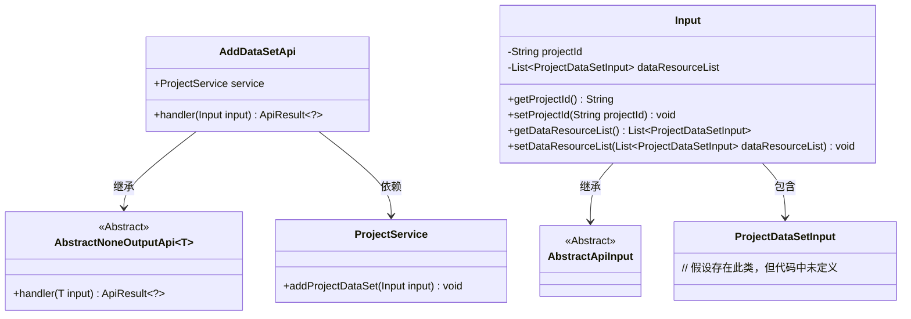

# 基础信息

|      |      |
|------|------|
| 名称 | AddDataSetApi |
| 编码语言 | .java |
| 代码路径 | WeFe/board/board-service/src/main/java/com/welab/wefe/board/service/api/project/dataset/AddDataSetApi.java |
| 包名 | com.welab.wefe.board.service.api.project.dataset |
| 依赖项 | ['com.welab.wefe.board.service.dto.entity.ProjectDataSetInput', 'com.welab.wefe.board.service.service.ProjectService', 'com.welab.wefe.common.exception.StatusCodeWithException', 'com.welab.wefe.common.fieldvalidate.annotation.Check', 'com.welab.wefe.common.web.api.base.AbstractNoneOutputApi', 'com.welab.wefe.common.web.api.base.Api', 'com.welab.wefe.common.web.dto.AbstractApiInput', 'com.welab.wefe.common.web.dto.ApiResult', 'org.springframework.beans.factory.annotation.Autowired', 'java.util.List'] |
| 概述说明 | 这是一个用于向项目添加数据集的API类，包含项目ID和数据集列表作为输入参数，调用ProjectService的addProjectDataSet方法处理请求。 |

# 说明

该代码定义了一个名为AddDataSetApi的API类，用于向项目中添加数据集。API路径为project/data_resource/add，名称是add data set to project。该类继承自AbstractNoneOutputApi，使用泛型Input作为输入参数。通过Autowired注入ProjectService服务，在handler方法中调用服务的addProjectDataSet方法处理输入数据。Input内部类继承AbstractApiInput，包含两个必填字段：项目ID（projectId）和数据集列表（dataResourceList），并提供了相应的getter和setter方法。处理成功后返回空结果。

# 类列表 Class Summary

| 名称   | 类型  | 说明 |
|-------|------|-------------|
| AddDataSetApi | class | 这是一个用于向项目添加数据集的API类，路径为"project/data_resource/add"。它接收项目ID和数据集列表作为输入，调用ProjectService完成添加操作，成功后返回空结果。输入参数包括必填的项目ID和数据集列表。 |

## 类 AddDataSetApi

|      |      |
|------|------|
| 访问范围 | @Api(path = "project/data_resource/add", name = "add data set to project");public |
| 类型 | class |
| 名称 | AddDataSetApi |
| 说明 | 这是一个用于向项目添加数据集的API类，路径为"project/data_resource/add"。它接收项目ID和数据集列表作为输入，调用ProjectService完成添加操作，成功后返回空结果。输入参数包括必填的项目ID和数据集列表。 |

### UML类图

这段代码展示了一个添加数据集到项目的API实现。AddDataSetApi继承自泛型抽象类AbstractNoneOutputApi，使用Input作为输入参数类型。Input类包含项目ID和数据集列表字段，并继承自AbstractApiInput。ProjectService被注入用于业务逻辑处理，通过addProjectDataSet方法实现核心功能。类图清晰地展示了继承关系和依赖关系，Input类与ProjectDataSetInput存在聚合关系。

### 内部方法调用关系图

```mermaid
graph TD
    A["类AddDataSetApi"]
    B["注解: @Api(path='project/data_resource/add', name='add data set to project')"]
    C["继承: AbstractNoneOutputApi<Input>"]
    D["依赖注入: @Autowired ProjectService service"]
    E["重写方法: handler(Input input)"]
    F["内部类: Input"]
    G["Input属性: String projectId"]
    H["Input属性: List<ProjectDataSetInput> dataResourceList"]
    I["Input方法: getter/setter"]
    J["handler逻辑: service.addProjectDataSet(input)"]
    K["返回结果: success()"]

    A --> B
    A --> C
    A --> D
    A --> E
    E --> J
    E --> K
    A --> F
    F --> G
    F --> H
    F --> I
```

这段代码展示了一个名为AddDataSetApi的API类，用于向项目添加数据集。该类继承自AbstractNoneOutputApi并指定了泛型类型Input，包含一个通过@Autowired注入的ProjectService实例。主要逻辑在handler方法中实现，调用service.addProjectDataSet处理输入参数后返回成功结果。Input作为内部类定义了项目ID和数据集列表两个必填字段，并提供了相应的getter/setter方法。整个流程清晰地展现了从API入口到业务处理的调用关系和数据流转路径。

### 字段列表 Field List

| 名称  | 类型  | 说明 |
|-------|-------|------|
| service | ProjectService | 自动注入ProjectService实例。 |

### 方法列表

| 名称  | 类型  | 说明 |
|-------|-------|------|
| handler | ApiResult<?> | 重写handler方法，调用service.addProjectDataSet处理输入，成功返回ApiResult。 |

