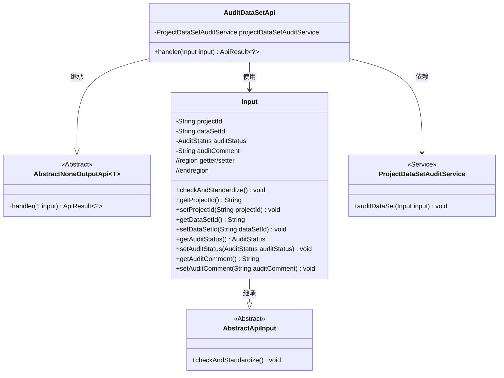
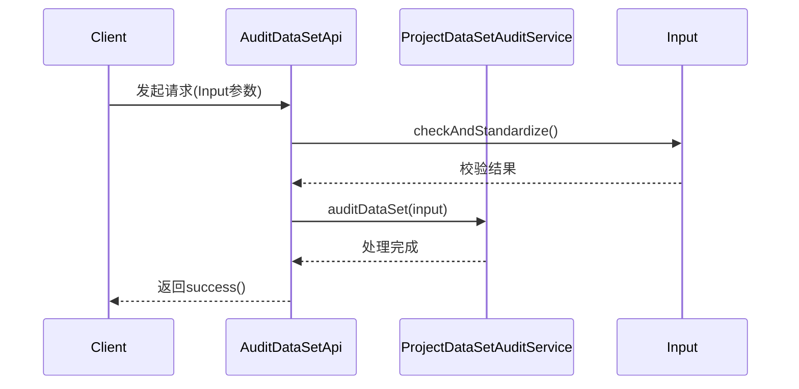

# 基础信息

|      |      |
|------|------|
| 名称 | AuditDataSetApi |
| 编码语言 | .java |
| 代码路径 | WeFe/board/board-service/src/main/java/com/welab/wefe/board/service/api/project/dataset/AuditDataSetApi.java |
| 包名 | com.welab.wefe.board.service.api.project.dataset |
| 依赖项 | ['com.welab.wefe.board.service.service.ProjectDataSetAuditService', 'com.welab.wefe.common.StatusCode', 'com.welab.wefe.common.exception.StatusCodeWithException', 'com.welab.wefe.common.fieldvalidate.annotation.Check', 'com.welab.wefe.common.util.StringUtil', 'com.welab.wefe.common.web.api.base.AbstractNoneOutputApi', 'com.welab.wefe.common.web.api.base.Api', 'com.welab.wefe.common.web.dto.AbstractApiInput', 'com.welab.wefe.common.web.dto.ApiResult', 'com.welab.wefe.common.wefe.enums.AuditStatus', 'org.springframework.beans.factory.annotation.Autowired'] |
| 概述说明 | 这是一个审核项目数据集授权的API类，包含项目ID、数据集ID、审核状态和意见等必填字段，拒绝时需填写原因。 |

# 说明

该代码定义了一个名为AuditDataSetApi的API类，用于审核项目中的数据集授权申请。API路径为project/data_resource/audit，继承自AbstractNoneOutputApi，输入参数为内部类Input。Input包含必填的项目ID、数据集ID、审核状态和可选的审核意见。当审核状态为拒绝且未填写意见时，会抛出异常。处理逻辑通过ProjectDataSetAuditService的auditDataSet方法完成审核操作。

# 类列表 Class Summary

| 名称   | 类型  | 说明 |
|-------|------|-------------|
| AuditDataSetApi | class | 审核项目数据集授权申请的API，包含项目ID、数据集ID、状态和审核意见等必填参数，拒绝时需填写原因。 |

## 类 AuditDataSetApi

|      |      |
|------|------|
| 访问范围 | @Api(path = "project/data_resource/audit", name = "audit the data set authorization application in the project");public |
| 类型 | class |
| 名称 | AuditDataSetApi |
| 说明 | 审核项目数据集授权申请的API，包含项目ID、数据集ID、状态和审核意见等必填参数，拒绝时需填写原因。 |

### UML类图

该类图展示了审计数据集API的核心结构。AuditDataSetApi继承自泛型抽象类AbstractNoneOutputApi，处理Input类型的参数，并依赖ProjectDataSetAuditService执行审核操作。Input类继承自AbstractApiInput，包含项目ID、数据集ID等审核参数，并实现了参数校验逻辑。整体设计采用分层架构，通过继承和服务依赖实现功能解耦。

### 内部方法调用关系图

```mermaid
graph TD
    A["类AuditDataSetApi"]
    B["继承: AbstractNoneOutputApi<Input>"]
    C["注解: @Api"]
    D["依赖注入: ProjectDataSetAuditService"]
    E["重写方法: handler(Input input)"]
    F["内部类: Input"]
    G["继承: AbstractApiInput"]
    H["校验方法: checkAndStandardize()"]
    I["属性: projectId, dataSetId, auditStatus, auditComment"]
    J["getter/setter方法"]

    A --> B
    A --> C
    A --> D
    A --> E
    E --> D["调用projectDataSetAuditService.auditDataSet"]
    A --> F
    F --> G
    F --> H
    F --> I
    F --> J
    H -->|校验条件| I["auditStatus为disagree时需auditComment"]
```

这段代码实现了一个数据集授权审核的API接口，主要包含两个核心部分：AuditDataSetApi类处理审核请求流程，Input内部类封装请求参数并实现校验逻辑。流程图展示了类结构和关键方法调用关系，时序图则描述了从客户端请求到服务处理的完整调用链。代码通过注解定义API路径，继承抽象类实现标准化处理，并严格校验当审核状态为拒绝时必须填写拒绝原因的业务规则。

### 字段列表 Field List

| 名称  | 类型  | 说明 |
|-------|-------|------|
| projectDataSetAuditService | ProjectDataSetAuditService | 使用@Autowired自动注入ProjectDataSetAuditService服务实例。 |

### 方法列表

| 名称  | 类型  | 说明 |
|-------|-------|------|
| handler | ApiResult<?> | 方法重写，调用审计服务处理输入数据，成功返回结果。 |

